# MAAQ — Conception de la base de données

Conçue le 01/10/2026 à partir de `MAAQ_US_Detaillees_BA.md` (65 user stories, décisions D1 à D11). Mise à jour le 01/10/2026 avec les réponses du PM aux trois documents `MAAQ_BDD_Points_a_valider.docx` (section 2.3), `MAAQ_BDD_Points_a_valider_2.docx` (section 2.4) et `MAAQ_BDD_Points_a_valider_3.docx` (section 2.5).
Le script SQL complet est aussi livré seul : `maaq_schema.sql`.

---

## 1. Synthèse

- **Périmètre** : 65 US, 11 modules (accès, configuration, invités, catalogue, contrats, tchat, carnet, administration, réglages, sécurité/RGPD, support). 40 tables, 6 vues, 6 fonctions, 5 triggers de règles.
- **SGBD** : PostgreSQL 15+, hébergé dans l'UE. Le DDL a été exécuté et testé : 128 contrôles de comportement, tous réussis.
- **Choix structurants** : un seul modèle `users` pour les 3 rôles avec un rang `core`/`secondary` ; un `accounts` qui sert de frontière d'isolation et porte quota et délai de grâce ; catalogue, contrats et informations par agent entièrement pilotés par des données (aucune migration pour ajouter un agent, un contrat ou un champ) ; **carnet de bord partitionné par mois** (≈ 50 demandes par profil et par jour au maximum, 1 000 comptes par an).
- **Principe RGPD** : MAAQ ne stocke ni les messages du tchat (chez Digitorn) ni les mots de passe Google ; secrets hachés ; informations personnelles chiffrées côté application ; purge par traitements planifiés.
- **Après les réponses du PM** : 28 points tranchés en trois séries (sections 2.3 à 2.5) ; il ne reste aucune question ouverte, seulement des hypothèses de détail (section 3.1) et 15 règles de user stories à aligner avec les décisions (section 3.4).

---

## 2. Guide de relecture rapide

### 2.1 Les tables en une phrase

| Table | À quoi elle sert | User story source |
|---|---|---|
| `accounts` | Un abonnement : un utilisateur principal et ses invités, avec le quota d'invités du plan, le plafond quotidien de demandes et le délai de grâce de suppression | US-18, 21, 56, 58, 59, 64 |
| `users` | Toute personne qui se connecte (admin, utilisateur principal, invité), avec son rang d'invité et son statut | US-3, 4, 10, 18, 19, 20, 64 |
| `activation_links` | Lien de 30 min à usage unique envoyé pour activer un compte ou une invitation | US-4, 5, 18, 64 |
| `verification_codes` | Codes à 6 chiffres à usage unique (nouvel appareil, récupération d'accès, réinitialisation du mot de passe, boîte de validation) | US-3, 8, 15, 51 |
| `devices` | Un appareil vérifié d'un profil, avec son schéma tactile, son verrouillage et son fuseau horaire | US-6, 7, 8, 51, 53 |
| `sessions` | Sessions ouvertes (3 mois max), invalidables à tout moment côté serveur | US-3, 6, 9, 20, 53 |
| `security_events` | Journal des verrouillages, changements d'email, appareils vérifiés ou révoqués (conservé 3 ans par défaut, durée réglable) | US-7, 19, 53 |
| `legal_document_versions` | Versions de la politique de confidentialité, des CGU et du texte de consentement au challenge | US-36, 54 |
| `legal_acceptances` | Qui a accepté quelle version, et quand | US-4, 54, 64 |
| `agent_categories` | Les 3 rubriques du catalogue et leurs règles d'accès (Contrats réservée au noyau) | US-22, 23, 30 |
| `agents` | Un agent publié dans le catalogue, sa fiche, son état Disponible / Bloqué et le nombre d'adresses en copie qu'il accepte | US-16, 23, 24, 42, 45, 46, 47 |
| `agent_sample_prompts` | Exemples de demandes (fiche, recherche) et 3 suggestions de première demande | US-24, 25, 41 |
| `agent_validated_actions` | Types d'actions d'un agent qui exigent une validation avant exécution | US-24, 39, 45 |
| `connector_types` | Types de connecteurs : Google Drive, Google Agenda, boîte de validation | US-13, 14, 15 |
| `agent_requirements` | Quels connecteurs un agent exige, et qui les configure (chaque profil, l'utilisateur principal, ou une connexion unique du compte) | US-13, 29, 45 |
| `agent_info_fields` | Les informations que l'utilisateur doit fournir pour un agent donné, définies par l'administrateur à la publication (valeur unique ou liste, avec une clé commune optionnelle pour le pré-remplissage) | US-10, 45 |
| `user_agent_info_values` | Valeurs saisies par ou pour un profil pour les champs d'un agent, chiffrées | US-10, 11, 12 |
| `profile_agents` | Le dashboard : agents ajoutés par chaque profil (retrait = masquage) | US-22, 26, 27, 28, 31 |
| `agent_connections` | Compte Google ou boîte de validation configuré par un profil pour un agent, et son statut | US-13, 14, 15, 29 |
| `account_connections` | Connexion unique du compte à un connecteur, indépendante des agents (Google Drive de l'utilisateur principal) | US-13, 32, 34 |
| `cc_addresses` | Adresses en copie systématique des événements, propres à chaque profil et agent | US-16, 17 |
| `contract_definitions` | Liste commune des contrats obligatoires (Mutuelle, Assurance Auto…) | US-32, 48 |
| `contract_field_definitions` | Champs de détail de chaque contrat, avec type et caractère obligatoire | US-33, 48 |
| `contract_field_options` | Valeurs possibles d'un champ « liste de choix » | US-48 |
| `account_contracts` | Un contrat suivi par un compte : dernière modification et consentement au challenge | US-32, 33, 35, 36 |
| `contract_field_values` | Valeurs saisies pour un contrat d'un compte | US-33, 35 |
| `contract_documents` | Lien entre un contrat et un document scanné (le fichier est dans le Drive) | US-34, 35 |
| `contract_consent_events` | Preuve de chaque activation ou retrait du consentement au challenge, avec l'empreinte de l'email du consentant | US-36 |
| `logbook_entries` | Le carnet de bord : demandes et actions des agents, conservées 14 mois, partitionné par mois | US-38, 39, 40, 50, 57 |
| `logbook_entry_participants` | Qui participait à une demande du noyau (règle de visibilité des invités secondaires), partitionné par mois | US-40 |
| `logbook_sync_runs` | Historique des synchronisations du carnet avec Digitorn | US-40 |
| `action_decisions` | Décision sur une action proposée par un agent, pour l'exécuter une seule fois | US-39 |
| `error_reports` | Signalements de réponses ou actions erronées, conservés 14 mois par défaut (durée réglable) | US-61 |
| `data_exports` | Demandes d'export des données d'un profil | US-55 |
| `erasure_traces` | Trace non nominative d'une suppression définitive et suivi chez Digitorn | US-20, 56, 57, 58 |
| `daily_request_counters` | Nombre de demandes envoyées aux agents par profil et par jour, pour appliquer le plafond quotidien | US-38 |
| `chat_erasure_requests` | File des effacements d'historique de tchat à faire chez Digitorn, avec réessais | US-9, 28, 43, 53 |
| `platform_settings` | Réglages modifiables sans nouvelle version (fréquence de synchro, délais, emails, limites, taille et nombre de documents, durées de rétention du carnet, des signalements et du journal de sécurité, délai de purge des comptes non activés) | US-27, 34, 40, 58, 61, 62, 65 |
| `platform_setting_changes` | Historique des modifications de réglages | US-65 |
| `admin_audit_log` | Journal des actions de l'administrateur | US-45 à 48, 64 |

Vues et fonctions : `v_dashboard_agents` (statut Prêt / À configurer / Bloqué), `v_profile_agent_missing_items` (ce qui manque et qui doit le faire), `v_account_guest_quota` (places d'invités restantes), `v_guest_display_status` (statut d'invitation affiché), `v_info_prefill_suggestions` (valeurs proposées pré-remplies d'un agent à l'autre), `v_never_activated_purge_candidates` (comptes et invités jamais activés à supprimer), `logbook_visible_entries(profil)` (carnet visible selon le rang), `ensure_logbook_partitions(n)` (prépare les mois à venir) et `purge_expired_logbook()` (purge selon la durée de rétention, 14 mois par défaut), `purge_expired_error_reports()` et `purge_expired_security_events()` (purges réglables), et `register_agent_request(profil, jour)` (compte une demande et applique le plafond quotidien).

### 2.2 Les relations en langage naturel

- Un compte contient un utilisateur principal et zéro à plusieurs invités ; un administrateur n'appartient à aucun compte.
- Un invité est soit « invité 1 » (noyau du compte avec l'utilisateur principal), soit « invité secondaire ». Un compte a au plus un invité 1 ; s'il est supprimé, personne n'est promu automatiquement.
- Un profil peut avoir plusieurs appareils ; un appareil porte un schéma tactile et appartient à un seul profil.
- Un appareil peut avoir plusieurs sessions ; révoquer l'appareil ferme ses sessions.
- Un profil peut recevoir plusieurs liens d'activation, mais un seul est valable à la fois.
- Une rubrique contient plusieurs agents ; un agent appartient à une seule rubrique.
- Un agent a plusieurs exemples de demandes, plusieurs actions à valider, plusieurs connecteurs requis et plusieurs champs d'information qui lui sont propres.
- Un profil choisit jusqu'à 10 agents par rubrique (son dashboard) ; retirer un agent le masque sans rien supprimer.
- Un profil configure, pour chaque agent, ses propres connecteurs ; un compte a en plus une connexion unique par type de connecteur (le Google Drive de l'utilisateur principal), utilisable par tous les agents qui l'exigent.
- Un profil peut ajouter des adresses en copie pour un agent, dans la limite fixée par l'administrateur pour cet agent ; ces adresses ne s'appliquent qu'aux événements qu'il demande.
- Un profil renseigne des valeurs (chiffrées) pour les champs de chaque agent, une valeur ou une liste selon le champ ; une valeur déjà saisie pour un champ de même clé commune dans un autre agent est proposée pré-remplie ; l'utilisateur principal peut renseigner pour ses invités.
- La liste des contrats est commune à tous ; chaque compte suit un sous-ensemble de ces contrats, avec des valeurs de champs, des documents et un interrupteur de consentement partagé par le noyau.
- Chaque activation ou retrait du consentement est conservé dans un journal à part, qui survit au compte et identifie le consentant par une empreinte de son email.
- Un compte a un carnet de bord, découpé par mois ; chaque entrée est liée à un agent, à un demandeur et éventuellement à des participants.
- Une action proposée par un agent reçoit au plus une décision (validée ou refusée) de son demandeur.
- Un profil a un compteur de demandes par jour ; le plafond quotidien est une limite du compte, la même pour chacun de ses profils.
- Un profil peut demander un export de ses données ; une seule demande peut être en cours à la fois.
- Un réglage de plateforme a un historique de modifications ; chaque action de l'administrateur sur les agents, contrats et comptes est journalisée.

### 2.3 Décisions prises (réponses du PM du 01/10/2026)

Le PM a répondu à toutes les lignes du document `MAAQ_BDD_Points_a_valider.docx`. Le tableau résume chaque décision et son effet sur la base. ✓ = confirmé tel quel, ✗ = infirmé, ◐ = commentaire sans case cochée (interprétation de ma part, reprise en section 2.4).

| # | Décision du PM | Effet sur le schéma |
|---|---|---|
| P1 | ✓ Réinitialisation du mot de passe par un code à 6 chiffres envoyé par email, jamais par lien. Une fois le mot de passe réinitialisé, l'utilisateur peut recréer son schéma. | `verification_codes` : usage `password_reset`. Le parcours se termine par la création d'un schéma (`devices.pattern_*`). |
| P2 | ✗ Garder aussi une empreinte de l'email du consentant. | `contract_consent_events.actor_email_hash` (obligatoire, HMAC-SHA256 avec clé hors base) en plus des identifiants techniques. |
| P3 | ✗ Une connexion Drive unique par compte, indépendante des agents. Un agent peut aussi utiliser ce Drive ; la connexion se fait via l'agent dans MAAQ ou directement par un widget Digitorn. | Nouvelle table `account_connections` ; nouvelle valeur `account` de `agent_requirements.owner_scope` ; vue des éléments manquants adaptée. |
| P4 | ✓ MAAQ ne garde du tchat que les décisions de validation et le carnet synchronisé. | Aucun changement. |
| P5 | ✗ Champs libres propres à chaque agent, à compléter par l'utilisateur au moment de configurer son agent. | Le catalogue global disparaît : `agent_info_fields` (champs d'un agent) et `user_agent_info_values` (valeurs chiffrées) remplacent `info_field_definitions`, `agent_required_info_fields` et `user_info_values`. |
| P6 | ✓ Un contrat retiré est archivé, ses valeurs restent. | Aucun changement. |
| P7 | ✓ L'email d'un invité retiré est libéré tout de suite. | Aucun changement. |
| P8 | ◐ C'est l'administrateur qui, à la publication de l'agent, précise les informations à ajouter (adresses en copie, liste de contacts…). | `agents.cc_addresses_max_count` (0 = pas d'adresses en copie, sinon le maximum, 10 en pratique) ; les listes de contacts sont des champs `agent_info_fields` avec `max_items` supérieur à 1. |
| P9 | ◐ Journal de sécurité conservé 3 ans. | Conservation portée de 12 mois à 3 ans (traitement de purge). |
| P10 | ✓ Les signalements survivent 14 mois à la suppression du profil. | Aucun changement. |
| P11 | ◐ Supprimer la fonctionnalité « Nouvelle réponse ». | Colonne `profile_agents.has_unread_response` retirée. |
| P12 | ◐ Une seule durée : 30 jours. | Délai de grâce unique de 30 jours (désabonnement et suppression demandée). |
| P13 | ✗ Un invité en délai de grâce doit déjà être considéré hors du quota. | Le quota ne compte que les invités en attente d'activation ou actifs (trigger et vue `v_account_guest_quota`). |
| P14 | ✗ Un compte jamais activé est purgé après 30 jours. | Précisé en N8 : 30 jours depuis le dernier lien envoyé, invités compris (vue `v_never_activated_purge_candidates`). |
| P15 | ✓ Révoquer un appareil efface l'historique de tchat de tout le profil. | Aucun changement. |
| P16 | ✓ « Dernière mise à jour » = dernière synchronisation globale réussie. | Aucun changement. |

Zones floues : F4, F5 et F6 sont confirmées comme de vraies contradictions ; F1, F2, F3 et F7 sont tranchées par les réponses P1, P2, P12 et P13. Hypothèses : H1, H3, H4, H9, H11, H17, H22 et H24 sont confirmées ; H2, H6, H13 et H23 sont modifiées, et H26, H28 modifiées une seconde fois par la seconde série (section 3.1).

### 2.4 Décisions sur les huit points de la seconde série (réponses du PM du 01/10/2026)

Mêmes symboles que ci-dessus : ✓ confirmé, ✗ infirmé, ◐ commentaire sans case cochée (interprétation de ma part).

| # | Décision du PM | Effet sur le schéma |
|---|---|---|
| N1 | ✗ La valeur saisie pour un agent est proposée pré-remplie pour les autres. | `agent_info_fields.shared_key` (clé commune choisie à la publication) et vue `v_info_prefill_suggestions`. Le pré-remplissage ne rapproche que des champs de même clé **et** de même type. L'utilisateur confirme : la valeur est alors copiée, indépendante de la source. |
| N2 | ✓ L'administrateur active la section « Adresses en copie » à la publication et fixe le maximum. | Aucun changement (`agents.cc_addresses_max_count`). |
| N3 | ✓ Le Drive du compte est connecté par l'utilisateur principal uniquement ; les invités voient « à configurer par [prénom] ». | Aucun changement (`account_connections`). |
| N4 | ✓ Seul le badge « Nouvelle réponse » disparaît ; le traitement en arrière-plan et l'affichage de la réponse au retour restent. | Aucun changement. |
| N5 | ◐ La durée de rétention (en mois) doit être paramétrable dans la console d'administration. Attendu : 1 000 comptes par an, 50 demandes par jour au maximum. | Nouveau réglage `logbook_retention_months` (14 par défaut) lu par `purge_expired_logbook()`. Volumétrie : à 3 profils par compte (hypothèse), borne haute ≈ 64 millions d'entrées à 12 mois et ≈ 127 millions à 24 mois. Le partitionnement mensuel est conservé. |
| N6 | ◐ Rendre aussi le nombre de documents par contrat réglable. | Nouveau réglage `max_documents_per_contract` (20 par défaut) lu par le trigger. La taille maximale reste réglable, 15 Mo au départ. |
| N7 | ◐ Détection automatique par l'appareil, sans rien stocker. | Colonne `users.timezone` supprimée. Les dates restent en UTC ; l'application convertit à l'affichage avec le fuseau de l'appareil. Remplacé ensuite par O3 : le fuseau est mémorisé par appareil (`devices.timezone`). |
| N8 | ◐ Compter les 30 jours depuis le dernier envoi de lien ; purger aussi les invités jamais activés. | Vue `v_never_activated_purge_candidates` et réglage `unactivated_purge_days` (30 par défaut). Un utilisateur principal jamais activé est supprimé avec son compte ; un invité jamais activé, seul. |

### 2.5 Décisions sur les quatre derniers points (réponses du PM du 01/10/2026)

Mêmes symboles : ✓ confirmé, ✗ infirmé.

| # | Décision du PM | Effet sur le schéma |
|---|---|---|
| O1 | ✗ Une durée de rétention réglable pour chacun : carnet, signalements et journal de sécurité. | Réglages `error_report_retention_months` (14 par défaut) et `security_event_retention_months` (36 par défaut) à côté de `logbook_retention_months` ; fonctions `purge_expired_error_reports()` et `purge_expired_security_events()` qui les lisent. |
| O2 | ✗ Un plafond quotidien par profil, fixé par rapport au plan, réglable côté administrateur, que l'application fait respecter avec un message au-delà de 50 demandes. | `accounts.daily_request_limit` (50 par défaut, modifiable par l'administrateur), table `daily_request_counters` et fonction `register_agent_request()` qui compte la demande et refuse au-delà du plafond, de façon atomique. |
| O3 | ✗ Mémoriser le fuseau de l'appareil à la connexion (une colonne de plus). | `devices.timezone` (Europe/Paris par défaut), mis à jour à chaque connexion. |
| O4 | ✓ La clé commune est définie par l'administrateur, en saisie libre. | Aucun changement (`agent_info_fields.shared_key`). |

Il ne reste plus de question ouverte. Les hypothèses de détail prises pour appliquer ces décisions sont H34 à H36 (section 3.1).

---

## 3. Hypothèses et questions ouvertes

### 3.1 Hypothèses

Je n'ai pas eu besoin du brief de base : les US détaillées suffisent. La colonne « Statut » indique l'effet des réponses du PM du 01/10/2026 (deux séries).

| ID | Hypothèse | Statut | Impact si fausse |
|---|---|---|---|
| H1 | SGBD PostgreSQL 15+, hébergé dans l'UE (US-2 RT3), avec chiffrement du disque. | Confirmée | Moyen : le DDL est propre à PostgreSQL. |
| H2 | ~~Volumétrie V1 : ~10 demandes par jour et par profil, pas de partitionnement.~~ **Remplacée** : 1 000 comptes par an, 50 demandes par jour et par profil au maximum ; borne haute ≈ 64 millions d'entrées de carnet à 12 mois (3 profils par compte, hypothèse). Carnet et participants partitionnés par mois dès la V1. | Modifiée (N5) | Moyen : dimensionnement du stockage et de la synchronisation. |
| H3 | Multi-tenant logique : une seule base, un compte = un « tenant ». L'isolation est portée par l'identifiant du compte et le rang. | Confirmée | Moyen : sinon activer la Row Level Security (section 9.2). |
| H4 | Noms de tables et colonnes en anglais, commentaires en français. | Confirmée | Nul. |
| H5 | Réinitialisation du mot de passe par code à 6 chiffres envoyé par email. | Confirmée (P1) | Moyen. |
| H6 | ~~Le plan d'abonnement n'a qu'un paramètre.~~ **Remplacée** : d'autres informations seront ajoutées aux plans. Pas de table `plans` créée tant que ces informations sont inconnues ; `accounts.guest_quota` reste la valeur effective. | Modifiée | Moyen : ajouter `plans` et `accounts.plan_id` (section 9.1). |
| H7 | L'email d'un invité retiré est libéré immédiatement. | Confirmée (P7) | Faible. |
| H8 | Un contrat retiré de la liste est archivé, ses données restent. | Confirmée (P6) | Moyen (RGPD). |
| H9 | Devise unique : l'euro. | Confirmée | Faible. |
| H10 | ~~Badge « Nouvelle réponse » stocké.~~ **Supprimée** : fonctionnalité retirée. | Supprimée (P11) | — |
| H11 | Chaque profil a un identifiant chez Digitorn (`users.digitorn_user_ref`). | Confirmée | Moyen. |
| H12 | ~~Journal de sécurité conservé 12 mois.~~ **Remplacée** : 3 ans. | Modifiée (P9) | Faible. |
| H13 | ~~« 15 Mo » fixe.~~ **Remplacée** : la taille maximale d'un document (15 Mo par défaut) et le nombre de documents par contrat (20 par défaut) sont réglables dans la console. 1 Mo = 1 048 576 octets. | Modifiée (N6) | Faible. |
| H14 | Consentements conservés avec identifiants techniques, sans clé étrangère, **et empreinte de l'email du consentant**. Validation du DPO encore à obtenir. | Modifiée (P2) | Élevé (RGPD, valeur probante). |
| H15 | Signalements conservés 14 mois, y compris après suppression du profil. | Confirmée (P10) | Moyen (RGPD). |
| H16 | MAAQ ne stocke ni messages de tchat, ni brouillons, ni textes en cours de saisie. | Confirmée (P4) | Moyen. |
| H17 | Messages au support non stockés en base : ils partent par email. | Confirmée | Faible. |
| H18 | ~~Adresses en copie : 10 par profil et par agent, section pour les agents qui exigent Google Agenda.~~ **Remplacée** par H25. | Remplacée | — |
| H19 | ~~Drive des contrats = connexion Drive du principal pour l'agent Contrats.~~ **Remplacée** par H27. | Remplacée | — |
| H20 | Une durée de délai de grâce portée par l'application, une échéance stockée : **30 jours** pour tous les cas. | Confirmée (P12) | Faible. |
| H21 | Décisions sur les actions proposées tenues par MAAQ (idempotence), contenu des cartes chez Digitorn. | Confirmée (P4) | Moyen. |
| H22 | Plusieurs administrateurs possibles, sans permissions fines. | Confirmée | Faible. |
| H23 | ~~Fuseau Europe/Paris pour tous.~~ ~~Un fuseau par profil.~~ ~~Aucun fuseau stocké.~~ **Remplacée** : le fuseau de l'appareil est mémorisé à chaque connexion (`devices.timezone`, Europe/Paris par défaut). Les dates restent en UTC. | Modifiée trois fois (O3) | Faible. |
| H24 | Sauvegardes (2 ans, US-58 RT3) hors du schéma. | Confirmée | Moyen (DPO). |
| H25 | **Nouvelle** : l'administrateur règle à la publication de chaque agent le nombre d'adresses en copie acceptées (`agents.cc_addresses_max_count`, 0 = aucune). | Nouvelle (N2) | Faible. |
| H26 | ~~Les champs d'information sont propres à chaque agent, sans partage.~~ **Remplacée** : champs propres à chaque agent, avec une clé commune optionnelle ; une valeur déjà saisie pour un champ de même clé et de même type est proposée pré-remplie pour les autres agents (copie confirmée par l'utilisateur). | Modifiée (N1) | Moyen. |
| H27 | **Nouvelle** : une connexion unique par compte et par type de connecteur (`account_connections`), faite par l'utilisateur principal, via l'agent dans MAAQ ou par widget Digitorn ; elle sert tous les agents qui l'exigent (`owner_scope = account`). | Nouvelle (N3) | Moyen. |
| H28 | **Nouvelle** : un compte ou un invité jamais activé est supprimé 30 jours après le dernier lien d'activation envoyé (délai réglable). | Nouvelle (N8) | Faible. |
| H29 | **Nouvelle** : l'idempotence de la synchronisation du carnet suppose que la date d'une entrée est identique d'une récupération à l'autre (contrainte du partitionnement). Les participants n'ont pas de clé étrangère vers l'entrée (une partition référencée ne peut pas être supprimée). | Nouvelle | Moyen : voir section 9.4. |
| H30 | **Nouvelle** : l'empreinte de l'email du consentant est un HMAC-SHA256 dont la clé est conservée hors de la base. | Nouvelle | Moyen. |
| H31 | **Nouvelle** : les durées de rétention du carnet de bord (14 mois), des signalements (14 mois) et du journal de sécurité (36 mois) sont des réglages de la console, avec ces valeurs par défaut. | Nouvelle (N5, O1) | Faible. |
| H32 | ~~« 50 demandes par jour au maximum » est une prévision de volume.~~ **Remplacée** : c'est un plafond quotidien par profil, fixé par compte selon le plan (50 par défaut), réglable par l'administrateur et appliqué par l'application avec un message. | Modifiée (O2) | Moyen : règle visible par l'utilisateur. |
| H33 | **Nouvelle** : la clé commune des champs d'information est définie par l'administrateur à la publication de l'agent ; le pré-remplissage ne rapproche que des champs de même clé et de même type. | Nouvelle (O4) | Faible. |
| H34 | **Nouvelle** : les emails du serveur qui citent une heure utilisent le fuseau de l'appareil concerné par l'événement (verrouillage, nouvel appareil) ; à défaut, celui du dernier appareil utilisé par le profil, puis Europe/Paris. | Nouvelle (O3) | Faible. |
| H35 | **Nouvelle** : la journée du plafond de demandes est le jour calendaire du fuseau de l'appareil au moment de la demande ; une demande relancée après une erreur n'est comptée qu'une fois. | Nouvelle (O2) | Faible. |
| H36 | **Nouvelle** : le plafond quotidien est une colonne du compte (`accounts.daily_request_limit`), appliquée à chaque profil ; le plan n'existe pas en base (H6). | Nouvelle (O2) | Moyen : si les plans portent le plafond, il devient dérivé. |

### 3.2 Contradictions et zones floues relevées dans les sources

| Où | Constat | Résolution |
|---|---|---|
| US-3 RF9 ↔ US-8 | « Mot de passe oublié ? » renvoie vers un parcours qui ne couvre que le schéma tactile. | Tranché (P1) : code par email. |
| US-36 RT1 ↔ US-58 RF4 | Conserver la preuve de consentement 5 ans, mais tout supprimer à J+30. | Tranché (P2) : preuve conservée avec empreinte de l'email ; validation DPO à obtenir. |
| US-56 RF1 ↔ US-58 | Délai de grâce « d'un mois » d'un côté, « 30 jours » de l'autre. | Tranché (P12) : 30 jours. |
| US-13 ↔ US-32 RF11, US-34 | Connexion Google « par agent », Drive des contrats unique. | Tranché (P3) : connexion unique du compte. |
| US-40 RT1 | L'API du carnet de Digitorn n'est pas livrée avant le 14/10/2026. | Confirmée, ouverte (P4). |
| US-43 RF3, RF6 | Effacement « sur tous les appareils » mais révocation d'un seul appareil. | Tranché (P15) : tout le profil. |
| US-21 ↔ US-56 | Un invité en délai de grâce compte-t-il dans le quota ? | Tranché (P13) : non. |

### 3.3 Extraction (phase 1)

- **Acteurs** : administrateur (console sur ordinateur, mot de passe), utilisateur principal, invité 1 (noyau), invités secondaires. Systèmes externes : Digitorn (agents, historique, suppression), Google (Drive, Agenda), prestataire SMS UE, outil de facturation.
- **Cycles de vie** : compte (activation en attente → actif → délai de grâce → purge ; supprimé 30 jours après le dernier lien envoyé s'il n'est jamais activé) ; invité (invitation → actif → retiré ou en délai de grâce → purge ; supprimé aussi s'il n'est jamais activé) ; agent (disponible ↔ bloqué) ; connecteur (en attente → connecté / refusé / partiel / à reconnecter) ; document de contrat (analyse + classement : en cours → disponible / impossible) ; export (demandé → en préparation → prêt / échec / expiré) ; action proposée (en attente → validée / refusée / abandonnée).
- **Données sensibles** : identité, informations saisies pour les agents (possibles données de santé ou d'identité), détails de contrats (mutuelle), texte du carnet et des signalements, secrets (mot de passe, schéma, codes, jetons).

### 3.4 Conséquences sur les user stories (à mettre à jour par le BA)

Les décisions du PM modifient ou contredisent des règles écrites dans `MAAQ_US_Detaillees_BA.md`. La base suit les décisions ; les US doivent être alignées.

| US concernée | Règle à modifier | Décision |
|---|---|---|
| US-3 RF9, US-8 | Ajouter le parcours de réinitialisation du mot de passe par code ; il se termine par la création d'un schéma. | P1 |
| US-10 RF2, RF12 | Formulaire d'informations propre à chaque agent, défini à la publication ; une valeur déjà saisie pour un champ de même clé commune est proposée pré-remplie pour les autres agents. | P5, N1 |
| US-16 RF1, RF4 | La section « Adresses en copie » et sa limite sont réglées par agent à la publication, et non fixes (10). | P8 |
| US-13, US-32 RF11, US-34 RT1 | Le Drive des contrats est une connexion unique du compte, établie via l'agent dans MAAQ ou un widget Digitorn. | P3 |
| US-21 RF2 | Le quota ne compte pas les invités en délai de grâce. | P13 |
| US-22, US-38 RF13 | Retirer le badge « Nouvelle réponse » de la carte d'agent. | P11 |
| US-34 RF2, RF5 | La taille maximale (15 Mo) et le nombre de documents par contrat (20) deviennent des réglages de la console (US-65). | H13, N6 |
| US-36 RT1 | Ajouter l'empreinte de l'email du consentant au journal des consentements. | P2 |
| US-56 RF1, US-58 | Délai de grâce unique de 30 jours ; ajouter une règle de purge des comptes et des invités jamais activés, 30 jours après le dernier lien envoyé. | P12, P14, N8 |
| US-40 RF6, RT6 | La conservation de 14 mois du carnet devient une valeur par défaut, réglable dans la console. | N5 |
| US-61 RT2 | La conservation de 14 mois des signalements devient une valeur par défaut, réglable dans la console. | O1 |
| US-7 RF6, US-51 RF8 | Les heures citées dans les emails (verrouillage, nouvel appareil) sont exprimées dans le fuseau de l'appareil concerné. | O3 |
| US-38 | Ajouter la règle de plafond quotidien : au-delà du nombre de demandes autorisé pour le profil, la demande est refusée avec un message. | O2 |
| US-64 RF2 | Ajouter au formulaire de création de compte le plafond quotidien de demandes par profil (50 par défaut). | O2 |
| US-65 | Ajouter huit réglages : taille maximale des documents, nombre de documents par contrat, durées de rétention du carnet, des signalements et du journal de sécurité, délai de purge des comptes et invités jamais activés. | H13, N5, N6, N8, O1 |

---

## 4. Diagramme entité-relation

Niveau métier : seules les clés et quelques attributs clés sont montrés. Le détail des colonnes est dans le dictionnaire (section 6).

```mermaid
erDiagram
  accounts ||--o{ users : "regroupe"
  users ||--o{ activation_links : "reçoit"
  users ||--o{ verification_codes : "reçoit"
  users ||--o{ devices : "utilise"
  devices ||--o{ sessions : "ouvre"
  users ||--o{ sessions : "possède"
  users ||--o{ security_events : "concerné par"
  users ||--o{ legal_acceptances : "accepte"
  legal_document_versions ||--o{ legal_acceptances : "est acceptée"

  agent_categories ||--o{ agents : "classe"
  agents ||--o{ agent_sample_prompts : "illustré par"
  agents ||--o{ agent_validated_actions : "exige validation de"
  agents ||--o{ agent_requirements : "exige"
  connector_types ||--o{ agent_requirements : "est exigé"
  agents ||--o{ agent_info_fields : "demande"

  users ||--o{ user_agent_info_values : "renseigne"
  agent_info_fields ||--o{ user_agent_info_values : "porte"
  users ||--o{ profile_agents : "choisit (dashboard)"
  agents ||--o{ profile_agents : "est choisi"
  users ||--o{ agent_connections : "configure"
  agents ||--o{ agent_connections : "est connecté via"
  connector_types ||--o{ agent_connections : "type de"
  accounts ||--o{ account_connections : "partage"
  connector_types ||--o{ account_connections : "type de"
  agent_connections |o--o{ verification_codes : "vérifiée par"
  users ||--o{ cc_addresses : "ajoute en copie"
  agents ||--o{ cc_addresses : "pour"

  contract_definitions ||--o{ contract_field_definitions : "se détaille en"
  contract_field_definitions ||--o{ contract_field_options : "propose"
  accounts ||--o{ account_contracts : "suit"
  contract_definitions ||--o{ account_contracts : "est suivi"
  account_contracts ||--o{ contract_field_values : "contient"
  contract_field_definitions ||--o{ contract_field_values : "type de"
  contract_field_options |o--o{ contract_field_values : "choisie"
  account_contracts ||--o{ contract_documents : "rattache"
  contract_definitions ||--o{ contract_consent_events : "consentement sur"
  legal_document_versions ||--o{ contract_consent_events : "texte accepté"

  accounts ||--o{ logbook_entries : "possède"
  agents ||--o{ logbook_entries : "trace de"
  users |o--o{ logbook_entries : "demande"
  logbook_entries ||--o{ logbook_entry_participants : "implique (sans FK, voir H29)"
  users ||--o{ logbook_entry_participants : "participe"
  agents ||--o{ action_decisions : "propose"
  users ||--o{ action_decisions : "décide"
  users |o--o{ error_reports : "signale"
  agents ||--o{ error_reports : "visé par"
  users ||--o{ data_exports : "demande"
  users ||--o{ chat_erasure_requests : "fait effacer"
  users ||--o{ daily_request_counters : "compte ses demandes"
  agents |o--o{ chat_erasure_requests : "pour"
  platform_settings ||--o{ platform_setting_changes : "historisé par"
  users |o--o{ admin_audit_log : "agit"

  accounts {
    uuid id PK
    int guest_quota
    int daily_request_limit
    enum status
    timestamptz purge_scheduled_at
  }
  users {
    uuid id PK
    uuid account_id FK
    enum role "admin, primary_user, guest"
    enum guest_rank "core, secondary"
    citext email UK
    enum status
  }
  agents {
    bigint id PK
    int category_id FK
    enum status "available, blocked"
    smallint cc_addresses_max_count
    text digitorn_agent_ref UK
  }
  agent_info_fields {
    bigint agent_id FK
    text label
    text shared_key "pré-remplissage entre agents"
    smallint max_items "1 = valeur, plus = liste"
  }
  profile_agents {
    uuid user_id FK
    bigint agent_id FK
    timestamptz removed_at
  }
  account_connections {
    uuid account_id FK
    int connector_type_id FK
    enum status
  }
  account_contracts {
    uuid account_id FK
    bigint contract_definition_id FK
    bool consent_active
  }
  logbook_entries {
    uuid account_id FK
    bigint agent_id FK
    uuid requester_user_id FK
    timestamptz occurred_at "clé de partition mensuelle"
  }
  contract_consent_events {
    uuid account_id "sans FK (preuve conservée)"
    bytea actor_email_hash
    enum action_type
    date retain_until
  }
  erasure_traces {
    uuid former_user_id "sans FK (non nominatif)"
    enum digitorn_status
  }
  logbook_sync_runs {
    enum status
    timestamptz finished_at
  }
```



---

## 5. Script SQL (DDL)

Fichier autonome : `maaq_schema.sql`. Il s'exécute d'un seul bloc sur PostgreSQL 15+ et crée les extensions, domaines, types, tables, index, triggers, vues, fonctions et données de référence (3 rubriques, 3 types de connecteurs, 11 réglages, partitions du carnet pour le mois courant et les 3 suivants). Il est reproduit ici tel quel.

```sql
-- =====================================================================
-- MAAQ — Schéma de base de données (PostgreSQL 15+)
-- Source : MAAQ_US_Detaillees_BA.md (US-1 à US-65, décisions D1–D11)
-- Généré le 2026-10-01 — voir MAAQ_BDD_Conception.md pour le guide de relecture
--
-- CONVENTIONS
--  * Identifiants en anglais (snake_case, tables au pluriel), commentaires en français.
--  * Clés primaires : UUID pour ce qui est exposé ou sensible (comptes, profils, appareils,
--    sessions, exports : non énumérables) ; bigint identity pour tout le reste (plus compact).
--  * Dates en timestamptz (UTC en base, conversion à l'affichage). Montants en numeric.
--  * Chaque clé étrangère a un ON DELETE explicite. ON UPDATE n'est pas précisé : les clés
--    primaires ne sont jamais modifiées (comportement par défaut NO ACTION = refus).
--  * Toute clé étrangère est indexée (index nommés idx_<table>_<colonne>).
--  * Les statuts sont des types ENUM : ajout d'une valeur = ALTER TYPE ... ADD VALUE.
--  * Chiffrement : les informations personnelles saisies pour les agents sont chiffrées par
--    l'application AVANT insertion (colonne bytea). Le reste repose sur le chiffrement du
--    disque / de la base du prestataire UE.
--
-- Ordre d'exécution : extensions → types → comptes/profils → sécurité → catalogue →
-- configuration → contrats → carnet → conformité → paramètres → fonctions/vues/triggers.
-- =====================================================================

CREATE EXTENSION IF NOT EXISTS citext;   -- emails insensibles à la casse (unicité normalisée)

-- ---------------------------------------------------------------------
-- DOMAINES (règles de format réutilisées)
-- ---------------------------------------------------------------------
-- Email normalisé : insensible à la casse, sans espace, forme minimale x@y.z
CREATE DOMAIN email_address AS citext
  CHECK (VALUE ~ '^[^@[:space:]]+@[^@[:space:]]+\.[^@[:space:]]+$');

-- Téléphone stocké au format international E.164 (+33612345678) ; la normalisation
-- (06… → +336…) est faite par l'application avant insertion.
CREATE DOMAIN phone_e164 AS text
  CHECK (VALUE ~ '^\+[1-9][0-9]{6,14}$');

-- ---------------------------------------------------------------------
-- TYPES ÉNUMÉRÉS
-- ---------------------------------------------------------------------
CREATE TYPE user_role              AS ENUM ('admin', 'primary_user', 'guest');
CREATE TYPE guest_rank             AS ENUM ('core', 'secondary');          -- core = « invité 1 » (D1)
CREATE TYPE user_status            AS ENUM ('pending_activation', 'active', 'grace_period', 'removed');
CREATE TYPE account_status         AS ENUM ('activation_pending', 'active', 'grace_period');
CREATE TYPE grace_origin           AS ENUM ('in_app_request', 'billing_unsubscribe');
CREATE TYPE initial_setup_step     AS ENUM ('step_1_my_info', 'step_2_guest_info', 'completed');
CREATE TYPE activation_link_kind   AS ENUM ('guest_invitation', 'account_activation');
CREATE TYPE delivery_status        AS ENUM ('sending', 'sent', 'failed');
CREATE TYPE code_purpose           AS ENUM ('device_verification', 'access_recovery', 'validation_mailbox', 'password_reset');
CREATE TYPE code_channel           AS ENUM ('email', 'sms');
CREATE TYPE device_type            AS ENUM ('android', 'iphone', 'desktop', 'other');
CREATE TYPE session_end_reason     AS ENUM ('logout', 'device_revoked', 'guest_removed', 'account_grace_period', 'expired');
CREATE TYPE security_event_type    AS ENUM ('login_locked', 'pattern_locked', 'pattern_recovered', 'device_verified',
                                            'device_revoked', 'login_email_changed', 'password_changed');
CREATE TYPE legal_document_type    AS ENUM ('privacy_policy', 'terms_of_use', 'contract_challenge_consent');
CREATE TYPE agent_status           AS ENUM ('available', 'blocked');
CREATE TYPE prompt_kind            AS ENUM ('example', 'first_suggestion');
CREATE TYPE requirement_owner      AS ENUM ('primary_user', 'each_profile', 'account');
CREATE TYPE connection_status      AS ENUM ('pending', 'connected', 'refused', 'partial', 'reconnect_required');
CREATE TYPE info_data_type         AS ENUM ('text', 'phone', 'postal_code', 'past_date', 'email');
CREATE TYPE contract_field_type    AS ENUM ('text', 'date', 'amount', 'choice');
CREATE TYPE scan_status            AS ENUM ('pending', 'clean', 'infected');
CREATE TYPE classification_status  AS ENUM ('pending', 'classified', 'failed');
CREATE TYPE consent_action         AS ENUM ('granted', 'withdrawn');
CREATE TYPE consent_trigger        AS ENUM ('user_action', 'contract_details_deleted');
CREATE TYPE logbook_entry_type     AS ENUM ('request', 'action_done', 'action_validated', 'action_refused');
CREATE TYPE anonymization_status   AS ENUM ('none', 'pending', 'done');
CREATE TYPE decision_kind          AS ENUM ('pending', 'validated', 'refused', 'abandoned');
CREATE TYPE execution_status       AS ENUM ('not_started', 'running', 'succeeded', 'failed');
CREATE TYPE report_category        AS ENUM ('incorrect_response', 'wrong_action', 'other');
CREATE TYPE export_status          AS ENUM ('requested', 'preparing', 'ready', 'failed', 'expired');
CREATE TYPE sync_status            AS ENUM ('running', 'succeeded', 'failed');
CREATE TYPE erasure_status         AS ENUM ('pending', 'done', 'failed');
CREATE TYPE chat_erasure_reason    AS ENUM ('logout', 'device_revoked', 'agent_removed');
CREATE TYPE setting_value_type     AS ENUM ('integer', 'email');
CREATE TYPE audit_action           AS ENUM ('account_created', 'account_updated', 'activation_link_resent', 'agent_published', 'agent_blocked',
                                            'agent_reactivated', 'contract_created', 'contract_updated', 'contract_archived',
                                            'contract_field_changed', 'device_revoked_by_admin');

-- =====================================================================
-- 1. COMPTES ET PROFILS
-- =====================================================================

-- Compte MAAQ = un abonnement porté par un utilisateur principal et ses invités.
-- C'est aussi la frontière d'isolation des données (tenant). Stories : US-18, 21, 56, 58, 59, 64.
CREATE TABLE accounts (
  id                  uuid PRIMARY KEY DEFAULT gen_random_uuid(),
  status              account_status NOT NULL DEFAULT 'activation_pending',
  -- Nombre d'invités autorisé par le plan ; plan géré hors application (US-21 RT1),
  -- saisi par l'administrateur à la création (US-64 RF2).
  guest_quota         integer NOT NULL CHECK (guest_quota >= 0),
  -- Plafond quotidien de demandes aux agents, par profil du compte : fixé selon le plan à la création, réglable par
  -- l'administrateur (décision du 01/10/2026, O2). Au-delà, l'application refuse la demande avec un message.
  daily_request_limit integer NOT NULL DEFAULT 50 CHECK (daily_request_limit >= 1),
  -- Délai de grâce (désabonnement ou demande de suppression) : voir US-58, US-59
  grace_origin        grace_origin,
  grace_started_at    timestamptz,
  purge_scheduled_at  timestamptz,
  -- Fin d'abonnement : point de départ des 5 ans de conservation des preuves de consentement
  subscription_ended_at timestamptz,
  created_at          timestamptz NOT NULL DEFAULT now(),
  updated_at          timestamptz NOT NULL DEFAULT now(),
  -- Les 3 colonnes de délai de grâce sont toutes renseignées ou toutes vides
  CONSTRAINT ck_accounts_grace_consistent CHECK (
    (status = 'grace_period') = (grace_origin IS NOT NULL AND grace_started_at IS NOT NULL AND purge_scheduled_at IS NOT NULL)
  )
);
CREATE INDEX idx_accounts_purge_scheduled_at ON accounts (purge_scheduled_at) WHERE purge_scheduled_at IS NOT NULL;
COMMENT ON TABLE accounts IS $$Compte MAAQ (abonnement) : un utilisateur principal + ses invités. Frontière d'isolation des données. [US-18, 21, 56, 58, 59, 64]$$;
COMMENT ON COLUMN accounts.status IS $$activation_pending = créé par l'admin, lien d'activation non utilisé ; grace_period = accès suspendu en attente de suppression$$;
COMMENT ON COLUMN accounts.guest_quota IS $$Nombre maximum d'invités du plan. Une réduction du plan n'expulse personne (US-21 RF6) : seuls les ajouts sont bloqués$$;
COMMENT ON COLUMN accounts.daily_request_limit IS $$Nombre maximum de demandes aux agents par jour et par profil du compte (50 par défaut), fixé selon le plan et réglable par l'administrateur ; voir register_agent_request()$$;
COMMENT ON COLUMN accounts.grace_origin IS $$in_app_request = bouton Désabonnement (annulable immédiatement) ; billing_unsubscribe = outil de facturation (reprise = nouvel abonnement hors app) — US-59 RF2/RF3$$;
COMMENT ON COLUMN accounts.purge_scheduled_at IS $$Date de suppression définitive (début du délai de grâce + 30 jours). Lue par le traitement quotidien (US-56 RT2)$$;
COMMENT ON COLUMN accounts.subscription_ended_at IS $$Date de fin d'abonnement ; sert à calculer la fin de conservation du journal des consentements (5 ans, US-36 RT1)$$;

-- Profil connectable : administrateur, utilisateur principal ou invité. Un seul modèle pour les
-- 3 rôles car ils partagent connexion, appareils, sessions, sécurité. Stories : US-3, 4, 10, 18-20, 64.
CREATE TABLE users (
  id                      uuid PRIMARY KEY DEFAULT gen_random_uuid(),
  -- CASCADE : supprimer le compte efface tous ses profils (US-58 RF4). NULL pour un administrateur.
  account_id              uuid REFERENCES accounts (id) ON DELETE CASCADE,
  role                    user_role NOT NULL,
  -- Rang d'un invité : « core » = invité 1 (noyau du compte avec l'utilisateur principal, D1)
  guest_rank              guest_rank,
  first_name              varchar(100) NOT NULL,
  last_name               varchar(100) NOT NULL,
  email                   email_address NOT NULL,
  phone                   phone_e164,
  -- Empreinte irréversible (argon2/bcrypt) ; NULL tant que le compte n'est pas activé (US-3 RT1)
  password_hash           text,
  status                  user_status NOT NULL DEFAULT 'pending_activation',
  -- Progression de la configuration initiale, utilisateur principal uniquement (US-10 RF1, RF7)
  initial_setup_step      initial_setup_step,
  -- Compteur d'échecs de mot de passe, côté serveur donc non contournable (US-3 RF4, RT2)
  failed_login_count      smallint NOT NULL DEFAULT 0 CHECK (failed_login_count >= 0),
  login_locked_until      timestamptz,
  activated_at            timestamptz,
  -- Suppression : demandée par le profil (délai de grâce) ou invité retiré par l'utilisateur principal
  deletion_requested_at   timestamptz,
  removed_at              timestamptz,
  purge_scheduled_at      timestamptz,
  -- Identifiant du profil chez Digitorn, pour transmission de contexte et suppression (US-10 RT2, US-56 RT1)
  digitorn_user_ref       text UNIQUE,
  created_at              timestamptz NOT NULL DEFAULT now(),
  updated_at              timestamptz NOT NULL DEFAULT now(),
  CONSTRAINT ck_users_admin_without_account CHECK ((role = 'admin') = (account_id IS NULL)),
  CONSTRAINT ck_users_rank_only_for_guest   CHECK ((role = 'guest') = (guest_rank IS NOT NULL)),
  CONSTRAINT ck_users_setup_only_for_primary CHECK ((role = 'primary_user') = (initial_setup_step IS NOT NULL)),
  CONSTRAINT ck_users_purge_when_leaving    CHECK ((status IN ('grace_period', 'removed')) = (purge_scheduled_at IS NOT NULL)),
  CONSTRAINT ck_users_removed_at            CHECK ((status = 'removed') = (removed_at IS NOT NULL)),
  CONSTRAINT ck_users_email_trimmed         CHECK (email::text = btrim(email::text))
);
-- Un email = un seul compte actif (US-18 RF3). Un invité retiré libère son email (hypothèse H7).
CREATE UNIQUE INDEX ux_users_email_not_removed ON users (email) WHERE status <> 'removed';
-- Un seul utilisateur principal par compte
CREATE UNIQUE INDEX ux_users_one_primary_per_account ON users (account_id) WHERE role = 'primary_user';
-- Un seul invité 1 par compte tant qu'il n'est pas retiré (D6 : pas de promotion automatique)
CREATE UNIQUE INDEX ux_users_one_core_guest_per_account ON users (account_id) WHERE guest_rank = 'core' AND status <> 'removed';
CREATE INDEX idx_users_account_id ON users (account_id, role);
CREATE INDEX idx_users_purge_scheduled_at ON users (purge_scheduled_at) WHERE purge_scheduled_at IS NOT NULL;
COMMENT ON TABLE users IS $$Profil connectable : administrateur, utilisateur principal ou invité (3 rôles, un seul modèle). [US-3, 4, 10, 11, 18, 19, 20, 64]$$;
COMMENT ON COLUMN users.account_id IS $$Compte d'appartenance ; NULL pour les administrateurs (hors compte client)$$;
COMMENT ON COLUMN users.guest_rank IS $$core = invité 1 (premier invité ajouté, ou désigné par l'utilisateur principal) ; secondary = invités 2 à n (D1, D6)$$;
COMMENT ON COLUMN users.email IS $$Email de connexion, unique et insensible à la casse. Pour un invité actif, sa modification change aussi l'email de connexion (US-19 RF4)$$;
COMMENT ON COLUMN users.phone IS $$Téléphone mobile pour SMS (invitation, code de vérification). Distinct du téléphone saisi pour les agents (US-19 RF5)$$;
COMMENT ON COLUMN users.status IS $$pending_activation = invitation/activation en attente ; active ; grace_period = suppression demandée par le profil ; removed = invité retiré, données purgées après X jours$$;
COMMENT ON COLUMN users.initial_setup_step IS $$Étape de la configuration initiale (utilisateur principal) pour reprendre là où il s'est arrêté ; NULL pour invités et admins$$;
COMMENT ON COLUMN users.login_locked_until IS $$Fin du blocage de 15 min après 5 échecs consécutifs de mot de passe (US-3 RF4)$$;
COMMENT ON COLUMN users.purge_scheduled_at IS $$Date de suppression définitive des données du profil : délai de grâce de 30 jours (auto-suppression, durée unique décidée le 01/10/2026) ou X jours après retrait (US-20 RT2, paramètre de la console)$$;
COMMENT ON COLUMN users.digitorn_user_ref IS $$Identifiant de ce profil chez Digitorn (format à valider avec Digitorn, hypothèse H11)$$;

-- Lien d'activation à usage unique (invité ou utilisateur principal). Stories : US-4, 5, 18, 64.
CREATE TABLE activation_links (
  id                  bigint GENERATED ALWAYS AS IDENTITY PRIMARY KEY,
  -- CASCADE : un lien n'a pas de sens sans son profil (suppression de l'invité = lien invalidé, US-20 RF7)
  user_id             uuid NOT NULL REFERENCES users (id) ON DELETE CASCADE,
  kind                activation_link_kind NOT NULL,
  -- Seule l'empreinte du jeton est stockée : une fuite de base ne permet pas d'activer un compte
  token_hash          bytea NOT NULL UNIQUE,
  expires_at          timestamptz NOT NULL,
  used_at             timestamptz,
  revoked_at          timestamptz,
  delivery_status     delivery_status NOT NULL DEFAULT 'sending',
  -- Envoi asynchrone réessayé jusqu'à 3 fois : 1 envoi + 3 reprises (US-18 RF12)
  delivery_attempts   smallint NOT NULL DEFAULT 0 CHECK (delivery_attempts BETWEEN 0 AND 4),
  sms_requested       boolean NOT NULL DEFAULT false,
  sent_at             timestamptz,
  -- SET NULL : on garde le lien même si l'expéditeur est supprimé
  created_by_user_id  uuid REFERENCES users (id) ON DELETE SET NULL,
  created_at          timestamptz NOT NULL DEFAULT now(),
  CONSTRAINT ck_activation_links_expiry CHECK (expires_at > created_at)
);
-- Un seul lien valide à la fois par profil (US-5 RT1) ; le renvoi révoque l'ancien dans la même transaction
CREATE UNIQUE INDEX ux_activation_links_one_valid ON activation_links (user_id) WHERE used_at IS NULL AND revoked_at IS NULL;
-- Limite de 3 renvois par heure (US-5 RT2) : comptage des envois récents d'un profil
CREATE INDEX idx_activation_links_user_id ON activation_links (user_id, created_at DESC);
CREATE INDEX idx_activation_links_created_by_user_id ON activation_links (created_by_user_id);
COMMENT ON TABLE activation_links IS $$Liens d'activation valables 30 min, à usage unique (invitation d'un invité, activation d'un utilisateur principal). [US-4, 5, 18, 64]$$;
COMMENT ON COLUMN activation_links.token_hash IS $$Empreinte SHA-256 du jeton envoyé par email/SMS ; le jeton lui-même n'est jamais conservé$$;
COMMENT ON COLUMN activation_links.expires_at IS $$Envoi + 30 minutes. Le statut « Invitation expirée » de l'écran invités se déduit de cette date$$;
COMMENT ON COLUMN activation_links.delivery_status IS $$sending = Envoi en cours ; sent = Invitation envoyée ; failed = Échec d'envoi (US-18 RF7, RF12)$$;
COMMENT ON COLUMN activation_links.sms_requested IS $$true si un numéro était renseigné : l'invitation part aussi par SMS$$;

-- Appareil reconnu d'un profil + son schéma tactile. Stories : US-6, 7, 8, 51, 53.
CREATE TABLE devices (
  -- L'identifiant est celui conservé sur l'appareil (US-51 RT1) ; un téléphone partagé par 2 profils = 2 lignes
  id                    uuid PRIMARY KEY,
  user_id               uuid NOT NULL REFERENCES users (id) ON DELETE CASCADE,
  device_type           device_type NOT NULL,
  browser               varchar(100),
  first_connected_at    timestamptz NOT NULL DEFAULT now(),
  last_activity_at      timestamptz NOT NULL DEFAULT now(),
  -- Fuseau horaire de l'appareil, mis à jour à chaque connexion (décision du 01/10/2026, O3). Sert aux heures citées
  -- dans les emails du serveur et à la journée du plafond de demandes. Le nom est vérifié par l'application (liste IANA).
  timezone              text NOT NULL DEFAULT 'Europe/Paris' CHECK (timezone ~ '^(UTC|[A-Za-z_]+(/[A-Za-z0-9_+-]+)+)$'),
  revoked_at            timestamptz,
  -- SET NULL : on garde la trace de la révocation même si son auteur disparaît
  revoked_by_user_id    uuid REFERENCES users (id) ON DELETE SET NULL,
  -- Schéma tactile : propre au profil ET à l'appareil (US-6 RF11), jamais en clair (US-6 RT1)
  pattern_hash          text,
  pattern_set_at        timestamptz,
  pattern_failed_count  smallint NOT NULL DEFAULT 0 CHECK (pattern_failed_count BETWEEN 0 AND 3),
  -- Verrouillage serveur, persistant, levé uniquement par la récupération (US-7 RF3, RT1)
  pattern_locked_at     timestamptz,
  created_at            timestamptz NOT NULL DEFAULT now(),
  updated_at            timestamptz NOT NULL DEFAULT now()
);
CREATE INDEX idx_devices_user_id ON devices (user_id) WHERE revoked_at IS NULL;
CREATE INDEX idx_devices_revoked_by_user_id ON devices (revoked_by_user_id);
COMMENT ON TABLE devices IS $$Appareil vérifié d'un profil (type, navigateur) avec son schéma tactile et son verrouillage. [US-6, 7, 8, 51, 53]$$;
COMMENT ON COLUMN devices.id IS $$Identifiant propre à MAAQ, généré à la vérification d'identité et conservé sur l'appareil$$;
COMMENT ON COLUMN devices.timezone IS $$Fuseau horaire IANA de l'appareil (ex. Europe/Paris), mis à jour à chaque connexion ; défaut Europe/Paris$$;
COMMENT ON COLUMN devices.revoked_at IS $$Appareil révoqué : il disparaît de la liste et doit repasser par la vérification d'identité (US-53 RF3)$$;
COMMENT ON COLUMN devices.pattern_hash IS $$Empreinte du schéma 3×3 (min. 4 points). NULL pour l'administrateur (pas de schéma) ou tant que non créé$$;
COMMENT ON COLUMN devices.pattern_failed_count IS $$Échecs consécutifs ; 3 = verrouillage. Remis à 0 après un schéma correct ou une récupération (US-6 RF8)$$;
COMMENT ON COLUMN devices.pattern_locked_at IS $$Non NULL = accès par schéma verrouillé sur cet appareil ; le mot de passe reste utilisable (US-7 RF4)$$;

-- Session mémorisée sur un appareil : 3 mois maximum (US-6 RT3). Stories : US-3, 6, 9, 20, 53.
CREATE TABLE sessions (
  id               uuid PRIMARY KEY DEFAULT gen_random_uuid(),
  user_id          uuid NOT NULL REFERENCES users (id) ON DELETE CASCADE,
  -- CASCADE : révoquer/supprimer l'appareil emporte ses sessions (US-53 RT1)
  device_id        uuid NOT NULL REFERENCES devices (id) ON DELETE CASCADE,
  token_hash       bytea NOT NULL UNIQUE,
  created_at       timestamptz NOT NULL DEFAULT now(),
  last_seen_at     timestamptz NOT NULL DEFAULT now(),
  expires_at       timestamptz NOT NULL,
  revoked_at       timestamptz,
  revoked_reason   session_end_reason,
  CONSTRAINT ck_sessions_expiry CHECK (expires_at > created_at),
  CONSTRAINT ck_sessions_revoked CHECK ((revoked_at IS NULL) = (revoked_reason IS NULL))
);
CREATE INDEX idx_sessions_user_id ON sessions (user_id) WHERE revoked_at IS NULL;
CREATE INDEX idx_sessions_device_id ON sessions (device_id);
COMMENT ON TABLE sessions IS $$Sessions ouvertes ; invalidées côté serveur à la déconnexion, révocation, retrait d'invité ou délai de grâce. [US-3, 6, 9, 20, 53]$$;
COMMENT ON COLUMN sessions.token_hash IS $$Empreinte du jeton de session : une session copiée ne vaut plus rien une fois invalidée (US-9 RT1)$$;

-- Codes à usage unique envoyés par email/SMS. Stories : US-8, 15, 51 (et réinitialisation de mot de passe, H5).
CREATE TABLE verification_codes (
  id                   bigint GENERATED ALWAYS AS IDENTITY PRIMARY KEY,
  user_id              uuid NOT NULL REFERENCES users (id) ON DELETE CASCADE,
  purpose              code_purpose NOT NULL,
  channel              code_channel NOT NULL,
  -- Destinataire figé à l'envoi (email ou numéro) : preuve de ce qui a été utilisé
  target               text NOT NULL,
  -- Jamais en clair (US-8 RT3, US-51 RT2)
  code_hash            bytea NOT NULL,
  expires_at           timestamptz NOT NULL,
  consumed_at          timestamptz,
  -- 5 codes incorrects invalident le code (US-8 RF6, US-51 RF4)
  failed_attempts      smallint NOT NULL DEFAULT 0 CHECK (failed_attempts BETWEEN 0 AND 5),
  invalidated_at       timestamptz,
  -- Appareil en cours de vérification : pas de FK, la ligne devices n'existe qu'après un code correct (US-51 RF3)
  device_identifier    uuid,
  -- Connexion « boîte de validation » à vérifier (US-15 RF4) ; FK ajoutée après création d'agent_connections
  agent_connection_id  bigint,
  created_at           timestamptz NOT NULL DEFAULT now(),
  CONSTRAINT ck_verification_codes_device CHECK (purpose <> 'device_verification' OR device_identifier IS NOT NULL),
  CONSTRAINT ck_verification_codes_mailbox CHECK (purpose <> 'validation_mailbox' OR agent_connection_id IS NOT NULL)
);
-- Délais de renvoi (60 s) et plafonds horaires (5 / h) : lecture des derniers envois d'un profil
CREATE INDEX idx_verification_codes_user_id ON verification_codes (user_id, purpose, created_at DESC);
CREATE INDEX idx_verification_codes_agent_connection_id ON verification_codes (agent_connection_id) WHERE agent_connection_id IS NOT NULL;
COMMENT ON TABLE verification_codes IS $$Codes à 6 chiffres à usage unique (vérification d'appareil, récupération d'accès, boîte de validation). [US-8, 15, 51]$$;
COMMENT ON COLUMN verification_codes.purpose IS $$device_verification (10 min) ; access_recovery (30 min) ; validation_mailbox (vérification de la boîte, US-15) ; password_reset = hypothèse H5 (US-3 renvoie vers un parcours non décrit)$$;
COMMENT ON COLUMN verification_codes.device_identifier IS $$Identifiant d'appareil proposé par le client, devient devices.id après un code correct$$;

-- Journal des événements de sécurité. Stories : US-7, 19, 51, 53.
CREATE TABLE security_events (
  id              bigint GENERATED ALWAYS AS IDENTITY PRIMARY KEY,
  -- SET NULL : le journal survit à la suppression du profil (pseudonymisé), conservation 3 ans par défaut, durée réglable (H12)
  user_id         uuid REFERENCES users (id) ON DELETE SET NULL,
  actor_user_id   uuid REFERENCES users (id) ON DELETE SET NULL,
  device_id       uuid REFERENCES devices (id) ON DELETE SET NULL,
  event_type      security_event_type NOT NULL,
  occurred_at     timestamptz NOT NULL DEFAULT now(),
  -- Données réellement variables selon le type d'événement (ancien/nouvel email, type d'appareil…)
  details         jsonb
);
CREATE INDEX idx_security_events_user_id ON security_events (user_id, occurred_at DESC);
CREATE INDEX idx_security_events_actor_user_id ON security_events (actor_user_id);
CREATE INDEX idx_security_events_device_id ON security_events (device_id);
CREATE INDEX idx_security_events_type ON security_events (event_type, occurred_at DESC);
COMMENT ON TABLE security_events IS $$Journal des événements de sécurité (verrouillages, changement d'email, appareils vérifiés/révoqués), conservé 3 ans par défaut (durée réglable). [US-7 RT2, 19 RT1, 53 RT2]$$;
COMMENT ON COLUMN security_events.event_type IS $$Type d'événement : verrouillage du schéma ou du mot de passe, récupération, appareil vérifié ou révoqué, changement d'email ou de mot de passe$$;
COMMENT ON COLUMN security_events.actor_user_id IS $$Auteur de l'action quand il diffère du profil concerné (ex. utilisateur principal révoquant l'appareil d'un invité)$$;

-- =====================================================================
-- 2. CONFORMITÉ : TEXTES JURIDIQUES ET ACCEPTATIONS
-- =====================================================================

-- Versions successives des textes (conservées, US-54 RT2). Contient aussi le texte de consentement au challenge de contrat.
CREATE TABLE legal_document_versions (
  id              bigint GENERATED ALWAYS AS IDENTITY PRIMARY KEY,
  document_type   legal_document_type NOT NULL,
  version_label   varchar(30) NOT NULL,
  content         text NOT NULL,
  published_at    timestamptz NOT NULL,
  created_at      timestamptz NOT NULL DEFAULT now(),
  UNIQUE (document_type, version_label)
);
CREATE INDEX idx_legal_document_versions_current ON legal_document_versions (document_type, published_at DESC);
COMMENT ON TABLE legal_document_versions IS $$Versions de la politique de confidentialité, des CGU et du texte de consentement au challenge de contrat. [US-36, 54]$$;
COMMENT ON COLUMN legal_document_versions.content IS $$Texte intégral de la version (le nom du partenaire du consentement y figure : à fournir, US-36 RF2)$$;
COMMENT ON COLUMN legal_document_versions.published_at IS $$Date d'entrée en vigueur ; la version courante est la plus récente déjà publiée$$;

CREATE TABLE legal_acceptances (
  id           bigint GENERATED ALWAYS AS IDENTITY PRIMARY KEY,
  user_id      uuid NOT NULL REFERENCES users (id) ON DELETE CASCADE,
  -- RESTRICT : une version acceptée ne peut pas être supprimée (preuve)
  version_id   bigint NOT NULL REFERENCES legal_document_versions (id) ON DELETE RESTRICT,
  accepted_at  timestamptz NOT NULL DEFAULT now(),
  UNIQUE (user_id, version_id)
);
CREATE INDEX idx_legal_acceptances_version_id ON legal_acceptances (version_id);
COMMENT ON TABLE legal_acceptances IS $$Acceptation par un profil d'une version de la politique ou des CGU (profil, date/heure, version). [US-4, 54, 64]$$;

-- =====================================================================
-- 3. CATALOGUE D'AGENTS (administration)
-- =====================================================================

-- Rubriques du catalogue : table plutôt qu'enum car les règles d'accès y sont attachées (US-23, US-30).
CREATE TABLE agent_categories (
  id                   integer GENERATED ALWAYS AS IDENTITY PRIMARY KEY,
  code                 text NOT NULL UNIQUE CHECK (code ~ '^[a-z_]+$'),
  label                varchar(60) NOT NULL,
  sort_order            smallint NOT NULL,
  -- true = réservée au noyau (utilisateur principal + invité 1) : rubrique Contrats (D7, US-23 RF11)
  is_core_only         boolean NOT NULL DEFAULT false,
  -- false = les agents de la rubrique vont sur la page Contrats et non sur le dashboard (US-22 RF7)
  shown_on_dashboard   boolean NOT NULL DEFAULT true
);
COMMENT ON TABLE agent_categories IS $$Rubriques du catalogue (Pro, Perso, Agents des Contrats) et leurs règles d'accès. [US-22, 23, 30, 45]$$;
INSERT INTO agent_categories (code, label, sort_order, is_core_only, shown_on_dashboard) VALUES
  ('pro', 'Pro', 1, false, true),
  ('perso', 'Perso', 2, false, true),
  ('contracts', 'Agents des Contrats', 3, true, false);

-- Agent publié dans le catalogue. Un agent n'existe ici qu'une fois « mis à disposition » (US-45).
CREATE TABLE agents (
  id                      bigint GENERATED ALWAYS AS IDENTITY PRIMARY KEY,
  digitorn_agent_ref      text NOT NULL UNIQUE,
  name                    varchar(100) NOT NULL,
  -- RESTRICT : une rubrique utilisée ne peut pas disparaître. Un agent n'a qu'une rubrique, non modifiable en V1 (US-45 RF3, RF5)
  category_id             integer NOT NULL REFERENCES agent_categories (id) ON DELETE RESTRICT,
  short_description       varchar(200) NOT NULL,
  full_description        text NOT NULL,
  -- Adresses en copie : l'administrateur précise à la publication si l'agent en demande (0 = non) et combien
  -- au maximum par profil (ex. 10). Décision du 01/10/2026 (point P8, hypothèse H25).
  cc_addresses_max_count  smallint NOT NULL DEFAULT 0 CHECK (cc_addresses_max_count BETWEEN 0 AND 50),
  status                  agent_status NOT NULL DEFAULT 'available',
  maintenance_message     varchar(200),
  blocked_at              timestamptz,
  blocked_by_user_id      uuid REFERENCES users (id) ON DELETE SET NULL,
  published_at            timestamptz NOT NULL DEFAULT now(),
  published_by_user_id    uuid REFERENCES users (id) ON DELETE SET NULL,
  created_at              timestamptz NOT NULL DEFAULT now(),
  updated_at              timestamptz NOT NULL DEFAULT now(),
  -- Blocage : message de maintenance obligatoire (US-46 RF2) ; effacé à la réactivation (US-47 RF3)
  CONSTRAINT ck_agents_blocked_has_message CHECK (
    (status = 'blocked') = (maintenance_message IS NOT NULL AND blocked_at IS NOT NULL AND length(btrim(maintenance_message)) > 0)
  )
);
CREATE INDEX idx_agents_category_id ON agents (category_id, name);
CREATE INDEX idx_agents_blocked_by_user_id ON agents (blocked_by_user_id);
CREATE INDEX idx_agents_published_by_user_id ON agents (published_by_user_id);
COMMENT ON TABLE agents IS $$Agent IA publié dans le catalogue, avec sa fiche et son état Disponible/Bloqué (blocage géré par MAAQ seul). [US-23, 24, 42, 45, 46, 47]$$;
COMMENT ON COLUMN agents.digitorn_agent_ref IS $$Identifiant de l'agent chez Digitorn, choisi parmi ceux hébergés et non encore publiés (US-45 RF2)$$;
COMMENT ON COLUMN agents.status IS $$available = utilisable ; blocked = maintenance, MAAQ refuse toute nouvelle demande vers cet agent (US-42 RT1)$$;
COMMENT ON COLUMN agents.cc_addresses_max_count IS $$Nombre maximum d'adresses en copie par profil que cet agent accepte, fixé par l'administrateur à la publication ; 0 = l'agent n'a pas de section « Adresses en copie » (US-16 RF1, RF4)$$;
COMMENT ON COLUMN agents.maintenance_message IS $$Message affiché dans la bannière de blocage, 200 caractères max, obligatoire au blocage$$;

-- Exemples de demandes (fiche + recherche) et suggestions de première demande (état d'accueil du tchat).
CREATE TABLE agent_sample_prompts (
  id          bigint GENERATED ALWAYS AS IDENTITY PRIMARY KEY,
  agent_id    bigint NOT NULL REFERENCES agents (id) ON DELETE CASCADE,
  kind        prompt_kind NOT NULL,
  content     varchar(500) NOT NULL,
  sort_order smallint NOT NULL DEFAULT 1,
  UNIQUE (agent_id, kind, sort_order)
);
COMMENT ON TABLE agent_sample_prompts IS $$Exemples de demandes (fiche agent, recherche) et suggestions de première demande (tchat vide). [US-24, 25, 41, 45]$$;
COMMENT ON COLUMN agent_sample_prompts.kind IS $$example = exemple affiché sur la fiche et indexé par la recherche ; first_suggestion = bouton de l'état d'accueil du tchat (3 par agent)$$;

-- Actions de l'agent qui exigent une validation avant exécution (affichées sur la fiche).
CREATE TABLE agent_validated_actions (
  id          bigint GENERATED ALWAYS AS IDENTITY PRIMARY KEY,
  agent_id    bigint NOT NULL REFERENCES agents (id) ON DELETE CASCADE,
  label       varchar(150) NOT NULL,
  sort_order smallint NOT NULL DEFAULT 1,
  UNIQUE (agent_id, label)
);
COMMENT ON TABLE agent_validated_actions IS $$Types d'actions soumises à validation, déclarés à la mise à disposition de l'agent. [US-24 RF1, 39 RF6, 45]$$;

-- Types de connecteurs : table pour pouvoir en ajouter (Outlook, etc.) sans migration de structure.
CREATE TABLE connector_types (
  id              integer GENERATED ALWAYS AS IDENTITY PRIMARY KEY,
  code            text NOT NULL UNIQUE CHECK (code ~ '^[a-z_]+$'),
  label           varchar(80) NOT NULL,
  -- true = autorisation via la page de consentement Google (US-14) ; false = vérification par code (boîte de validation)
  requires_oauth  boolean NOT NULL
);
COMMENT ON TABLE connector_types IS $$Types de connecteurs d'un agent : Google Drive, Google Agenda, boîte de validation. [US-13, 14, 15, 45]$$;
INSERT INTO connector_types (code, label, requires_oauth) VALUES
  ('google_drive', 'Google Drive', true),
  ('google_calendar', 'Google Agenda', true),
  ('validation_mailbox', 'Boîte mail de validation', false);

-- Connecteurs requis par un agent et responsable de leur configuration (US-29 RT1, US-45 RF10).
CREATE TABLE agent_requirements (
  agent_id           bigint NOT NULL REFERENCES agents (id) ON DELETE CASCADE,
  connector_type_id  integer NOT NULL REFERENCES connector_types (id) ON DELETE RESTRICT,
  -- primary_user : configuré par l'utilisateur principal pour cet agent ; each_profile : chaque profil le sien ;
  -- account : connexion unique du compte, indépendante des agents (ex. Drive des contrats, décision du 01/10/2026, P3)
  owner_scope        requirement_owner NOT NULL DEFAULT 'each_profile',
  PRIMARY KEY (agent_id, connector_type_id)
);
CREATE INDEX idx_agent_requirements_connector_type_id ON agent_requirements (connector_type_id);
COMMENT ON TABLE agent_requirements IS $$Connecteurs requis par agent et responsable de leur configuration. Base du statut « À configurer ». [US-13, 15, 29, 45]$$;
COMMENT ON COLUMN agent_requirements.owner_scope IS $$primary_user = seule l'utilisateur principal configure pour cet agent (l'invité voit « à configurer par X », US-29 RF3) ; each_profile = chaque profil connecte ses comptes ; account = connexion unique du compte (table account_connections), partagée par les agents qui l'exigent$$;

-- Informations que l'utilisateur doit fournir pour UN agent, définies librement par l'administrateur à la
-- publication (US-10 RF2, US-45 RF10). Décision du 01/10/2026 (P5) : champs propres à chaque agent, pas de catalogue commun.
CREATE TABLE agent_info_fields (
  id           bigint GENERATED ALWAYS AS IDENTITY PRIMARY KEY,
  agent_id     bigint NOT NULL REFERENCES agents (id) ON DELETE CASCADE,
  label        varchar(150) NOT NULL,
  -- Détermine le contrôle de format : téléphone FR/international, code postal à 5 chiffres, date de naissance passée… (US-10 RF4)
  data_type    info_data_type NOT NULL,
  is_required  boolean NOT NULL DEFAULT true,
  -- Clé commune (ex. 'telephone') : la valeur saisie pour un champ de même clé et de même type, dans un autre agent,
  -- est proposée pré-remplie (décision du 01/10/2026, N1). NULL = champ jamais partagé.
  shared_key   text CHECK (shared_key ~ '^[a-z0-9_]+$'),
  -- 1 = valeur unique ; plus de 1 = liste (ex. liste de contacts) avec ce nombre maximum d'éléments
  max_items    smallint NOT NULL DEFAULT 1 CHECK (max_items BETWEEN 1 AND 100),
  sort_order   smallint NOT NULL DEFAULT 1,
  created_at   timestamptz NOT NULL DEFAULT now(),
  updated_at   timestamptz NOT NULL DEFAULT now()
);
CREATE UNIQUE INDEX ux_agent_info_fields_label ON agent_info_fields (agent_id, lower(label));
CREATE INDEX idx_agent_info_fields_shared_key ON agent_info_fields (shared_key) WHERE shared_key IS NOT NULL;
COMMENT ON TABLE agent_info_fields IS $$Champs d'information propres à un agent (formulaire « Informations nécessaires à [agent] »), définis par l'administrateur à la publication. [US-10, 45]$$;
COMMENT ON COLUMN agent_info_fields.shared_key IS $$Clé commune permettant de proposer une valeur déjà saisie pour un autre agent (même clé, même type de donnée) : voir v_info_prefill_suggestions$$;
COMMENT ON COLUMN agent_info_fields.max_items IS $$1 = valeur unique ; supérieur à 1 = liste de valeurs (ex. contacts) limitée à ce nombre$$;

-- =====================================================================
-- 4. CONFIGURATION DES PROFILS : INFOS, DASHBOARD, CONNECTEURS, COPIES
-- =====================================================================

-- Valeurs saisies par ou pour un profil pour les champs d'un agent. Chiffrées (US-10 RT1).
CREATE TABLE user_agent_info_values (
  id                    bigint GENERATED ALWAYS AS IDENTITY PRIMARY KEY,
  user_id               uuid NOT NULL REFERENCES users (id) ON DELETE CASCADE,
  -- CASCADE : un champ supprimé par l'administrateur emporte ses valeurs (elles n'ont plus de sens)
  info_field_id         bigint NOT NULL REFERENCES agent_info_fields (id) ON DELETE CASCADE,
  -- Rang de la valeur dans une liste (1 pour un champ simple), limité par agent_info_fields.max_items (trigger)
  item_position         smallint NOT NULL DEFAULT 1 CHECK (item_position >= 1),
  -- Valeur chiffrée côté application (clé hors base) : donnée personnelle de santé/identité possible
  value_encrypted       bytea NOT NULL,
  -- Auteur : l'utilisateur principal peut renseigner pour ses invités (US-11) ; dernière écriture gagnante (US-12 RF8)
  updated_by_user_id    uuid REFERENCES users (id) ON DELETE SET NULL,
  created_at            timestamptz NOT NULL DEFAULT now(),
  updated_at            timestamptz NOT NULL DEFAULT now(),
  UNIQUE (user_id, info_field_id, item_position)
);
CREATE INDEX idx_user_agent_info_values_info_field_id ON user_agent_info_values (info_field_id);
CREATE INDEX idx_user_agent_info_values_updated_by_user_id ON user_agent_info_values (updated_by_user_id);
COMMENT ON TABLE user_agent_info_values IS $$Informations personnelles d'un profil pour un agent (valeurs chiffrées), une ligne par champ et par élément de liste. [US-10, 11, 12]$$;
COMMENT ON COLUMN user_agent_info_values.updated_by_user_id IS $$Profil ayant fait la dernière modification (traçabilité, US-12 RT1)$$;

-- Agents choisis par un profil (son dashboard). Le retrait masque sans supprimer (US-28 RT1).
CREATE TABLE profile_agents (
  id                    bigint GENERATED ALWAYS AS IDENTITY PRIMARY KEY,
  user_id               uuid NOT NULL REFERENCES users (id) ON DELETE CASCADE,
  -- RESTRICT : un agent référencé par des dashboards ne se supprime pas (le retrait définitif n'existe pas en V1)
  agent_id              bigint NOT NULL REFERENCES agents (id) ON DELETE RESTRICT,
  -- Date d'ajout = ordre d'affichage ; remise à now() lors d'un ré-ajout après retrait
  added_at              timestamptz NOT NULL DEFAULT now(),
  removed_at            timestamptz,
  created_at            timestamptz NOT NULL DEFAULT now(),
  updated_at            timestamptz NOT NULL DEFAULT now(),
  -- Un agent une seule fois par profil, même en cas de double envoi (US-26 RT1)
  UNIQUE (user_id, agent_id)
);
CREATE INDEX idx_profile_agents_agent_id ON profile_agents (agent_id);
CREATE INDEX idx_profile_agents_active ON profile_agents (user_id, added_at) WHERE removed_at IS NULL;
COMMENT ON TABLE profile_agents IS $$Dashboard : agents ajoutés par chaque profil. Retiré = masqué, configuration et carnet conservés. [US-22, 26, 27, 28, 31]$$;
COMMENT ON COLUMN profile_agents.removed_at IS $$Date de retrait ; NULL = agent visible sur le dashboard/page Contrats. Ne compte plus dans la limite de 10$$;

-- Connexion d'un profil à un connecteur pour un agent (compte Google, boîte de validation). Aucun mot de passe Google (US-13 RT1).
CREATE TABLE agent_connections (
  id                  bigint GENERATED ALWAYS AS IDENTITY PRIMARY KEY,
  user_id             uuid NOT NULL REFERENCES users (id) ON DELETE CASCADE,
  agent_id            bigint NOT NULL REFERENCES agents (id) ON DELETE RESTRICT,
  connector_type_id   integer NOT NULL REFERENCES connector_types (id) ON DELETE RESTRICT,
  -- Compte Google réellement autorisé (remplace l'adresse saisie si différente, US-14 RF6) ou adresse de la boîte de validation
  connected_email       email_address NOT NULL,
  status              connection_status NOT NULL DEFAULT 'pending',
  status_changed_at   timestamptz NOT NULL DEFAULT now(),
  created_at          timestamptz NOT NULL DEFAULT now(),
  updated_at          timestamptz NOT NULL DEFAULT now(),
  -- Conservée quand l'agent est retiré du dashboard (US-13 RF10) : une ligne par profil × agent × connecteur
  UNIQUE (user_id, agent_id, connector_type_id)
);
CREATE INDEX idx_agent_connections_agent_id ON agent_connections (agent_id);
CREATE INDEX idx_agent_connections_connector_type_id ON agent_connections (connector_type_id);
-- Proposition de réutiliser une adresse déjà connectée (US-13 RF7)
CREATE INDEX idx_agent_connections_connected_email ON agent_connections (user_id, connected_email);
COMMENT ON TABLE agent_connections IS $$Connecteurs configurés par un profil pour un agent (compte Google Drive/Agenda, boîte de validation) et leur statut. [US-13, 14, 15, 29]$$;
COMMENT ON COLUMN agent_connections.status IS $$pending = autorisation (ou code de vérification) en attente ; connected = utilisable ; refused/partial = consentement Google refusé/incomplet ; reconnect_required = autorisation expirée ou révoquée (US-13 RT3). Absence de ligne = « Non configuré »$$;

-- Connexion unique au niveau du compte, indépendante des agents : Google Drive de l'utilisateur principal
-- pour les contrats (décision du 01/10/2026, P3). Les agents qui l'exigent (owner_scope = 'account') l'utilisent ;
-- la connexion se fait via l'agent dans MAAQ ou via un widget Digitorn (le statut remonte de Digitorn).
CREATE TABLE account_connections (
  id                    bigint GENERATED ALWAYS AS IDENTITY PRIMARY KEY,
  -- CASCADE : la connexion disparaît avec le compte
  account_id            uuid NOT NULL REFERENCES accounts (id) ON DELETE CASCADE,
  connector_type_id     integer NOT NULL REFERENCES connector_types (id) ON DELETE RESTRICT,
  connected_email       email_address NOT NULL,
  status                connection_status NOT NULL DEFAULT 'pending',
  status_changed_at     timestamptz NOT NULL DEFAULT now(),
  connected_by_user_id  uuid REFERENCES users (id) ON DELETE SET NULL,
  created_at            timestamptz NOT NULL DEFAULT now(),
  updated_at            timestamptz NOT NULL DEFAULT now(),
  -- Une seule connexion par type de connecteur et par compte
  UNIQUE (account_id, connector_type_id)
);
CREATE INDEX idx_account_connections_connector_type_id ON account_connections (connector_type_id);
CREATE INDEX idx_account_connections_connected_by_user_id ON account_connections (connected_by_user_id);
COMMENT ON TABLE account_connections IS $$Connexion partagée du compte à un connecteur (Google Drive de l'utilisateur principal pour les contrats), indépendante des agents. [US-32 RF11, 34 RT1, 13]$$;
COMMENT ON COLUMN account_connections.status IS $$Mêmes valeurs que agent_connections.status. Le bandeau « Drive non connecté » des contrats se déduit de status différent de connected$$;

-- On peut maintenant relier les codes de vérification à la connexion concernée
ALTER TABLE verification_codes
  ADD CONSTRAINT fk_verification_codes_agent_connection
  FOREIGN KEY (agent_connection_id) REFERENCES agent_connections (id) ON DELETE CASCADE;

-- Adresses en copie systématique : propres à chaque profil et à chaque agent (D5, US-16, US-17).
CREATE TABLE cc_addresses (
  id          bigint GENERATED ALWAYS AS IDENTITY PRIMARY KEY,
  -- CASCADE : supprimées avec le compte du profil (US-17 RF8, US-20 RF1)
  user_id     uuid NOT NULL REFERENCES users (id) ON DELETE CASCADE,
  agent_id    bigint NOT NULL REFERENCES agents (id) ON DELETE RESTRICT,
  email       email_address NOT NULL,
  created_at  timestamptz NOT NULL DEFAULT now(),
  updated_at  timestamptz NOT NULL DEFAULT now(),
  UNIQUE (user_id, agent_id, email)
);
CREATE INDEX idx_cc_addresses_agent_id ON cc_addresses (agent_id);
COMMENT ON TABLE cc_addresses IS $$Adresses ajoutées en copie des événements d'agenda demandés par un profil (maximum fixé par agent, agents.cc_addresses_max_count). Les participants automatiques (D2) ne sont pas stockés : ils se déduisent du rang. [US-16, 17]$$;
COMMENT ON COLUMN cc_addresses.user_id IS $$Profil propriétaire : la liste de l'utilisateur principal ne s'applique qu'à SES événements (D5)$$;

-- =====================================================================
-- 5. CONTRATS
-- =====================================================================

-- Liste commune des contrats obligatoires, définie par l'administrateur (US-48).
CREATE TABLE contract_definitions (
  id           bigint GENERATED ALWAYS AS IDENTITY PRIMARY KEY,
  name         varchar(120) NOT NULL,
  sort_order  integer NOT NULL,
  -- « Retirer » un contrat = l'archiver : les informations déjà saisies sont conservées (US-48 RF4, RT2)
  archived_at  timestamptz,
  created_at   timestamptz NOT NULL DEFAULT now(),
  updated_at   timestamptz NOT NULL DEFAULT now()
);
-- Nom unique dans la liste, sans tenir compte des majuscules (US-48 RF2)
CREATE UNIQUE INDEX ux_contract_definitions_name ON contract_definitions (lower(name)) WHERE archived_at IS NULL;
CREATE INDEX idx_contract_definitions_sort_order ON contract_definitions (sort_order) WHERE archived_at IS NULL;
COMMENT ON TABLE contract_definitions IS $$Contrats obligatoires proposés dans « Mes contrats » (Assurance Auto, Mutuelle…), communs à tous les clients. [US-32, 48]$$;
COMMENT ON COLUMN contract_definitions.archived_at IS $$Contrat retiré de la liste par l'administrateur ; les données clients restent en base (hypothèse H8)$$;

-- Champs de détail d'un contrat, définis par l'administrateur (US-48 RF10).
CREATE TABLE contract_field_definitions (
  id                      bigint GENERATED ALWAYS AS IDENTITY PRIMARY KEY,
  contract_definition_id  bigint NOT NULL REFERENCES contract_definitions (id) ON DELETE RESTRICT,
  label                   varchar(120) NOT NULL,
  field_type              contract_field_type NOT NULL,
  is_required             boolean NOT NULL DEFAULT false,
  sort_order             integer NOT NULL DEFAULT 1,
  archived_at             timestamptz,
  created_at              timestamptz NOT NULL DEFAULT now(),
  updated_at              timestamptz NOT NULL DEFAULT now()
);
CREATE UNIQUE INDEX ux_contract_field_definitions_label ON contract_field_definitions (contract_definition_id, lower(label)) WHERE archived_at IS NULL;
COMMENT ON TABLE contract_field_definitions IS $$Champs de détail proposés pour chaque contrat (assureur, échéance, cotisation…) avec type et caractère obligatoire. [US-33, 48]$$;
COMMENT ON COLUMN contract_field_definitions.field_type IS $$text, date, amount (montant positif) ou choice (liste de choix, voir contract_field_options)$$;

CREATE TABLE contract_field_options (
  id                    bigint GENERATED ALWAYS AS IDENTITY PRIMARY KEY,
  field_definition_id   bigint NOT NULL REFERENCES contract_field_definitions (id) ON DELETE CASCADE,
  label                 varchar(120) NOT NULL,
  sort_order           integer NOT NULL DEFAULT 1,
  UNIQUE (field_definition_id, label)
);
COMMENT ON TABLE contract_field_options IS $$Valeurs possibles d'un champ de type « liste de choix ». [US-48 RF10]$$;

-- Contrat suivi par un compte : créé à la première saisie ou au premier consentement, sinon « Non renseigné » (US-32 RF6).
CREATE TABLE account_contracts (
  id                          bigint GENERATED ALWAYS AS IDENTITY PRIMARY KEY,
  -- CASCADE : les contrats appartiennent au compte et disparaissent avec lui (US-58 RF4)
  account_id                  uuid NOT NULL REFERENCES accounts (id) ON DELETE CASCADE,
  contract_definition_id      bigint NOT NULL REFERENCES contract_definitions (id) ON DELETE RESTRICT,
  -- Interrupteur de consentement au challenge : désactivé par défaut, partagé par le noyau (US-36 RF1, RF3)
  consent_active              boolean NOT NULL DEFAULT false,
  consent_changed_by_user_id  uuid REFERENCES users (id) ON DELETE SET NULL,
  consent_changed_at          timestamptz,
  last_modified_by_user_id    uuid REFERENCES users (id) ON DELETE SET NULL,
  last_modified_at            timestamptz,
  created_at                  timestamptz NOT NULL DEFAULT now(),
  updated_at                  timestamptz NOT NULL DEFAULT now(),
  UNIQUE (account_id, contract_definition_id)
);
CREATE INDEX idx_account_contracts_contract_definition_id ON account_contracts (contract_definition_id);
CREATE INDEX idx_account_contracts_consent_changed_by ON account_contracts (consent_changed_by_user_id);
CREATE INDEX idx_account_contracts_last_modified_by ON account_contracts (last_modified_by_user_id);
COMMENT ON TABLE account_contracts IS $$État d'un contrat pour un compte (accessible au noyau seulement) : dernière modification et consentement au challenge. [US-32, 33, 35, 36]$$;
COMMENT ON COLUMN account_contracts.consent_active IS $$État courant du consentement (la preuve est dans contract_consent_events). Remis à false par la suppression complète du contrat (US-35 RF5)$$;

CREATE TABLE contract_field_values (
  id                     bigint GENERATED ALWAYS AS IDENTITY PRIMARY KEY,
  account_contract_id    bigint NOT NULL REFERENCES account_contracts (id) ON DELETE CASCADE,
  field_definition_id    bigint NOT NULL REFERENCES contract_field_definitions (id) ON DELETE RESTRICT,
  -- Une seule colonne de valeur renseignée, selon le type du champ (colonnes typées plutôt que du texte libre : contrôles de format en base)
  value_text             varchar(500),
  value_date             date,
  value_amount           numeric(12,2) CHECK (value_amount >= 0),
  value_option_id        bigint REFERENCES contract_field_options (id) ON DELETE RESTRICT,
  updated_by_user_id     uuid REFERENCES users (id) ON DELETE SET NULL,
  updated_at             timestamptz NOT NULL DEFAULT now(),
  UNIQUE (account_contract_id, field_definition_id),
  CONSTRAINT ck_contract_field_values_one_value CHECK (num_nonnulls(value_text, value_date, value_amount, value_option_id) = 1)
);
CREATE INDEX idx_contract_field_values_field_definition_id ON contract_field_values (field_definition_id);
CREATE INDEX idx_contract_field_values_value_option_id ON contract_field_values (value_option_id);
CREATE INDEX idx_contract_field_values_updated_by ON contract_field_values (updated_by_user_id);
COMMENT ON TABLE contract_field_values IS $$Valeurs saisies pour un contrat d'un compte. Un champ vidé = ligne supprimée. [US-33, 35]$$;
COMMENT ON COLUMN contract_field_values.value_amount IS $$Montant en euros (devise unique supposée, H9), jamais négatif$$;

CREATE TABLE contract_documents (
  id                       bigint GENERATED ALWAYS AS IDENTITY PRIMARY KEY,
  account_contract_id      bigint NOT NULL REFERENCES account_contracts (id) ON DELETE CASCADE,
  file_name                varchar(255) NOT NULL,
  mime_type                text NOT NULL CHECK (mime_type IN ('image/jpeg', 'image/gif', 'application/pdf')),
  -- La taille maximale n'est plus figée : réglage platform_settings.max_document_size_mb (15 par défaut,
  -- décision du 01/10/2026, H13), contrôlé par trigger ; 1 Mo = 1 048 576 octets
  size_bytes               bigint NOT NULL CHECK (size_bytes > 0),
  added_by_user_id         uuid REFERENCES users (id) ON DELETE SET NULL,
  added_at                 timestamptz NOT NULL DEFAULT now(),
  scan_status              scan_status NOT NULL DEFAULT 'pending',
  classification_status    classification_status NOT NULL DEFAULT 'pending',
  classification_attempts  smallint NOT NULL DEFAULT 0 CHECK (classification_attempts >= 0),
  -- Référence du fichier classé dans le Google Drive de l'utilisateur principal par Admin_Classify (US-34 RT1)
  drive_file_ref           text,
  -- Stockage provisoire avant classement ; vidé une fois le fichier dans le Drive
  staging_storage_key      text,
  created_at               timestamptz NOT NULL DEFAULT now(),
  updated_at               timestamptz NOT NULL DEFAULT now()
);
CREATE INDEX idx_contract_documents_account_contract_id ON contract_documents (account_contract_id);
CREATE INDEX idx_contract_documents_added_by_user_id ON contract_documents (added_by_user_id);
CREATE INDEX idx_contract_documents_to_classify ON contract_documents (classification_status) WHERE classification_status <> 'classified';
COMMENT ON TABLE contract_documents IS $$Lien entre un contrat et un document scanné (le fichier vit dans le Drive de l'utilisateur principal). Retirer = supprimer la ligne seulement. [US-34, 35]$$;
COMMENT ON COLUMN contract_documents.scan_status IS $$Analyse antivirus obligatoire avant disponibilité (US-34 RT2)$$;
COMMENT ON COLUMN contract_documents.classification_status IS $$pending = « Classement en cours » ; classified = « Document disponible » ; failed = « Classement impossible » après 3 essais auto (US-34 RF13, RF14)$$;

-- Journal des consentements (preuve). Volontairement SANS clé étrangère vers accounts/users :
-- il doit survivre 5 ans à la suppression du compte (US-36 RT1) alors que le compte est effacé à J+30 (US-58).
CREATE TABLE contract_consent_events (
  id                      bigint GENERATED ALWAYS AS IDENTITY PRIMARY KEY,
  account_id              uuid NOT NULL,
  actor_user_id           uuid,
  -- Empreinte (HMAC-SHA256, clé hors base) de l'email du consentant : permet d'établir QUI a consenti après la
  -- suppression du compte, sans conserver l'email en clair (décision du 01/10/2026, P2)
  actor_email_hash        bytea NOT NULL,
  contract_definition_id  bigint NOT NULL REFERENCES contract_definitions (id) ON DELETE RESTRICT,
  action_type               consent_action NOT NULL,
  trigger_reason          consent_trigger NOT NULL DEFAULT 'user_action',
  -- Version exacte du texte accepté (nom du partenaire inclus)
  legal_version_id        bigint NOT NULL REFERENCES legal_document_versions (id) ON DELETE RESTRICT,
  occurred_at             timestamptz NOT NULL DEFAULT now(),
  -- Renseignée à la fin d'abonnement : fin d'abonnement + 5 ans ; le traitement de purge supprime au-delà
  retain_until            date
);
CREATE INDEX idx_contract_consent_events_account ON contract_consent_events (account_id, contract_definition_id, occurred_at DESC);
CREATE INDEX idx_contract_consent_events_contract_definition_id ON contract_consent_events (contract_definition_id);
CREATE INDEX idx_contract_consent_events_legal_version_id ON contract_consent_events (legal_version_id);
CREATE INDEX idx_contract_consent_events_retain_until ON contract_consent_events (retain_until) WHERE retain_until IS NOT NULL;
COMMENT ON TABLE contract_consent_events IS $$Journal append-only des consentements au challenge (qui, quand, quelle version du texte). Conservé 5 ans après la fin d'abonnement, d'où l'absence de FK vers le compte. [US-36 RT1]$$;
COMMENT ON COLUMN contract_consent_events.account_id IS $$Identifiant du compte, SANS FK : référence conservée après suppression du compte (point à valider DPO, H14)$$;
COMMENT ON COLUMN contract_consent_events.actor_email_hash IS $$Empreinte HMAC-SHA256 de l'email du consentant (clé hors base) : preuve nominative après suppression du compte sans conserver l'email$$;

-- =====================================================================
-- 6. CARNET DE BORD ET VALIDATION D'ACTIONS
-- =====================================================================

-- Entrées du carnet, alimentées par synchronisation avec Digitorn toutes les X heures (D4). Conservation : 14 mois glissants par défaut, durée réglable (platform_settings).
-- TABLE PARTITIONNÉE PAR MOIS (occurred_at) : à ~50 demandes par profil et par jour (décision du 01/10/2026, H2),
-- elle atteint plusieurs centaines de millions de lignes sur 14 mois. Les mois expirés sont supprimés en bloc
-- (DROP de partition) au lieu d'un DELETE massif. Contrainte de PostgreSQL : toute clé unique inclut la colonne de partition.
CREATE TABLE logbook_entries (
  id                    bigint GENERATED ALWAYS AS IDENTITY,
  account_id            uuid NOT NULL REFERENCES accounts (id) ON DELETE CASCADE,
  agent_id              bigint NOT NULL REFERENCES agents (id) ON DELETE RESTRICT,
  -- Identifiant de l'entrée chez Digitorn : une demande récupérée plusieurs fois n'apparaît qu'une fois (US-40 RT3).
  -- L'idempotence suppose que occurred_at est stable d'une récupération à l'autre (voir hypothèse H29).
  external_ref          text NOT NULL,
  occurred_at           timestamptz NOT NULL,
  -- SET NULL : invité supprimé → l'entrée reste, sans nom (US-57). Le texte est anonymisé par traitement (anonymization_status)
  requester_user_id     uuid REFERENCES users (id) ON DELETE SET NULL,
  entry_type            logbook_entry_type NOT NULL,
  summary               text NOT NULL,
  result                text,
  anonymization_status  anonymization_status NOT NULL DEFAULT 'none',
  synced_at             timestamptz NOT NULL DEFAULT now(),
  PRIMARY KEY (id, occurred_at),
  UNIQUE (account_id, agent_id, external_ref, occurred_at)
) PARTITION BY RANGE (occurred_at);
-- Partition de secours : reçoit les entrées hors des mois préparés (ex. récupération tardive)
CREATE TABLE logbook_entries_default PARTITION OF logbook_entries DEFAULT;
-- Les index déclarés sur la table partitionnée sont créés automatiquement sur chaque partition
CREATE INDEX idx_logbook_entries_listing ON logbook_entries (account_id, agent_id, occurred_at DESC);
CREATE INDEX idx_logbook_entries_agent_id ON logbook_entries (agent_id);
CREATE INDEX idx_logbook_entries_requester_user_id ON logbook_entries (requester_user_id);
COMMENT ON TABLE logbook_entries IS $$Carnet de bord : demandes et actions des agents pour un compte, en lecture seule, conservées 14 mois par défaut (durée réglable). Table partitionnée par mois. [US-38, 39, 40, 50, 57]$$;
COMMENT ON COLUMN logbook_entries.external_ref IS $$Identifiant Digitorn de l'entrée, garantit l'idempotence de la synchronisation$$;
COMMENT ON COLUMN logbook_entries.requester_user_id IS $$Demandeur ; NULL après suppression définitive de l'invité (affiché « Invité supprimé »)$$;
COMMENT ON COLUMN logbook_entries.anonymization_status IS $$pending = entrées masquées pendant l'anonymisation du texte (US-57 RF7) ; done = nom et données personnelles retirés (irréversible)$$;

-- Participants d'une demande : sert uniquement à la règle de visibilité D3 pour les invités secondaires.
-- Partitionnée comme le carnet et SANS clé étrangère vers lui : PostgreSQL interdit de supprimer une partition
-- référencée par une clé étrangère. Les deux tables sont purgées ensemble par purge_expired_logbook().
CREATE TABLE logbook_entry_participants (
  entry_id           bigint NOT NULL,
  entry_occurred_at  timestamptz NOT NULL,
  user_id            uuid NOT NULL REFERENCES users (id) ON DELETE CASCADE,
  PRIMARY KEY (entry_id, entry_occurred_at, user_id)
) PARTITION BY RANGE (entry_occurred_at);
CREATE TABLE logbook_entry_participants_default PARTITION OF logbook_entry_participants DEFAULT;
CREATE INDEX idx_logbook_entry_participants_user_id ON logbook_entry_participants (user_id);
COMMENT ON TABLE logbook_entry_participants IS $$Participants d'une demande du noyau : un invité secondaire ne voit que les demandes où il figure (D3). Partitionnée comme le carnet. [US-40 RT5]$$;
COMMENT ON COLUMN logbook_entry_participants.entry_occurred_at IS $$Date de l'entrée du carnet (clé de partition, avec entry_id)$$;

-- Historique des synchronisations : « Dernière mise à jour » du carnet, alertes d'échec.
CREATE TABLE logbook_sync_runs (
  id                bigint GENERATED ALWAYS AS IDENTITY PRIMARY KEY,
  started_at        timestamptz NOT NULL DEFAULT now(),
  finished_at       timestamptz,
  status            sync_status NOT NULL DEFAULT 'running',
  entries_imported  integer NOT NULL DEFAULT 0 CHECK (entries_imported >= 0),
  error_message     text
);
CREATE INDEX idx_logbook_sync_runs_status ON logbook_sync_runs (status, finished_at DESC);
COMMENT ON TABLE logbook_sync_runs IS $$Exécutions de la synchronisation du carnet avec Digitorn ; la dernière réussie alimente « Dernière mise à jour ». [US-40 RF5, RT2, RT4]$$;

-- Décision sur une action proposée par l'agent : garantit « exécutée une seule fois » et « seul le demandeur décide » (US-39).
-- Le contenu des messages/cartes reste chez Digitorn.
CREATE TABLE action_decisions (
  id                   bigint GENERATED ALWAYS AS IDENTITY PRIMARY KEY,
  agent_id             bigint NOT NULL REFERENCES agents (id) ON DELETE RESTRICT,
  -- Identifiant de la carte d'action chez Digitorn : clé d'idempotence (US-39 RT1)
  external_action_ref  text NOT NULL,
  -- CASCADE : décision éphémère, la trace durable est dans le carnet
  requester_user_id    uuid NOT NULL REFERENCES users (id) ON DELETE CASCADE,
  decision             decision_kind NOT NULL DEFAULT 'pending',
  decided_by_user_id   uuid REFERENCES users (id) ON DELETE SET NULL,
  decided_at           timestamptz,
  execution_status     execution_status NOT NULL DEFAULT 'not_started',
  created_at           timestamptz NOT NULL DEFAULT now(),
  updated_at           timestamptz NOT NULL DEFAULT now(),
  UNIQUE (agent_id, external_action_ref),
  CONSTRAINT ck_action_decisions_decided_at CHECK ((decision IN ('validated', 'refused')) = (decided_at IS NOT NULL))
);
CREATE INDEX idx_action_decisions_requester_user_id ON action_decisions (requester_user_id);
CREATE INDEX idx_action_decisions_decided_by_user_id ON action_decisions (decided_by_user_id);
COMMENT ON TABLE action_decisions IS $$Décision (validée/refusée/abandonnée) sur une action proposée par un agent, avec état d'exécution ; sert l'idempotence. [US-39]$$;
COMMENT ON COLUMN action_decisions.decision IS $$pending = carte en attente ; abandoned = déconnexion ou expiration de l'historique sans décision (US-39 RF8)$$;

-- Signalements d'erreurs d'un agent : conservés 14 mois, même après effacement du tchat (US-61).
CREATE TABLE error_reports (
  id                bigint GENERATED ALWAYS AS IDENTITY PRIMARY KEY,
  -- SET NULL : le signalement survit à la suppression du profil (conservation 14 mois, hypothèse H15)
  reporter_user_id  uuid REFERENCES users (id) ON DELETE SET NULL,
  reporter_role     user_role NOT NULL,
  agent_id          bigint NOT NULL REFERENCES agents (id) ON DELETE RESTRICT,
  category          report_category NOT NULL,
  user_comment         varchar(1000),
  -- Référence du message/de la carte signalé chez Digitorn : empêche un second signalement (US-61 RF4)
  message_ref       text NOT NULL,
  -- Copies conservées car l'historique du tchat est effacé (US-61 RF5)
  request_text      text,
  response_text     text NOT NULL,
  reported_at       timestamptz NOT NULL DEFAULT now(),
  UNIQUE (reporter_user_id, agent_id, message_ref)
);
CREATE INDEX idx_error_reports_agent_id ON error_reports (agent_id);
-- Purge des signalements de plus de 14 mois (US-61 RT2)
CREATE INDEX idx_error_reports_reported_at ON error_reports (reported_at);
COMMENT ON TABLE error_reports IS $$Registre des signalements de réponses ou actions erronées d'un agent, conservés 14 mois par défaut (durée réglable). [US-61]$$;
COMMENT ON COLUMN error_reports.response_text IS $$Copie de la réponse signalée (peut contenir des données personnelles : à chiffrer, voir plan de sécurité)$$;

-- =====================================================================
-- 7. TRAITEMENTS RGPD : EXPORT, EFFACEMENT
-- =====================================================================

CREATE TABLE data_exports (
  id                   uuid PRIMARY KEY DEFAULT gen_random_uuid(),
  user_id              uuid NOT NULL REFERENCES users (id) ON DELETE CASCADE,
  status               export_status NOT NULL DEFAULT 'requested',
  requested_at         timestamptz NOT NULL DEFAULT now(),
  ready_at             timestamptz,
  -- Lien de téléchargement valable 7 jours (US-55 RF3) ; fichier supprimé à l'expiration (RT2)
  download_expires_at  timestamptz,
  storage_key          text,
  failure_reason       text,
  created_at           timestamptz NOT NULL DEFAULT now(),
  updated_at           timestamptz NOT NULL DEFAULT now()
);
-- Une seule demande en cours par profil (US-55 RF5)
CREATE UNIQUE INDEX ux_data_exports_one_in_progress ON data_exports (user_id) WHERE status IN ('requested', 'preparing');
CREATE INDEX idx_data_exports_user_id ON data_exports (user_id);
CREATE INDEX idx_data_exports_expiry ON data_exports (download_expires_at) WHERE status = 'ready';
COMMENT ON TABLE data_exports IS $$Demandes d'export des données d'un profil (droit d'accès/portabilité), préparées en arrière-plan. [US-55]$$;

-- Trace non nominative d'une suppression définitive + suivi de la suppression chez Digitorn.
-- SANS FK : le profil n'existe plus ; seul l'identifiant technique reste (US-58 RF7).
CREATE TABLE erasure_traces (
  id                  bigint GENERATED ALWAYS AS IDENTITY PRIMARY KEY,
  former_user_id      uuid NOT NULL,
  former_account_id   uuid,
  former_role         user_role NOT NULL,
  deleted_at          timestamptz NOT NULL DEFAULT now(),
  -- Conservé le temps que Digitorn confirme la suppression (réessais quotidiens, US-58 RF5), puis vidé
  digitorn_user_ref   text,
  digitorn_status     erasure_status NOT NULL DEFAULT 'pending',
  digitorn_attempts   smallint NOT NULL DEFAULT 0 CHECK (digitorn_attempts >= 0),
  last_attempt_at     timestamptz,
  last_error          text,
  completed_at        timestamptz,
  CONSTRAINT ck_erasure_traces_done CHECK ((digitorn_status = 'done') = (completed_at IS NOT NULL))
);
CREATE INDEX idx_erasure_traces_pending ON erasure_traces (digitorn_status) WHERE digitorn_status <> 'done';
COMMENT ON TABLE erasure_traces IS $$Preuve minimale et non nominative d'une suppression définitive (date, identifiant technique) + suivi côté Digitorn. [US-20, 56, 57, 58]$$;

-- Effacement de l'historique de tchat chez Digitorn, à réessayer jusqu'au succès (US-43 RF8, RT2).
CREATE TABLE chat_erasure_requests (
  id               bigint GENERATED ALWAYS AS IDENTITY PRIMARY KEY,
  user_id          uuid NOT NULL REFERENCES users (id) ON DELETE CASCADE,
  -- NULL = tous les tchats du profil (déconnexion) ; renseigné = un seul agent (retrait du dashboard, US-28 RF6)
  agent_id         bigint REFERENCES agents (id) ON DELETE RESTRICT,
  reason           chat_erasure_reason NOT NULL,
  status           erasure_status NOT NULL DEFAULT 'pending',
  attempts         smallint NOT NULL DEFAULT 0 CHECK (attempts >= 0),
  last_attempt_at  timestamptz,
  last_error       text,
  -- Alerte email admin envoyée si l'échec dure plus de 24 h (US-43 RT2)
  alerted_at       timestamptz,
  completed_at     timestamptz,
  requested_at     timestamptz NOT NULL DEFAULT now()
);
CREATE INDEX idx_chat_erasure_requests_pending ON chat_erasure_requests (status, requested_at) WHERE status <> 'done';
CREATE INDEX idx_chat_erasure_requests_user_id ON chat_erasure_requests (user_id);
CREATE INDEX idx_chat_erasure_requests_agent_id ON chat_erasure_requests (agent_id);
COMMENT ON TABLE chat_erasure_requests IS $$File des effacements d'historique de tchat demandés à Digitorn (déconnexion, révocation d'appareil, retrait d'agent), avec réessais. [US-9, 28, 43, 53]$$;

-- Compteur de demandes aux agents par profil et par jour : applique le plafond quotidien (décision du 01/10/2026, O2).
-- Une ligne par profil et par jour ; la journée est celle du fuseau de l'appareil au moment de la demande.
CREATE TABLE daily_request_counters (
  user_id        uuid NOT NULL REFERENCES users (id) ON DELETE CASCADE,
  request_date   date NOT NULL,
  request_count  integer NOT NULL DEFAULT 0 CHECK (request_count >= 0),
  PRIMARY KEY (user_id, request_date)
);
COMMENT ON TABLE daily_request_counters IS $$Nombre de demandes envoyées aux agents par un profil un jour donné, pour appliquer le plafond quotidien du compte. Purgé après quelques jours. [US-38]$$;
COMMENT ON COLUMN daily_request_counters.request_count IS $$Nombre de demandes déjà acceptées ce jour-là ; borné par accounts.daily_request_limit via register_agent_request()$$;
COMMENT ON COLUMN daily_request_counters.request_date IS $$Jour calendaire dans le fuseau de l'appareil au moment de la demande (hypothèse H35)$$;

-- =====================================================================
-- 8. ADMINISTRATION : PARAMÈTRES ET JOURNAL
-- =====================================================================

-- Paramètres modifiables sans nouvelle version (US-65, US-27 RT1, US-62 RT1). Clé/valeur car ce sont des
-- réglages de plateforme peu nombreux, pas des données métier : une colonne par réglage imposerait une migration à chaque ajout.
CREATE TABLE platform_settings (
  setting_key         text PRIMARY KEY CHECK (setting_key ~ '^[a-z_]+$'),
  value_type          setting_value_type NOT NULL,
  value_text          text,
  min_value           integer,
  max_value           integer,
  description         text NOT NULL,
  updated_at          timestamptz NOT NULL DEFAULT now(),
  updated_by_user_id  uuid REFERENCES users (id) ON DELETE SET NULL,
  -- Entier : borné par min/max ; l'évaluation est protégée par CASE (jamais de cast d'un texte non numérique)
  CONSTRAINT ck_platform_settings_integer CHECK (
    value_type <> 'integer' OR value_text IS NULL OR
    CASE WHEN value_text ~ '^[0-9]{1,9}$'
         THEN value_text::integer BETWEEN COALESCE(min_value, 0) AND COALESCE(max_value, 2147483647)
         ELSE false END
  ),
  CONSTRAINT ck_platform_settings_email CHECK (
    value_type <> 'email' OR value_text IS NULL OR value_text ~ '^[^@[:space:]]+@[^@[:space:]]+\.[^@[:space:]]+$'
  )
);
CREATE INDEX idx_platform_settings_updated_by_user_id ON platform_settings (updated_by_user_id);
COMMENT ON TABLE platform_settings IS $$Réglages de la plateforme modifiables depuis la console admin (fréquence de synchro, délais, emails, limites). [US-27, 62, 65]$$;
INSERT INTO platform_settings (setting_key, value_type, value_text, min_value, max_value, description) VALUES
  ('logbook_sync_interval_hours', 'integer', '5',  1, 24,   $$Fréquence de synchronisation du carnet avec Digitorn, en heures (US-40 RT2, US-65)$$),
  ('guest_data_retention_days',   'integer', '30', 1, NULL, $$Délai avant suppression des données d'un invité retiré, en jours (US-20 RT2, US-65)$$),
  ('alert_email',                 'email',   NULL, NULL, NULL, $$Adresse qui reçoit les alertes (échecs de synchronisation, d'effacement, de suppression) — à renseigner au déploiement$$),
  ('support_email',               'email',   NULL, NULL, NULL, $$Boîte mail du support (US-62 RT1) — à renseigner au déploiement$$),
  ('max_agents_per_category',     'integer', '10', 1, NULL, $$Nombre maximum d'agents par profil et par rubrique (US-27 RT1)$$),
  ('max_document_size_mb',        'integer', '15', 1, NULL, $$Taille maximale d'un document de contrat, en Mo (US-34 RF2) : amenée à augmenter à l'usage$$),
  ('max_documents_per_contract',  'integer', '20', 1, NULL, $$Nombre maximum de documents par contrat (US-34 RF5), réglable (décision du 01/10/2026)$$),
  ('logbook_retention_months',    'integer', '14', 1, NULL, $$Durée de conservation du carnet de bord, en mois (US-40 RF6), réglable (décision du 01/10/2026)$$),
  ('unactivated_purge_days',      'integer', '30', 1, NULL, $$Délai avant suppression d'un compte ou d'un invité jamais activé, en jours depuis le dernier lien envoyé$$),
  ('error_report_retention_months',    'integer', '14', 1, NULL, $$Durée de conservation des signalements d'erreur, en mois (US-61 RT2), réglable (décision du 01/10/2026)$$),
  ('security_event_retention_months',  'integer', '36', 1, NULL, $$Durée de conservation du journal de sécurité, en mois (3 ans), réglable (décision du 01/10/2026)$$);

CREATE TABLE platform_setting_changes (
  id                   bigint GENERATED ALWAYS AS IDENTITY PRIMARY KEY,
  setting_key          text NOT NULL REFERENCES platform_settings (setting_key) ON DELETE RESTRICT,
  old_value            text,
  new_value            text,
  changed_by_user_id   uuid REFERENCES users (id) ON DELETE SET NULL,
  changed_at           timestamptz NOT NULL DEFAULT now()
);
CREATE INDEX idx_platform_setting_changes_key ON platform_setting_changes (setting_key, changed_at DESC);
CREATE INDEX idx_platform_setting_changes_changed_by ON platform_setting_changes (changed_by_user_id);
COMMENT ON TABLE platform_setting_changes IS $$Historique des modifications de paramètres : ancien/nouveau, administrateur, date. [US-65 RF4]$$;

-- Journal d'administration : qui a publié, bloqué, réactivé, modifié quoi (US-45 RT1, 46 RT2, 47 RT1, 48 RT1, 64 RT1).
CREATE TABLE admin_audit_log (
  id              bigint GENERATED ALWAYS AS IDENTITY PRIMARY KEY,
  admin_user_id   uuid REFERENCES users (id) ON DELETE SET NULL,
  action_type        audit_action NOT NULL,
  entity_type     text NOT NULL,
  entity_id       text NOT NULL,
  -- Détails variables selon l'action (ancien nom d'un contrat, message de blocage…)
  details         jsonb,
  occurred_at     timestamptz NOT NULL DEFAULT now()
);
CREATE INDEX idx_admin_audit_log_admin_user_id ON admin_audit_log (admin_user_id);
CREATE INDEX idx_admin_audit_log_entity ON admin_audit_log (entity_type, entity_id);
CREATE INDEX idx_admin_audit_log_occurred_at ON admin_audit_log (occurred_at DESC);
COMMENT ON TABLE admin_audit_log IS $$Journal d'administration : actions de l'administrateur sur agents, contrats et comptes. [US-45, 46, 47, 48, 64]$$;

-- =====================================================================
-- 9. FONCTIONS, TRIGGERS ET VUES
-- =====================================================================

-- Mise à jour automatique de updated_at (audit)
CREATE FUNCTION set_updated_at() RETURNS trigger LANGUAGE plpgsql AS $$
BEGIN
  NEW.updated_at := now();
  RETURN NEW;
END $$;

-- Pose le trigger sur TOUTES les tables possédant une colonne updated_at (évite 25 déclarations répétitives)
DO $$
DECLARE r record;
BEGIN
  FOR r IN
    SELECT c.table_name
    FROM information_schema.columns c
    JOIN information_schema.tables t
      ON t.table_schema = c.table_schema AND t.table_name = c.table_name AND t.table_type = 'BASE TABLE'
    WHERE c.table_schema = 'public' AND c.column_name = 'updated_at'
  LOOP
    EXECUTE format('CREATE TRIGGER trg_%1$s_updated_at BEFORE UPDATE ON %1$I FOR EACH ROW EXECUTE FUNCTION set_updated_at()', r.table_name);
  END LOOP;
END $$;

-- Quota d'invités vérifié côté serveur à l'ajout, même si l'écran affichait une place (US-18 RT1).
-- Le verrou sur le compte sérialise deux ajouts simultanés. Les invités retirés ou en délai de grâce libèrent
-- leur place (US-20 RF2 ; décision du 01/10/2026, P13).
CREATE FUNCTION enforce_guest_quota() RETURNS trigger LANGUAGE plpgsql AS $$
DECLARE v_quota integer; v_used integer;
BEGIN
  IF NEW.role <> 'guest' THEN RETURN NEW; END IF;
  SELECT guest_quota INTO v_quota FROM accounts WHERE id = NEW.account_id FOR UPDATE;
  SELECT count(*) INTO v_used FROM users
   WHERE account_id = NEW.account_id AND role = 'guest' AND status IN ('pending_activation', 'active');
  IF v_used >= v_quota THEN
    RAISE EXCEPTION 'Quota d''invités atteint pour le compte %', NEW.account_id USING ERRCODE = 'check_violation';
  END IF;
  RETURN NEW;
END $$;
CREATE TRIGGER trg_users_guest_quota BEFORE INSERT ON users FOR EACH ROW EXECUTE FUNCTION enforce_guest_quota();

-- Règles d'ajout d'un agent au dashboard : limite par rubrique (US-26 RT2, US-27) et rubrique Contrats
-- réservée au noyau (D7, US-23 RF11). S'applique à l'ajout et au ré-ajout après retrait.
CREATE FUNCTION enforce_profile_agent_rules() RETURNS trigger LANGUAGE plpgsql AS $$
DECLARE
  v_role user_role; v_rank guest_rank; v_category_id integer; v_core_only boolean; v_max integer; v_count integer;
BEGIN
  IF NEW.removed_at IS NOT NULL THEN RETURN NEW; END IF;                       -- retrait : rien à contrôler
  IF TG_OP = 'UPDATE' AND OLD.removed_at IS NULL THEN RETURN NEW; END IF;      -- agent déjà actif : pas un (ré)ajout
  SELECT role, guest_rank INTO v_role, v_rank FROM users WHERE id = NEW.user_id;
  SELECT c.id, c.is_core_only INTO v_category_id, v_core_only
    FROM agents a JOIN agent_categories c ON c.id = a.category_id WHERE a.id = NEW.agent_id;
  IF v_role = 'admin' THEN
    RAISE EXCEPTION 'Un administrateur n''a pas de dashboard' USING ERRCODE = 'check_violation';
  END IF;
  IF v_core_only AND v_role = 'guest' AND v_rank = 'secondary' THEN
    RAISE EXCEPTION 'Rubrique réservée au noyau du compte' USING ERRCODE = 'check_violation';
  END IF;
  -- Verrou par profil et rubrique : deux ajouts simultanés (2 appareils, double toucher) ne dépassent pas la limite
  PERFORM pg_advisory_xact_lock(hashtextextended('profile_agents:' || NEW.user_id::text || ':' || v_category_id::text, 0));
  SELECT value_text::integer INTO v_max FROM platform_settings WHERE setting_key = 'max_agents_per_category';
  SELECT count(*) INTO v_count
    FROM profile_agents pa JOIN agents a ON a.id = pa.agent_id
   WHERE pa.user_id = NEW.user_id AND a.category_id = v_category_id AND pa.removed_at IS NULL
     AND pa.id IS DISTINCT FROM NEW.id;
  IF v_count >= COALESCE(v_max, 10) THEN
    RAISE EXCEPTION 'Limite de % agents atteinte dans cette rubrique', COALESCE(v_max, 10) USING ERRCODE = 'check_violation';
  END IF;
  -- Ré-ajout après retrait : l'agent repasse en fin de liste (ordre d'ajout, US-22 RF3)
  IF TG_OP = 'UPDATE' THEN NEW.added_at := now(); END IF;
  RETURN NEW;
END $$;
CREATE TRIGGER trg_profile_agents_rules BEFORE INSERT OR UPDATE ON profile_agents
  FOR EACH ROW EXECUTE FUNCTION enforce_profile_agent_rules();

-- Limite d'adresses en copie par profil et par agent (US-16 RF4) : fixée par l'administrateur à la publication
-- de l'agent (agents.cc_addresses_max_count, 10 en pratique). 0 = l'agent n'accepte pas d'adresses en copie.
CREATE FUNCTION enforce_cc_limit() RETURNS trigger LANGUAGE plpgsql AS $$
DECLARE v_count integer; v_max smallint;
BEGIN
  SELECT cc_addresses_max_count INTO v_max FROM agents WHERE id = NEW.agent_id;
  PERFORM pg_advisory_xact_lock(hashtextextended('cc_addresses:' || NEW.user_id::text || ':' || NEW.agent_id::text, 0));
  SELECT count(*) INTO v_count FROM cc_addresses WHERE user_id = NEW.user_id AND agent_id = NEW.agent_id;
  IF v_count >= COALESCE(v_max, 0) THEN
    RAISE EXCEPTION 'Limite d''adresses en copie atteinte pour cet agent (maximum %)', COALESCE(v_max, 0) USING ERRCODE = 'check_violation';
  END IF;
  RETURN NEW;
END $$;
CREATE TRIGGER trg_cc_addresses_limit BEFORE INSERT ON cc_addresses FOR EACH ROW EXECUTE FUNCTION enforce_cc_limit();

-- Une valeur de liste ne dépasse pas le nombre d'éléments prévu par le champ de l'agent (agent_info_fields.max_items)
CREATE FUNCTION enforce_info_value_position() RETURNS trigger LANGUAGE plpgsql AS $$
DECLARE v_max smallint;
BEGIN
  SELECT max_items INTO v_max FROM agent_info_fields WHERE id = NEW.info_field_id;
  IF NEW.item_position > v_max THEN
    RAISE EXCEPTION 'Ce champ accepte au plus % élément(s)', v_max USING ERRCODE = 'check_violation';
  END IF;
  RETURN NEW;
END $$;
CREATE TRIGGER trg_user_agent_info_values_position BEFORE INSERT OR UPDATE OF item_position, info_field_id ON user_agent_info_values
  FOR EACH ROW EXECUTE FUNCTION enforce_info_value_position();

-- Nombre maximal de documents par contrat (20 par défaut, US-34 RF5) et taille maximale (15 Mo par défaut, US-34 RF2, RT3),
-- tous deux réglables dans platform_settings
CREATE FUNCTION enforce_contract_document_limit() RETURNS trigger LANGUAGE plpgsql AS $$
DECLARE v_count integer; v_max_mb integer; v_max_docs integer;
BEGIN
  SELECT value_text::integer INTO v_max_mb FROM platform_settings WHERE setting_key = 'max_document_size_mb';
  SELECT value_text::integer INTO v_max_docs FROM platform_settings WHERE setting_key = 'max_documents_per_contract';
  IF NEW.size_bytes > COALESCE(v_max_mb, 15)::bigint * 1048576 THEN
    RAISE EXCEPTION 'Document trop volumineux (maximum % Mo)', COALESCE(v_max_mb, 15) USING ERRCODE = 'check_violation';
  END IF;
  PERFORM pg_advisory_xact_lock(hashtextextended('contract_documents:' || NEW.account_contract_id::text, 0));
  SELECT count(*) INTO v_count FROM contract_documents WHERE account_contract_id = NEW.account_contract_id;
  IF v_count >= COALESCE(v_max_docs, 20) THEN
    RAISE EXCEPTION 'Limite de % documents atteinte pour ce contrat', COALESCE(v_max_docs, 20) USING ERRCODE = 'check_violation';
  END IF;
  RETURN NEW;
END $$;
CREATE TRIGGER trg_contract_documents_limit BEFORE INSERT ON contract_documents
  FOR EACH ROW EXECUTE FUNCTION enforce_contract_document_limit();

-- Éléments de configuration manquants par profil et agent (qui doit faire quoi) — base des statuts
-- « Prêt / À configurer » du dashboard, de la page Contrats et de l'écran informatif de l'invité (US-22, 29, 31).
CREATE VIEW v_profile_agent_missing_items AS
-- Connecteurs requis non connectés : par le profil, par l'utilisateur principal, ou connexion unique du compte
SELECT pa.user_id, pa.agent_id, 'connector'::text AS item_kind, ct.code AS item_code,
       CASE ar.owner_scope WHEN 'each_profile' THEN 'profile' ELSE 'primary_user' END AS responsible
  FROM profile_agents pa
  JOIN users u ON u.id = pa.user_id
  JOIN agent_requirements ar ON ar.agent_id = pa.agent_id
  JOIN connector_types ct ON ct.id = ar.connector_type_id
 WHERE pa.removed_at IS NULL
   AND CASE ar.owner_scope
         WHEN 'account' THEN NOT EXISTS (
           SELECT 1 FROM account_connections c
            WHERE c.account_id = u.account_id AND c.connector_type_id = ar.connector_type_id AND c.status = 'connected')
         ELSE NOT EXISTS (
           SELECT 1 FROM agent_connections ac
            WHERE ac.agent_id = pa.agent_id AND ac.connector_type_id = ar.connector_type_id AND ac.status = 'connected'
              AND ac.user_id = CASE ar.owner_scope
                    WHEN 'primary_user' THEN (SELECT p.id FROM users p WHERE p.account_id = u.account_id AND p.role = 'primary_user')
                    ELSE pa.user_id END)
       END
UNION ALL
-- Informations obligatoires de l'agent non renseignées (au moins un élément pour un champ liste)
SELECT pa.user_id, pa.agent_id, 'info'::text, f.label, 'profile'
  FROM profile_agents pa
  JOIN agent_info_fields f ON f.agent_id = pa.agent_id AND f.is_required
 WHERE pa.removed_at IS NULL
   AND NOT EXISTS (SELECT 1 FROM user_agent_info_values v WHERE v.user_id = pa.user_id AND v.info_field_id = f.id);
COMMENT ON VIEW v_profile_agent_missing_items IS $$Éléments manquants (connecteur ou information) et responsable (profil ou utilisateur principal) par agent du dashboard. [US-29 RT1]$$;

-- Dashboard / page Contrats : agents d'un profil avec statut calculé (US-22 RT1)
CREATE VIEW v_dashboard_agents AS
SELECT pa.user_id, a.id AS agent_id, a.name, a.short_description, c.code AS category_code, pa.added_at,
       CASE WHEN a.status = 'blocked' THEN 'blocked'
            WHEN EXISTS (SELECT 1 FROM v_profile_agent_missing_items m WHERE m.user_id = pa.user_id AND m.agent_id = pa.agent_id)
                 THEN 'to_configure'
            ELSE 'ready' END AS display_status
  FROM profile_agents pa
  JOIN agents a ON a.id = pa.agent_id
  JOIN agent_categories c ON c.id = a.category_id
 WHERE pa.removed_at IS NULL;
COMMENT ON VIEW v_dashboard_agents IS $$Agents actifs d'un profil avec statut Prêt / À configurer / Bloqué. [US-22, 29, 31, 42]$$;

-- Valeurs déjà saisies pour un autre agent et proposées pré-remplies (décision du 01/10/2026, N1) : même profil, même
-- clé commune et même type de donnée. La valeur la plus récemment modifiée est retenue. L'utilisateur confirme la
-- copie : c'est alors une nouvelle ligne de user_agent_info_values, indépendante de la source.
CREATE VIEW v_info_prefill_suggestions AS
SELECT DISTINCT ON (pa.user_id, f.id, v.item_position)
       pa.user_id, f.id AS info_field_id, src.id AS source_field_id, v.item_position, v.value_encrypted
  FROM profile_agents pa
  JOIN agent_info_fields f ON f.agent_id = pa.agent_id AND f.shared_key IS NOT NULL
  JOIN agent_info_fields src ON src.shared_key = f.shared_key AND src.id <> f.id AND src.data_type = f.data_type
  JOIN user_agent_info_values v ON v.user_id = pa.user_id AND v.info_field_id = src.id AND v.item_position <= f.max_items
 WHERE pa.removed_at IS NULL
   AND NOT EXISTS (SELECT 1 FROM user_agent_info_values t
                    WHERE t.user_id = pa.user_id AND t.info_field_id = f.id AND t.item_position = v.item_position)
 ORDER BY pa.user_id, f.id, v.item_position, v.updated_at DESC;
COMMENT ON VIEW v_info_prefill_suggestions IS $$Valeurs déjà saisies pour un autre agent (même clé commune et même type) proposées pré-remplies pour un champ encore vide. [US-10 RF12]$$;

-- Comptes et invités jamais activés à supprimer : le dernier lien d'activation (ou, à défaut, la création) date de plus de
-- unactivated_purge_days jours (30 par défaut, décision du 01/10/2026, N8). Pour un utilisateur principal, le traitement
-- supprime le compte entier (cascade) ; pour un invité, seulement son profil.
CREATE VIEW v_never_activated_purge_candidates AS
SELECT u.id AS user_id, u.account_id, u.role,
       COALESCE(l.last_link_at, u.created_at) AS last_activity_at
  FROM users u
  LEFT JOIN LATERAL (SELECT max(al.created_at) AS last_link_at FROM activation_links al WHERE al.user_id = u.id) l ON true
 WHERE u.status = 'pending_activation'
   AND COALESCE(l.last_link_at, u.created_at) <
       now() - make_interval(days => (SELECT value_text::integer FROM platform_settings WHERE setting_key = 'unactivated_purge_days'));
COMMENT ON VIEW v_never_activated_purge_candidates IS $$Profils jamais activés dont le dernier lien a plus de 30 jours (réglable) : à purger (compte entier pour un utilisateur principal). [US-58, décision N8]$$;

-- Quota d'invités : « N invités sur M — M−N places disponibles » (US-21)
CREATE VIEW v_account_guest_quota AS
SELECT a.id AS account_id, a.guest_quota,
       count(u.id) AS guests_used,
       greatest(a.guest_quota - count(u.id), 0) AS places_left
  FROM accounts a
  LEFT JOIN users u ON u.account_id = a.id AND u.role = 'guest' AND u.status IN ('pending_activation', 'active')
 GROUP BY a.id, a.guest_quota;
COMMENT ON VIEW v_account_guest_quota IS $$Quota d'invités par compte : invités comptés (en attente, expirés, échec d'envoi, actifs ; pas les invités retirés ni en délai de grâce), places restantes. [US-21]$$;

-- Statut affiché d'un invité sur l'écran de gestion des invités (US-4 RF10, US-5 RF1, US-18 RF12).
-- « Invitation expirée » se déduit du lien (30 min) : pas de statut stocké qui deviendrait faux avec le temps.
CREATE VIEW v_guest_display_status AS
SELECT u.id AS user_id, u.account_id, u.guest_rank,
       CASE
         WHEN u.status = 'active' THEN 'active'
         WHEN u.status = 'pending_activation' AND l.id IS NULL THEN 'invitation_sent'
         WHEN u.status = 'pending_activation' AND l.delivery_status = 'sending' THEN 'sending'
         WHEN u.status = 'pending_activation' AND l.delivery_status = 'failed' THEN 'send_failed'
         WHEN u.status = 'pending_activation' AND l.expires_at < now() THEN 'invitation_expired'
         WHEN u.status = 'pending_activation' THEN 'invitation_sent'
         ELSE u.status::text
       END AS display_status,
       l.sent_at AS last_invitation_sent_at
  FROM users u
  LEFT JOIN LATERAL (
    SELECT al.* FROM activation_links al
     WHERE al.user_id = u.id AND al.kind = 'guest_invitation'
     ORDER BY al.created_at DESC LIMIT 1) l ON true
 WHERE u.role = 'guest' AND u.status <> 'removed';
COMMENT ON VIEW v_guest_display_status IS $$Statut affiché des invités : Envoi en cours, Invitation envoyée, Invitation expirée, Échec d'envoi, Actif. [US-4, 5, 18, 21]$$;

-- Carnet de bord visible par un profil (règle D3) :
--  * utilisateur principal et invité 1 (noyau) → toutes les entrées du compte ;
--  * invité secondaire → ses propres entrées + celles où il est participant.
-- Les entrées en cours d'anonymisation sont masquées (US-57 RF7).
CREATE FUNCTION logbook_visible_entries(p_viewer uuid) RETURNS SETOF logbook_entries
LANGUAGE sql STABLE AS $$
  SELECT e.*
    FROM logbook_entries e
    JOIN users v ON v.id = p_viewer AND v.account_id = e.account_id
   WHERE e.anonymization_status <> 'pending'
     AND ( v.role = 'primary_user'
        OR v.guest_rank = 'core'
        OR e.requester_user_id = v.id
        OR EXISTS (SELECT 1 FROM logbook_entry_participants p
                    WHERE p.entry_id = e.id AND p.entry_occurred_at = e.occurred_at AND p.user_id = v.id) )
$$;
COMMENT ON FUNCTION logbook_visible_entries(uuid) IS $$Entrées du carnet visibles par un profil selon son rang (décision D3). [US-40, 50]$$;

-- Prépare les partitions mensuelles du carnet (mois courant + N mois à venir) ; à appeler chaque mois.
CREATE FUNCTION ensure_logbook_partitions(p_months_ahead integer DEFAULT 3) RETURNS void LANGUAGE plpgsql AS $$
DECLARE
  v_base timestamp := date_trunc('month', now() AT TIME ZONE 'UTC');
  v_from text; v_to text; v_suffix text;
BEGIN
  FOR i IN 0..p_months_ahead LOOP
    v_suffix := to_char(v_base + make_interval(months => i), 'YYYY_MM');
    v_from := to_char(v_base + make_interval(months => i), 'YYYY-MM-DD') || ' 00:00:00+00';
    v_to   := to_char(v_base + make_interval(months => i + 1), 'YYYY-MM-DD') || ' 00:00:00+00';
    EXECUTE format('CREATE TABLE IF NOT EXISTS %I PARTITION OF logbook_entries FOR VALUES FROM (%L) TO (%L)',
                   'logbook_entries_' || v_suffix, v_from, v_to);
    EXECUTE format('CREATE TABLE IF NOT EXISTS %I PARTITION OF logbook_entry_participants FOR VALUES FROM (%L) TO (%L)',
                   'logbook_entry_participants_' || v_suffix, v_from, v_to);
  END LOOP;
END $$;
COMMENT ON FUNCTION ensure_logbook_partitions(integer) IS $$Crée les partitions mensuelles du carnet et de ses participants (mois courant + N à venir). À planifier chaque mois. [US-40]$$;

-- Purge des entrées du carnet au-delà de la durée de rétention réglable, 14 mois par défaut (US-40 RF6, RT6) : supprime en bloc les mois entièrement
-- expirés, puis efface les lignes expirées du mois frontière. Retourne le nombre de lignes supprimées hors DROP.
CREATE FUNCTION purge_expired_logbook(p_retention interval DEFAULT NULL) RETURNS bigint LANGUAGE plpgsql AS $$
DECLARE
  -- Sans argument : durée lue dans platform_settings.logbook_retention_months (14 mois par défaut)
  v_cutoff timestamptz := now() - COALESCE(p_retention, make_interval(months =>
    (SELECT value_text::integer FROM platform_settings WHERE setting_key = 'logbook_retention_months')));
  r record; v_month_end timestamptz; v_n bigint; v_total bigint := 0;
BEGIN
  FOR r IN
    SELECT c.relname FROM pg_inherits i
      JOIN pg_class c ON c.oid = i.inhrelid JOIN pg_class p ON p.oid = i.inhparent
     WHERE p.relname = 'logbook_entries' AND c.relname ~ '^logbook_entries_[0-9]{4}_[0-9]{2}$'
  LOOP
    v_month_end := ((to_date(substr(r.relname, 17), 'YYYY_MM') + interval '1 month')::timestamp) AT TIME ZONE 'UTC';
    IF v_month_end <= v_cutoff THEN
      EXECUTE format('DROP TABLE IF EXISTS %I', 'logbook_entry_participants_' || substr(r.relname, 17));
      EXECUTE format('DROP TABLE %I', r.relname);
    END IF;
  END LOOP;
  DELETE FROM logbook_entry_participants WHERE entry_occurred_at < v_cutoff;
  GET DIAGNOSTICS v_n = ROW_COUNT; v_total := v_total + v_n;
  DELETE FROM logbook_entries WHERE occurred_at < v_cutoff;
  GET DIAGNOSTICS v_n = ROW_COUNT; v_total := v_total + v_n;
  RETURN v_total;
END $$;
COMMENT ON FUNCTION purge_expired_logbook(interval) IS $$Supprime les entrées du carnet au-delà de la durée de rétention (réglage logbook_retention_months, 14 mois par défaut) : partitions entières puis lignes du mois frontière. À planifier chaque jour. [US-40 RF6, RT6]$$;

-- Enregistre une demande d'un profil et applique le plafond quotidien de son compte. Retourne true si la demande est
-- acceptée (compteur incrémenté), false si le plafond est atteint (l'application affiche le message). L'incrément est
-- atomique : deux demandes simultanées ne dépassent pas le plafond. Une relance après erreur ne doit pas être comptée
-- deux fois : l'application n'appelle la fonction qu'une fois par demande (US-38 RT2, CC-7).
CREATE FUNCTION register_agent_request(p_user_id uuid, p_request_date date) RETURNS boolean LANGUAGE plpgsql AS $$
DECLARE v_limit integer; v_count integer;
BEGIN
  SELECT a.daily_request_limit INTO v_limit
    FROM users u JOIN accounts a ON a.id = u.account_id WHERE u.id = p_user_id;
  IF v_limit IS NULL THEN RETURN false; END IF;                       -- administrateur ou profil inconnu : pas de demande
  INSERT INTO daily_request_counters AS c (user_id, request_date, request_count)
       VALUES (p_user_id, p_request_date, 1)
  ON CONFLICT (user_id, request_date) DO UPDATE SET request_count = c.request_count + 1
        WHERE c.request_count < v_limit
  RETURNING c.request_count INTO v_count;
  RETURN v_count IS NOT NULL;
END $$;
COMMENT ON FUNCTION register_agent_request(uuid, date) IS $$Compte une demande d'un profil et applique le plafond quotidien du compte : true = acceptée, false = plafond atteint. [US-38]$$;

-- Purge des signalements au-delà de la durée de rétention réglable (14 mois par défaut, US-61 RT2)
CREATE FUNCTION purge_expired_error_reports() RETURNS bigint LANGUAGE plpgsql AS $$
DECLARE v_n bigint;
BEGIN
  DELETE FROM error_reports
   WHERE reported_at < now() - make_interval(months =>
         (SELECT value_text::integer FROM platform_settings WHERE setting_key = 'error_report_retention_months'));
  GET DIAGNOSTICS v_n = ROW_COUNT;
  RETURN v_n;
END $$;
COMMENT ON FUNCTION purge_expired_error_reports() IS $$Supprime les signalements plus anciens que error_report_retention_months (14 mois par défaut). À planifier chaque jour. [US-61 RT2]$$;

-- Purge du journal de sécurité au-delà de la durée de rétention réglable (36 mois par défaut)
CREATE FUNCTION purge_expired_security_events() RETURNS bigint LANGUAGE plpgsql AS $$
DECLARE v_n bigint;
BEGIN
  DELETE FROM security_events
   WHERE occurred_at < now() - make_interval(months =>
         (SELECT value_text::integer FROM platform_settings WHERE setting_key = 'security_event_retention_months'));
  GET DIAGNOSTICS v_n = ROW_COUNT;
  RETURN v_n;
END $$;
COMMENT ON FUNCTION purge_expired_security_events() IS $$Supprime les événements de sécurité plus anciens que security_event_retention_months (36 mois par défaut). À planifier chaque mois. [US-7, 19, 53]$$;

-- Partitions initiales du carnet : mois courant + 3 mois à venir
SELECT ensure_logbook_partitions(3);
```

---

## 6. Dictionnaire de données

Généré automatiquement depuis la base (40 tables, 341 colonnes), donc toujours identique au DDL. Les tables `logbook_entries` et `logbook_entry_participants` sont partitionnées par mois : le dictionnaire décrit la table parente. Les colonnes `created_at` / `updated_at` sont l'audit standard ; `updated_at` est tenu à jour par un trigger. La user story source est indiquée au niveau de la table ; les références plus précises (RF / RT) figurent dans les descriptions.

### `account_connections`

*Connexion partagée du compte à un connecteur (Google Drive de l'utilisateur principal pour les contrats), indépendante des agents.* — **US-32 RF11, 34 RT1, 13**

| Colonne | Type | Contraintes | Description |
|---|---|---|---|
| `id` | bigint | **PK** · identity | Identifiant technique |
| `account_id` | uuid | NOT NULL · UNIQUE (account_id, connector_type_id) · FK → accounts.id · ON DELETE CASCADE | Compte concerné |
| `connector_type_id` | integer | NOT NULL · UNIQUE (account_id, connector_type_id) · FK → connector_types.id · ON DELETE RESTRICT | Type de connecteur |
| `connected_email` | email_address | NOT NULL | Adresse du compte Google ou de la boîte de validation |
| `status` | connection_status | NOT NULL · défaut 'pending' | Mêmes valeurs que agent_connections.status. Le bandeau « Drive non connecté » des contrats se déduit de status différent de connected |
| `status_changed_at` | timestamptz | NOT NULL · défaut now() | Date du dernier changement de statut |
| `connected_by_user_id` | uuid | FK → users.id · ON DELETE SET NULL | Profil ayant connecté |
| `created_at` | timestamptz | NOT NULL · défaut now() | Date de création |
| `updated_at` | timestamptz | NOT NULL · défaut now() | Date de dernière modification (automatique) |

### `account_contracts`

*État d'un contrat pour un compte (accessible au noyau seulement) : dernière modification et consentement au challenge.* — **US-32, 33, 35, 36**

| Colonne | Type | Contraintes | Description |
|---|---|---|---|
| `id` | bigint | **PK** · identity | Identifiant technique |
| `account_id` | uuid | NOT NULL · UNIQUE (account_id, contract_definition_id) · FK → accounts.id · ON DELETE CASCADE | Compte concerné |
| `contract_definition_id` | bigint | NOT NULL · UNIQUE (account_id, contract_definition_id) · FK → contract_definitions.id · ON DELETE RESTRICT | Contrat de la liste commune |
| `consent_active` | boolean | NOT NULL · défaut false | État courant du consentement (la preuve est dans contract_consent_events). Remis à false par la suppression complète du contrat (US-35 RF5) |
| `consent_changed_by_user_id` | uuid | FK → users.id · ON DELETE SET NULL | Profil ayant changé le consentement |
| `consent_changed_at` | timestamptz |  | Date du dernier changement de consentement |
| `last_modified_by_user_id` | uuid | FK → users.id · ON DELETE SET NULL | Profil ayant fait la dernière modification |
| `last_modified_at` | timestamptz |  | Date de la dernière modification |
| `created_at` | timestamptz | NOT NULL · défaut now() | Date de création |
| `updated_at` | timestamptz | NOT NULL · défaut now() | Date de dernière modification (automatique) |

### `accounts`

*Compte MAAQ (abonnement) : un utilisateur principal + ses invités. Frontière d'isolation des données.* — **US-18, 21, 56, 58, 59, 64**

| Colonne | Type | Contraintes | Description |
|---|---|---|---|
| `id` | uuid | **PK** · défaut gen_random_uuid() | Identifiant technique |
| `status` | account_status | NOT NULL · CHECK ck_accounts_grace_consistent · défaut 'activation_pending' | activation_pending = créé par l'admin, lien d'activation non utilisé ; grace_period = accès suspendu en attente de suppression |
| `guest_quota` | integer | NOT NULL · CHECK accounts_guest_quota_check | Nombre maximum d'invités du plan. Une réduction du plan n'expulse personne (US-21 RF6) : seuls les ajouts sont bloqués |
| `daily_request_limit` | integer | NOT NULL · CHECK accounts_daily_request_limit_check · défaut 50 | Nombre maximum de demandes aux agents par jour et par profil du compte (50 par défaut), fixé selon le plan et réglable par l'administrateur ; voir register_agent_request() |
| `grace_origin` | grace_origin | CHECK ck_accounts_grace_consistent | in_app_request = bouton Désabonnement (annulable immédiatement) ; billing_unsubscribe = outil de facturation (reprise = nouvel abonnement hors app) — US-59 RF2/RF3 |
| `grace_started_at` | timestamptz | CHECK ck_accounts_grace_consistent | Début du délai de grâce |
| `purge_scheduled_at` | timestamptz | CHECK ck_accounts_grace_consistent | Date de suppression définitive (début du délai de grâce + 30 jours). Lue par le traitement quotidien (US-56 RT2) |
| `subscription_ended_at` | timestamptz |  | Date de fin d'abonnement ; sert à calculer la fin de conservation du journal des consentements (5 ans, US-36 RT1) |
| `created_at` | timestamptz | NOT NULL · défaut now() | Date de création |
| `updated_at` | timestamptz | NOT NULL · défaut now() | Date de dernière modification (automatique) |

### `action_decisions`

*Décision (validée/refusée/abandonnée) sur une action proposée par un agent, avec état d'exécution ; sert l'idempotence.* — **US-39**

| Colonne | Type | Contraintes | Description |
|---|---|---|---|
| `id` | bigint | **PK** · identity | Identifiant technique |
| `agent_id` | bigint | NOT NULL · UNIQUE (agent_id, external_action_ref) · FK → agents.id · ON DELETE RESTRICT | Agent concerné |
| `external_action_ref` | text | NOT NULL · UNIQUE (agent_id, external_action_ref) | Identifiant de la carte d'action chez Digitorn |
| `requester_user_id` | uuid | NOT NULL · FK → users.id · ON DELETE CASCADE | Profil demandeur |
| `decision` | decision_kind | NOT NULL · CHECK ck_action_decisions_decided_at · défaut 'pending' | pending = carte en attente ; abandoned = déconnexion ou expiration de l'historique sans décision (US-39 RF8) |
| `decided_by_user_id` | uuid | FK → users.id · ON DELETE SET NULL | Profil ayant décidé |
| `decided_at` | timestamptz | CHECK ck_action_decisions_decided_at | Date de la décision |
| `execution_status` | execution_status | NOT NULL · défaut 'not_started' | État d'exécution |
| `created_at` | timestamptz | NOT NULL · défaut now() | Date de création |
| `updated_at` | timestamptz | NOT NULL · défaut now() | Date de dernière modification (automatique) |

### `activation_links`

*Liens d'activation valables 30 min, à usage unique (invitation d'un invité, activation d'un utilisateur principal).* — **US-4, 5, 18, 64**

| Colonne | Type | Contraintes | Description |
|---|---|---|---|
| `id` | bigint | **PK** · identity | Identifiant technique |
| `user_id` | uuid | NOT NULL · FK → users.id · ON DELETE CASCADE | Profil concerné |
| `kind` | activation_link_kind | NOT NULL | Sous-type |
| `token_hash` | bytea | NOT NULL · UNIQUE | Empreinte SHA-256 du jeton envoyé par email/SMS ; le jeton lui-même n'est jamais conservé |
| `expires_at` | timestamptz | NOT NULL · CHECK ck_activation_links_expiry | Envoi + 30 minutes. Le statut « Invitation expirée » de l'écran invités se déduit de cette date |
| `used_at` | timestamptz |  | Date d'utilisation |
| `revoked_at` | timestamptz |  | Date de révocation |
| `delivery_status` | delivery_status | NOT NULL · défaut 'sending' | sending = Envoi en cours ; sent = Invitation envoyée ; failed = Échec d'envoi (US-18 RF7, RF12) |
| `delivery_attempts` | smallint | NOT NULL · CHECK activation_links_delivery_attempts_check · défaut 0 | Tentatives d'envoi |
| `sms_requested` | boolean | NOT NULL · défaut false | true si un numéro était renseigné : l'invitation part aussi par SMS |
| `sent_at` | timestamptz |  | Date d'envoi |
| `created_by_user_id` | uuid | FK → users.id · ON DELETE SET NULL | Profil à l'origine de la création |
| `created_at` | timestamptz | NOT NULL · CHECK ck_activation_links_expiry · défaut now() | Date de création |

### `admin_audit_log`

*Journal d'administration : actions de l'administrateur sur agents, contrats et comptes.* — **US-45, 46, 47, 48, 64**

| Colonne | Type | Contraintes | Description |
|---|---|---|---|
| `id` | bigint | **PK** · identity | Identifiant technique |
| `admin_user_id` | uuid | FK → users.id · ON DELETE SET NULL | Administrateur auteur |
| `action_type` | audit_action | NOT NULL | Action réalisée |
| `entity_type` | text | NOT NULL | Type d'objet concerné |
| `entity_id` | text | NOT NULL | Identifiant de l'objet concerné |
| `details` | jsonb |  | Détails variables selon le type |
| `occurred_at` | timestamptz | NOT NULL · défaut now() | Date et heure de l'événement |

### `agent_categories`

*Rubriques du catalogue (Pro, Perso, Agents des Contrats) et leurs règles d'accès.* — **US-22, 23, 30, 45**

| Colonne | Type | Contraintes | Description |
|---|---|---|---|
| `id` | integer | **PK** · identity | Identifiant technique |
| `code` | text | NOT NULL · CHECK agent_categories_code_check · UNIQUE | Code technique stable (jamais affiché) |
| `label` | varchar(60) | NOT NULL | Libellé affiché |
| `sort_order` | smallint | NOT NULL | Ordre d'affichage |
| `is_core_only` | boolean | NOT NULL · défaut false | true = réservée au noyau du compte |
| `shown_on_dashboard` | boolean | NOT NULL · défaut true | true = affichée sur le dashboard (sinon page Contrats) |

### `agent_connections`

*Connecteurs configurés par un profil pour un agent (compte Google Drive/Agenda, boîte de validation) et leur statut.* — **US-13, 14, 15, 29**

| Colonne | Type | Contraintes | Description |
|---|---|---|---|
| `id` | bigint | **PK** · identity | Identifiant technique |
| `user_id` | uuid | NOT NULL · UNIQUE (user_id, agent_id, connector_type_id) · FK → users.id · ON DELETE CASCADE | Profil concerné |
| `agent_id` | bigint | NOT NULL · UNIQUE (user_id, agent_id, connector_type_id) · FK → agents.id · ON DELETE RESTRICT | Agent concerné |
| `connector_type_id` | integer | NOT NULL · UNIQUE (user_id, agent_id, connector_type_id) · FK → connector_types.id · ON DELETE RESTRICT | Type de connecteur |
| `connected_email` | email_address | NOT NULL | Adresse du compte Google ou de la boîte de validation |
| `status` | connection_status | NOT NULL · défaut 'pending' | pending = autorisation (ou code de vérification) en attente ; connected = utilisable ; refused/partial = consentement Google refusé/incomplet ; reconnect_required = autorisation expirée ou révoquée (US-13 RT3). Absence de ligne = « Non configuré » |
| `status_changed_at` | timestamptz | NOT NULL · défaut now() | Date du dernier changement de statut |
| `created_at` | timestamptz | NOT NULL · défaut now() | Date de création |
| `updated_at` | timestamptz | NOT NULL · défaut now() | Date de dernière modification (automatique) |

### `agent_info_fields`

*Champs d'information propres à un agent (formulaire « Informations nécessaires à [agent] »), définis par l'administrateur à la publication.* — **US-10, 45**

| Colonne | Type | Contraintes | Description |
|---|---|---|---|
| `id` | bigint | **PK** · identity | Identifiant technique |
| `agent_id` | bigint | NOT NULL · FK → agents.id · ON DELETE CASCADE | Agent concerné |
| `label` | varchar(150) | NOT NULL | Libellé affiché |
| `data_type` | info_data_type | NOT NULL | Type de la donnée |
| `is_required` | boolean | NOT NULL · défaut true | Obligatoire (true) ou facultatif (false) |
| `shared_key` | text | CHECK agent_info_fields_shared_key_check | Clé commune permettant de proposer une valeur déjà saisie pour un autre agent (même clé, même type de donnée) : voir v_info_prefill_suggestions |
| `max_items` | smallint | NOT NULL · CHECK agent_info_fields_max_items_check · défaut 1 | 1 = valeur unique ; supérieur à 1 = liste de valeurs (ex. contacts) limitée à ce nombre |
| `sort_order` | smallint | NOT NULL · défaut 1 | Ordre d'affichage |
| `created_at` | timestamptz | NOT NULL · défaut now() | Date de création |
| `updated_at` | timestamptz | NOT NULL · défaut now() | Date de dernière modification (automatique) |

### `agent_requirements`

*Connecteurs requis par agent et responsable de leur configuration. Base du statut « À configurer ».* — **US-13, 15, 29, 45**

| Colonne | Type | Contraintes | Description |
|---|---|---|---|
| `agent_id` | bigint | **PK** · FK → agents.id · ON DELETE CASCADE | Agent concerné |
| `connector_type_id` | integer | **PK** · FK → connector_types.id · ON DELETE RESTRICT | Type de connecteur |
| `owner_scope` | requirement_owner | NOT NULL · défaut 'each_profile' | primary_user = seule l'utilisateur principal configure pour cet agent (l'invité voit « à configurer par X », US-29 RF3) ; each_profile = chaque profil connecte ses comptes ; account = connexion unique du compte (table account_connections), partagée par les agents qui l'exigent |

### `agent_sample_prompts`

*Exemples de demandes (fiche agent, recherche) et suggestions de première demande (tchat vide).* — **US-24, 25, 41, 45**

| Colonne | Type | Contraintes | Description |
|---|---|---|---|
| `id` | bigint | **PK** · identity | Identifiant technique |
| `agent_id` | bigint | NOT NULL · UNIQUE (agent_id, kind, sort_order) · FK → agents.id · ON DELETE CASCADE | Agent concerné |
| `kind` | prompt_kind | NOT NULL · UNIQUE (agent_id, kind, sort_order) | example = exemple affiché sur la fiche et indexé par la recherche ; first_suggestion = bouton de l'état d'accueil du tchat (3 par agent) |
| `content` | varchar(500) | NOT NULL | Contenu |
| `sort_order` | smallint | NOT NULL · UNIQUE (agent_id, kind, sort_order) · défaut 1 | Ordre d'affichage |

### `agent_validated_actions`

*Types d'actions soumises à validation, déclarés à la mise à disposition de l'agent.* — **US-24 RF1, 39 RF6, 45**

| Colonne | Type | Contraintes | Description |
|---|---|---|---|
| `id` | bigint | **PK** · identity | Identifiant technique |
| `agent_id` | bigint | NOT NULL · UNIQUE (agent_id, label) · FK → agents.id · ON DELETE CASCADE | Agent concerné |
| `label` | varchar(150) | NOT NULL · UNIQUE (agent_id, label) | Libellé affiché |
| `sort_order` | smallint | NOT NULL · défaut 1 | Ordre d'affichage |

### `agents`

*Agent IA publié dans le catalogue, avec sa fiche et son état Disponible/Bloqué (blocage géré par MAAQ seul).* — **US-23, 24, 42, 45, 46, 47**

| Colonne | Type | Contraintes | Description |
|---|---|---|---|
| `id` | bigint | **PK** · identity | Identifiant technique |
| `digitorn_agent_ref` | text | NOT NULL · UNIQUE | Identifiant de l'agent chez Digitorn, choisi parmi ceux hébergés et non encore publiés (US-45 RF2) |
| `name` | varchar(100) | NOT NULL | Nom affiché |
| `category_id` | integer | NOT NULL · FK → agent_categories.id · ON DELETE RESTRICT | Rubrique du catalogue |
| `short_description` | varchar(200) | NOT NULL | Description courte (carte du catalogue) |
| `full_description` | text | NOT NULL | Description complète (fiche agent) |
| `cc_addresses_max_count` | smallint | NOT NULL · CHECK agents_cc_addresses_max_count_check · défaut 0 | Nombre maximum d'adresses en copie par profil que cet agent accepte, fixé par l'administrateur à la publication ; 0 = l'agent n'a pas de section « Adresses en copie » (US-16 RF1, RF4) |
| `status` | agent_status | NOT NULL · CHECK ck_agents_blocked_has_message · défaut 'available' | available = utilisable ; blocked = maintenance, MAAQ refuse toute nouvelle demande vers cet agent (US-42 RT1) |
| `maintenance_message` | varchar(200) | CHECK ck_agents_blocked_has_message | Message affiché dans la bannière de blocage, 200 caractères max, obligatoire au blocage |
| `blocked_at` | timestamptz | CHECK ck_agents_blocked_has_message | Date du blocage |
| `blocked_by_user_id` | uuid | FK → users.id · ON DELETE SET NULL | Administrateur ayant bloqué |
| `published_at` | timestamptz | NOT NULL · défaut now() | Date de publication |
| `published_by_user_id` | uuid | FK → users.id · ON DELETE SET NULL | Administrateur ayant publié |
| `created_at` | timestamptz | NOT NULL · défaut now() | Date de création |
| `updated_at` | timestamptz | NOT NULL · défaut now() | Date de dernière modification (automatique) |

### `cc_addresses`

*Adresses ajoutées en copie des événements d'agenda demandés par un profil (maximum fixé par agent, agents.cc_addresses_max_count). Les participants automatiques (D2) ne sont pas stockés : ils se déduisent du rang.* — **US-16, 17**

| Colonne | Type | Contraintes | Description |
|---|---|---|---|
| `id` | bigint | **PK** · identity | Identifiant technique |
| `user_id` | uuid | NOT NULL · UNIQUE (user_id, agent_id, email) · FK → users.id · ON DELETE CASCADE | Profil propriétaire : la liste de l'utilisateur principal ne s'applique qu'à SES événements (D5) |
| `agent_id` | bigint | NOT NULL · UNIQUE (user_id, agent_id, email) · FK → agents.id · ON DELETE RESTRICT | Agent concerné |
| `email` | email_address | NOT NULL · UNIQUE (user_id, agent_id, email) | Adresse email |
| `created_at` | timestamptz | NOT NULL · défaut now() | Date de création |
| `updated_at` | timestamptz | NOT NULL · défaut now() | Date de dernière modification (automatique) |

### `chat_erasure_requests`

*File des effacements d'historique de tchat demandés à Digitorn (déconnexion, révocation d'appareil, retrait d'agent), avec réessais.* — **US-9, 28, 43, 53**

| Colonne | Type | Contraintes | Description |
|---|---|---|---|
| `id` | bigint | **PK** · identity | Identifiant technique |
| `user_id` | uuid | NOT NULL · FK → users.id · ON DELETE CASCADE | Profil concerné |
| `agent_id` | bigint | FK → agents.id · ON DELETE RESTRICT | Agent concerné |
| `reason` | chat_erasure_reason | NOT NULL | Motif |
| `status` | erasure_status | NOT NULL · défaut 'pending' | Statut |
| `attempts` | smallint | NOT NULL · CHECK chat_erasure_requests_attempts_check · défaut 0 | Nombre de tentatives |
| `last_attempt_at` | timestamptz |  | Date de la dernière tentative |
| `last_error` | text |  | Dernier message d'erreur technique |
| `alerted_at` | timestamptz |  | Date de l'alerte envoyée à l'admin |
| `completed_at` | timestamptz |  | Date de fin de traitement |
| `requested_at` | timestamptz | NOT NULL · défaut now() | Date de la demande |

### `connector_types`

*Types de connecteurs d'un agent : Google Drive, Google Agenda, boîte de validation.* — **US-13, 14, 15, 45**

| Colonne | Type | Contraintes | Description |
|---|---|---|---|
| `id` | integer | **PK** · identity | Identifiant technique |
| `code` | text | NOT NULL · CHECK connector_types_code_check · UNIQUE | Code technique stable (jamais affiché) |
| `label` | varchar(80) | NOT NULL | Libellé affiché |
| `requires_oauth` | boolean | NOT NULL | true = autorisation via page de consentement Google |

### `contract_consent_events`

*Journal append-only des consentements au challenge (qui, quand, quelle version du texte). Conservé 5 ans après la fin d'abonnement, d'où l'absence de FK vers le compte.* — **US-36 RT1**

| Colonne | Type | Contraintes | Description |
|---|---|---|---|
| `id` | bigint | **PK** · identity | Identifiant technique |
| `account_id` | uuid | NOT NULL | Identifiant du compte, SANS FK : référence conservée après suppression du compte (point à valider DPO, H14) |
| `actor_user_id` | uuid |  | Profil auteur de l'action |
| `actor_email_hash` | bytea | NOT NULL | Empreinte HMAC-SHA256 de l'email du consentant (clé hors base) : preuve nominative après suppression du compte sans conserver l'email |
| `contract_definition_id` | bigint | NOT NULL · FK → contract_definitions.id · ON DELETE RESTRICT | Contrat de la liste commune |
| `action_type` | consent_action | NOT NULL | Action réalisée |
| `trigger_reason` | consent_trigger | NOT NULL · défaut 'user_action' | Déclencheur du changement |
| `legal_version_id` | bigint | NOT NULL · FK → legal_document_versions.id · ON DELETE RESTRICT | Version du texte de consentement accepté |
| `occurred_at` | timestamptz | NOT NULL · défaut now() | Date et heure de l'événement |
| `retain_until` | date |  | Date limite de conservation |

### `contract_definitions`

*Contrats obligatoires proposés dans « Mes contrats » (Assurance Auto, Mutuelle…), communs à tous les clients.* — **US-32, 48**

| Colonne | Type | Contraintes | Description |
|---|---|---|---|
| `id` | bigint | **PK** · identity | Identifiant technique |
| `name` | varchar(120) | NOT NULL | Nom affiché |
| `sort_order` | integer | NOT NULL | Ordre d'affichage |
| `archived_at` | timestamptz |  | Contrat retiré de la liste par l'administrateur ; les données clients restent en base (hypothèse H8) |
| `created_at` | timestamptz | NOT NULL · défaut now() | Date de création |
| `updated_at` | timestamptz | NOT NULL · défaut now() | Date de dernière modification (automatique) |

### `contract_documents`

*Lien entre un contrat et un document scanné (le fichier vit dans le Drive de l'utilisateur principal). Retirer = supprimer la ligne seulement.* — **US-34, 35**

| Colonne | Type | Contraintes | Description |
|---|---|---|---|
| `id` | bigint | **PK** · identity | Identifiant technique |
| `account_contract_id` | bigint | NOT NULL · FK → account_contracts.id · ON DELETE CASCADE | Contrat suivi par le compte |
| `file_name` | varchar(255) | NOT NULL | Nom du fichier |
| `mime_type` | text | NOT NULL · CHECK contract_documents_mime_type_check | Type du fichier |
| `size_bytes` | bigint | NOT NULL · CHECK contract_documents_size_bytes_check | Taille en octets |
| `added_by_user_id` | uuid | FK → users.id · ON DELETE SET NULL | Profil ayant ajouté |
| `added_at` | timestamptz | NOT NULL · défaut now() | Date d'ajout |
| `scan_status` | scan_status | NOT NULL · défaut 'pending' | Analyse antivirus obligatoire avant disponibilité (US-34 RT2) |
| `classification_status` | classification_status | NOT NULL · défaut 'pending' | pending = « Classement en cours » ; classified = « Document disponible » ; failed = « Classement impossible » après 3 essais auto (US-34 RF13, RF14) |
| `classification_attempts` | smallint | NOT NULL · CHECK contract_documents_classification_attempts_check · défaut 0 | Tentatives de classement |
| `drive_file_ref` | text |  | Référence du fichier dans le Drive |
| `staging_storage_key` | text |  | Fichier en stockage provisoire |
| `created_at` | timestamptz | NOT NULL · défaut now() | Date de création |
| `updated_at` | timestamptz | NOT NULL · défaut now() | Date de dernière modification (automatique) |

### `contract_field_definitions`

*Champs de détail proposés pour chaque contrat (assureur, échéance, cotisation…) avec type et caractère obligatoire.* — **US-33, 48**

| Colonne | Type | Contraintes | Description |
|---|---|---|---|
| `id` | bigint | **PK** · identity | Identifiant technique |
| `contract_definition_id` | bigint | NOT NULL · FK → contract_definitions.id · ON DELETE RESTRICT | Contrat de la liste commune |
| `label` | varchar(120) | NOT NULL | Libellé affiché |
| `field_type` | contract_field_type | NOT NULL | text, date, amount (montant positif) ou choice (liste de choix, voir contract_field_options) |
| `is_required` | boolean | NOT NULL · défaut false | Obligatoire (true) ou facultatif (false) |
| `sort_order` | integer | NOT NULL · défaut 1 | Ordre d'affichage |
| `archived_at` | timestamptz |  | Date d'archivage (NULL = actif) |
| `created_at` | timestamptz | NOT NULL · défaut now() | Date de création |
| `updated_at` | timestamptz | NOT NULL · défaut now() | Date de dernière modification (automatique) |

### `contract_field_options`

*Valeurs possibles d'un champ de type « liste de choix ».* — **US-48 RF10**

| Colonne | Type | Contraintes | Description |
|---|---|---|---|
| `id` | bigint | **PK** · identity | Identifiant technique |
| `field_definition_id` | bigint | NOT NULL · UNIQUE (field_definition_id, label) · FK → contract_field_definitions.id · ON DELETE CASCADE | Champ de détail concerné |
| `label` | varchar(120) | NOT NULL · UNIQUE (field_definition_id, label) | Libellé affiché |
| `sort_order` | integer | NOT NULL · défaut 1 | Ordre d'affichage |

### `contract_field_values`

*Valeurs saisies pour un contrat d'un compte. Un champ vidé = ligne supprimée.* — **US-33, 35**

| Colonne | Type | Contraintes | Description |
|---|---|---|---|
| `id` | bigint | **PK** · identity | Identifiant technique |
| `account_contract_id` | bigint | NOT NULL · UNIQUE (account_contract_id, field_definition_id) · FK → account_contracts.id · ON DELETE CASCADE | Contrat suivi par le compte |
| `field_definition_id` | bigint | NOT NULL · UNIQUE (account_contract_id, field_definition_id) · FK → contract_field_definitions.id · ON DELETE RESTRICT | Champ de détail concerné |
| `value_text` | varchar(500) | CHECK ck_contract_field_values_one_value | Valeur du paramètre |
| `value_date` | date | CHECK ck_contract_field_values_one_value | Valeur de type date |
| `value_amount` | numeric(12,2) | CHECK contract_field_values_value_amount_check · CHECK ck_contract_field_values_one_value | Montant en euros (devise unique supposée, H9), jamais négatif |
| `value_option_id` | bigint | CHECK ck_contract_field_values_one_value · FK → contract_field_options.id · ON DELETE RESTRICT | Choix sélectionné (liste de choix) |
| `updated_by_user_id` | uuid | FK → users.id · ON DELETE SET NULL | Profil ayant fait la dernière modification |
| `updated_at` | timestamptz | NOT NULL · défaut now() | Date de dernière modification (automatique) |

### `daily_request_counters`

*Nombre de demandes envoyées aux agents par un profil un jour donné, pour appliquer le plafond quotidien du compte. Purgé après quelques jours.* — **US-38**

| Colonne | Type | Contraintes | Description |
|---|---|---|---|
| `user_id` | uuid | **PK** · FK → users.id · ON DELETE CASCADE | Profil concerné |
| `request_date` | date | **PK** | Jour calendaire dans le fuseau de l'appareil au moment de la demande (hypothèse H35) |
| `request_count` | integer | NOT NULL · CHECK daily_request_counters_request_count_check · défaut 0 | Nombre de demandes déjà acceptées ce jour-là ; borné par accounts.daily_request_limit via register_agent_request() |

### `data_exports`

*Demandes d'export des données d'un profil (droit d'accès/portabilité), préparées en arrière-plan.* — **US-55**

| Colonne | Type | Contraintes | Description |
|---|---|---|---|
| `id` | uuid | **PK** · défaut gen_random_uuid() | Identifiant technique |
| `user_id` | uuid | NOT NULL · FK → users.id · ON DELETE CASCADE | Profil concerné |
| `status` | export_status | NOT NULL · défaut 'requested' | Statut |
| `requested_at` | timestamptz | NOT NULL · défaut now() | Date de la demande |
| `ready_at` | timestamptz |  | Date de disponibilité |
| `download_expires_at` | timestamptz |  | Fin de validité du lien de téléchargement |
| `storage_key` | text |  | Chemin du fichier dans le stockage |
| `failure_reason` | text |  | Cause de l'échec |
| `created_at` | timestamptz | NOT NULL · défaut now() | Date de création |
| `updated_at` | timestamptz | NOT NULL · défaut now() | Date de dernière modification (automatique) |

### `devices`

*Appareil vérifié d'un profil (type, navigateur) avec son schéma tactile et son verrouillage.* — **US-6, 7, 8, 51, 53**

| Colonne | Type | Contraintes | Description |
|---|---|---|---|
| `id` | uuid | **PK** | Identifiant propre à MAAQ, généré à la vérification d'identité et conservé sur l'appareil |
| `user_id` | uuid | NOT NULL · FK → users.id · ON DELETE CASCADE | Profil concerné |
| `device_type` | device_type | NOT NULL | Type d'appareil |
| `browser` | varchar(100) |  | Navigateur détecté |
| `first_connected_at` | timestamptz | NOT NULL · défaut now() | Date de première connexion |
| `last_activity_at` | timestamptz | NOT NULL · défaut now() | Date de dernière activité |
| `timezone` | text | NOT NULL · CHECK devices_timezone_check · défaut 'Europe/Paris' | Fuseau horaire IANA de l'appareil (ex. Europe/Paris), mis à jour à chaque connexion ; défaut Europe/Paris |
| `revoked_at` | timestamptz |  | Appareil révoqué : il disparaît de la liste et doit repasser par la vérification d'identité (US-53 RF3) |
| `revoked_by_user_id` | uuid | FK → users.id · ON DELETE SET NULL | Profil ayant révoqué l'appareil |
| `pattern_hash` | text |  | Empreinte du schéma 3×3 (min. 4 points). NULL pour l'administrateur (pas de schéma) ou tant que non créé |
| `pattern_set_at` | timestamptz |  | Date de création du schéma |
| `pattern_failed_count` | smallint | NOT NULL · CHECK devices_pattern_failed_count_check · défaut 0 | Échecs consécutifs ; 3 = verrouillage. Remis à 0 après un schéma correct ou une récupération (US-6 RF8) |
| `pattern_locked_at` | timestamptz |  | Non NULL = accès par schéma verrouillé sur cet appareil ; le mot de passe reste utilisable (US-7 RF4) |
| `created_at` | timestamptz | NOT NULL · défaut now() | Date de création |
| `updated_at` | timestamptz | NOT NULL · défaut now() | Date de dernière modification (automatique) |

### `erasure_traces`

*Preuve minimale et non nominative d'une suppression définitive (date, identifiant technique) + suivi côté Digitorn.* — **US-20, 56, 57, 58**

| Colonne | Type | Contraintes | Description |
|---|---|---|---|
| `id` | bigint | **PK** · identity | Identifiant technique |
| `former_user_id` | uuid | NOT NULL | Ancien identifiant du profil supprimé (non nominatif) |
| `former_account_id` | uuid |  | Ancien identifiant du compte supprimé |
| `former_role` | user_role | NOT NULL | Rôle du profil supprimé |
| `deleted_at` | timestamptz | NOT NULL · défaut now() | Date de suppression définitive |
| `digitorn_user_ref` | text |  | Identifiant du profil chez Digitorn |
| `digitorn_status` | erasure_status | NOT NULL · CHECK ck_erasure_traces_done · défaut 'pending' | Avancement de la suppression chez Digitorn |
| `digitorn_attempts` | smallint | NOT NULL · CHECK erasure_traces_digitorn_attempts_check · défaut 0 | Tentatives de suppression chez Digitorn |
| `last_attempt_at` | timestamptz |  | Date de la dernière tentative |
| `last_error` | text |  | Dernier message d'erreur technique |
| `completed_at` | timestamptz | CHECK ck_erasure_traces_done | Date de fin de traitement |

### `error_reports`

*Registre des signalements de réponses ou actions erronées d'un agent, conservés 14 mois par défaut (durée réglable).* — **US-61**

| Colonne | Type | Contraintes | Description |
|---|---|---|---|
| `id` | bigint | **PK** · identity | Identifiant technique |
| `reporter_user_id` | uuid | UNIQUE (reporter_user_id, agent_id, message_ref) · FK → users.id · ON DELETE SET NULL | Profil auteur du signalement |
| `reporter_role` | user_role | NOT NULL | Rôle de l'auteur au moment du signalement |
| `agent_id` | bigint | NOT NULL · UNIQUE (reporter_user_id, agent_id, message_ref) · FK → agents.id · ON DELETE RESTRICT | Agent concerné |
| `category` | report_category | NOT NULL | Catégorie |
| `user_comment` | varchar(1000) |  | Commentaire libre de l'auteur (1 000 caractères max) |
| `message_ref` | text | NOT NULL · UNIQUE (reporter_user_id, agent_id, message_ref) | Référence du message chez Digitorn |
| `request_text` | text |  | Demande ayant précédé la réponse signalée |
| `response_text` | text | NOT NULL | Copie de la réponse signalée (peut contenir des données personnelles : à chiffrer, voir plan de sécurité) |
| `reported_at` | timestamptz | NOT NULL · défaut now() | Date du signalement |

### `legal_acceptances`

*Acceptation par un profil d'une version de la politique ou des CGU (profil, date/heure, version).* — **US-4, 54, 64**

| Colonne | Type | Contraintes | Description |
|---|---|---|---|
| `id` | bigint | **PK** · identity | Identifiant technique |
| `user_id` | uuid | NOT NULL · UNIQUE (user_id, version_id) · FK → users.id · ON DELETE CASCADE | Profil concerné |
| `version_id` | bigint | NOT NULL · UNIQUE (user_id, version_id) · FK → legal_document_versions.id · ON DELETE RESTRICT | Version du texte concernée |
| `accepted_at` | timestamptz | NOT NULL · défaut now() | Date d'acceptation |

### `legal_document_versions`

*Versions de la politique de confidentialité, des CGU et du texte de consentement au challenge de contrat.* — **US-36, 54**

| Colonne | Type | Contraintes | Description |
|---|---|---|---|
| `id` | bigint | **PK** · identity | Identifiant technique |
| `document_type` | legal_document_type | NOT NULL · UNIQUE (document_type, version_label) | Type de document |
| `version_label` | varchar(30) | NOT NULL · UNIQUE (document_type, version_label) | Numéro de version |
| `content` | text | NOT NULL | Texte intégral de la version (le nom du partenaire du consentement y figure : à fournir, US-36 RF2) |
| `published_at` | timestamptz | NOT NULL | Date d'entrée en vigueur ; la version courante est la plus récente déjà publiée |
| `created_at` | timestamptz | NOT NULL · défaut now() | Date de création |

### `logbook_entries`

*Carnet de bord : demandes et actions des agents pour un compte, en lecture seule, conservées 14 mois par défaut (durée réglable). Table partitionnée par mois.* — **US-38, 39, 40, 50, 57**

| Colonne | Type | Contraintes | Description |
|---|---|---|---|
| `id` | bigint | **PK** · identity | Identifiant technique |
| `account_id` | uuid | NOT NULL · UNIQUE (account_id, agent_id, external_ref, occurred_at) · FK → accounts.id · ON DELETE CASCADE | Compte concerné |
| `agent_id` | bigint | NOT NULL · UNIQUE (account_id, agent_id, external_ref, occurred_at) · FK → agents.id · ON DELETE RESTRICT | Agent concerné |
| `external_ref` | text | NOT NULL · UNIQUE (account_id, agent_id, external_ref, occurred_at) | Identifiant Digitorn de l'entrée, garantit l'idempotence de la synchronisation |
| `occurred_at` | timestamptz | **PK** · UNIQUE (account_id, agent_id, external_ref, occurred_at) | Date et heure de l'événement |
| `requester_user_id` | uuid | FK → users.id · ON DELETE SET NULL | Demandeur ; NULL après suppression définitive de l'invité (affiché « Invité supprimé ») |
| `entry_type` | logbook_entry_type | NOT NULL | Type d'entrée |
| `summary` | text | NOT NULL | Résumé de la demande ou de l'action |
| `result` | text |  | Résultat de l'action |
| `anonymization_status` | anonymization_status | NOT NULL · défaut 'none' | pending = entrées masquées pendant l'anonymisation du texte (US-57 RF7) ; done = nom et données personnelles retirés (irréversible) |
| `synced_at` | timestamptz | NOT NULL · défaut now() | Date de récupération depuis Digitorn |

### `logbook_entry_participants`

*Participants d'une demande du noyau : un invité secondaire ne voit que les demandes où il figure (D3). Partitionnée comme le carnet.* — **US-40 RT5**

| Colonne | Type | Contraintes | Description |
|---|---|---|---|
| `entry_id` | bigint | **PK** | Entrée du carnet concernée |
| `entry_occurred_at` | timestamptz | **PK** | Date de l'entrée du carnet (clé de partition, avec entry_id) |
| `user_id` | uuid | **PK** · FK → users.id · ON DELETE CASCADE | Profil concerné |

### `logbook_sync_runs`

*Exécutions de la synchronisation du carnet avec Digitorn ; la dernière réussie alimente « Dernière mise à jour ».* — **US-40 RF5, RT2, RT4**

| Colonne | Type | Contraintes | Description |
|---|---|---|---|
| `id` | bigint | **PK** · identity | Identifiant technique |
| `started_at` | timestamptz | NOT NULL · défaut now() | Début |
| `finished_at` | timestamptz |  | Fin |
| `status` | sync_status | NOT NULL · défaut 'running' | Statut |
| `entries_imported` | integer | NOT NULL · CHECK logbook_sync_runs_entries_imported_check · défaut 0 | Nombre d'entrées importées |
| `error_message` | text |  | Message d'erreur |

### `platform_setting_changes`

*Historique des modifications de paramètres : ancien/nouveau, administrateur, date.* — **US-65 RF4**

| Colonne | Type | Contraintes | Description |
|---|---|---|---|
| `id` | bigint | **PK** · identity | Identifiant technique |
| `setting_key` | text | NOT NULL · FK → platform_settings.setting_key · ON DELETE RESTRICT | Clé du paramètre |
| `old_value` | text |  | Ancienne valeur |
| `new_value` | text |  | Nouvelle valeur |
| `changed_by_user_id` | uuid | FK → users.id · ON DELETE SET NULL | Administrateur auteur |
| `changed_at` | timestamptz | NOT NULL · défaut now() | Date de modification |

### `platform_settings`

*Réglages de la plateforme modifiables depuis la console admin (fréquence de synchro, délais, emails, limites).* — **US-27, 62, 65**

| Colonne | Type | Contraintes | Description |
|---|---|---|---|
| `setting_key` | text | **PK** · CHECK platform_settings_setting_key_check | Clé du paramètre |
| `value_type` | setting_value_type | NOT NULL · CHECK ck_platform_settings_integer · CHECK ck_platform_settings_email | Type de valeur |
| `value_text` | text | CHECK ck_platform_settings_integer · CHECK ck_platform_settings_email | Valeur du paramètre |
| `min_value` | integer | CHECK ck_platform_settings_integer | Borne minimale |
| `max_value` | integer | CHECK ck_platform_settings_integer | Borne maximale |
| `description` | text | NOT NULL | Description |
| `updated_at` | timestamptz | NOT NULL · défaut now() | Date de dernière modification (automatique) |
| `updated_by_user_id` | uuid | FK → users.id · ON DELETE SET NULL | Profil ayant fait la dernière modification |

### `profile_agents`

*Dashboard : agents ajoutés par chaque profil. Retiré = masqué, configuration et carnet conservés.* — **US-22, 26, 27, 28, 31**

| Colonne | Type | Contraintes | Description |
|---|---|---|---|
| `id` | bigint | **PK** · identity | Identifiant technique |
| `user_id` | uuid | NOT NULL · UNIQUE (user_id, agent_id) · FK → users.id · ON DELETE CASCADE | Profil concerné |
| `agent_id` | bigint | NOT NULL · UNIQUE (user_id, agent_id) · FK → agents.id · ON DELETE RESTRICT | Agent concerné |
| `added_at` | timestamptz | NOT NULL · défaut now() | Date d'ajout |
| `removed_at` | timestamptz |  | Date de retrait ; NULL = agent visible sur le dashboard/page Contrats. Ne compte plus dans la limite de 10 |
| `created_at` | timestamptz | NOT NULL · défaut now() | Date de création |
| `updated_at` | timestamptz | NOT NULL · défaut now() | Date de dernière modification (automatique) |

### `security_events`

*Journal des événements de sécurité (verrouillages, changement d'email, appareils vérifiés/révoqués), conservé 3 ans par défaut (durée réglable).* — **US-7 RT2, 19 RT1, 53 RT2**

| Colonne | Type | Contraintes | Description |
|---|---|---|---|
| `id` | bigint | **PK** · identity | Identifiant technique |
| `user_id` | uuid | FK → users.id · ON DELETE SET NULL | Profil concerné |
| `actor_user_id` | uuid | FK → users.id · ON DELETE SET NULL | Auteur de l'action quand il diffère du profil concerné (ex. utilisateur principal révoquant l'appareil d'un invité) |
| `device_id` | uuid | FK → devices.id · ON DELETE SET NULL | Appareil concerné |
| `event_type` | security_event_type | NOT NULL | Type d'événement : verrouillage du schéma ou du mot de passe, récupération, appareil vérifié ou révoqué, changement d'email ou de mot de passe |
| `occurred_at` | timestamptz | NOT NULL · défaut now() | Date et heure de l'événement |
| `details` | jsonb |  | Détails variables selon le type |

### `sessions`

*Sessions ouvertes ; invalidées côté serveur à la déconnexion, révocation, retrait d'invité ou délai de grâce.* — **US-3, 6, 9, 20, 53**

| Colonne | Type | Contraintes | Description |
|---|---|---|---|
| `id` | uuid | **PK** · défaut gen_random_uuid() | Identifiant technique |
| `user_id` | uuid | NOT NULL · FK → users.id · ON DELETE CASCADE | Profil concerné |
| `device_id` | uuid | NOT NULL · FK → devices.id · ON DELETE CASCADE | Appareil concerné |
| `token_hash` | bytea | NOT NULL · UNIQUE | Empreinte du jeton de session : une session copiée ne vaut plus rien une fois invalidée (US-9 RT1) |
| `created_at` | timestamptz | NOT NULL · CHECK ck_sessions_expiry · défaut now() | Date de création |
| `last_seen_at` | timestamptz | NOT NULL · défaut now() | Dernière utilisation de la session |
| `expires_at` | timestamptz | NOT NULL · CHECK ck_sessions_expiry | Date d'expiration |
| `revoked_at` | timestamptz | CHECK ck_sessions_revoked | Date de révocation |
| `revoked_reason` | session_end_reason | CHECK ck_sessions_revoked | Motif de fin de session |

### `user_agent_info_values`

*Informations personnelles d'un profil pour un agent (valeurs chiffrées), une ligne par champ et par élément de liste.* — **US-10, 11, 12**

| Colonne | Type | Contraintes | Description |
|---|---|---|---|
| `id` | bigint | **PK** · identity | Identifiant technique |
| `user_id` | uuid | NOT NULL · UNIQUE (user_id, info_field_id, item_position) · FK → users.id · ON DELETE CASCADE | Profil concerné |
| `info_field_id` | bigint | NOT NULL · UNIQUE (user_id, info_field_id, item_position) · FK → agent_info_fields.id · ON DELETE CASCADE | Champ d'information concerné |
| `item_position` | smallint | NOT NULL · UNIQUE (user_id, info_field_id, item_position) · CHECK user_agent_info_values_item_position_check · défaut 1 | Rang de la valeur dans une liste |
| `value_encrypted` | bytea | NOT NULL | Valeur chiffrée côté application |
| `updated_by_user_id` | uuid | FK → users.id · ON DELETE SET NULL | Profil ayant fait la dernière modification (traçabilité, US-12 RT1) |
| `created_at` | timestamptz | NOT NULL · défaut now() | Date de création |
| `updated_at` | timestamptz | NOT NULL · défaut now() | Date de dernière modification (automatique) |

### `users`

*Profil connectable : administrateur, utilisateur principal ou invité (3 rôles, un seul modèle).* — **US-3, 4, 10, 11, 18, 19, 20, 64**

| Colonne | Type | Contraintes | Description |
|---|---|---|---|
| `id` | uuid | **PK** · défaut gen_random_uuid() | Identifiant technique |
| `account_id` | uuid | CHECK ck_users_admin_without_account · FK → accounts.id · ON DELETE CASCADE | Compte d'appartenance ; NULL pour les administrateurs (hors compte client) |
| `role` | user_role | NOT NULL · CHECK ck_users_admin_without_account · CHECK ck_users_rank_only_for_guest · CHECK ck_users_setup_only_for_primary | Rôle du profil |
| `guest_rank` | guest_rank | CHECK ck_users_rank_only_for_guest | core = invité 1 (premier invité ajouté, ou désigné par l'utilisateur principal) ; secondary = invités 2 à n (D1, D6) |
| `first_name` | varchar(100) | NOT NULL | Prénom |
| `last_name` | varchar(100) | NOT NULL | Nom |
| `email` | email_address | NOT NULL · CHECK ck_users_email_trimmed | Email de connexion, unique et insensible à la casse. Pour un invité actif, sa modification change aussi l'email de connexion (US-19 RF4) |
| `phone` | phone_e164 |  | Téléphone mobile pour SMS (invitation, code de vérification). Distinct du téléphone saisi pour les agents (US-19 RF5) |
| `password_hash` | text |  | Empreinte irréversible du mot de passe |
| `status` | user_status | NOT NULL · CHECK ck_users_purge_when_leaving · CHECK ck_users_removed_at · défaut 'pending_activation' | pending_activation = invitation/activation en attente ; active ; grace_period = suppression demandée par le profil ; removed = invité retiré, données purgées après X jours |
| `initial_setup_step` | initial_setup_step | CHECK ck_users_setup_only_for_primary | Étape de la configuration initiale (utilisateur principal) pour reprendre là où il s'est arrêté ; NULL pour invités et admins |
| `failed_login_count` | smallint | NOT NULL · CHECK users_failed_login_count_check · défaut 0 | Échecs de mot de passe consécutifs |
| `login_locked_until` | timestamptz |  | Fin du blocage de 15 min après 5 échecs consécutifs de mot de passe (US-3 RF4) |
| `activated_at` | timestamptz |  | Date d'activation du compte |
| `deletion_requested_at` | timestamptz |  | Date de la demande de suppression |
| `removed_at` | timestamptz | CHECK ck_users_removed_at | Date de retrait |
| `purge_scheduled_at` | timestamptz | CHECK ck_users_purge_when_leaving | Date de suppression définitive des données du profil : délai de grâce de 30 jours (auto-suppression, durée unique décidée le 01/10/2026) ou X jours après retrait (US-20 RT2, paramètre de la console) |
| `digitorn_user_ref` | text | UNIQUE | Identifiant de ce profil chez Digitorn (format à valider avec Digitorn, hypothèse H11) |
| `created_at` | timestamptz | NOT NULL · défaut now() | Date de création |
| `updated_at` | timestamptz | NOT NULL · défaut now() | Date de dernière modification (automatique) |

### `verification_codes`

*Codes à 6 chiffres à usage unique (vérification d'appareil, récupération d'accès, boîte de validation).* — **US-8, 15, 51**

| Colonne | Type | Contraintes | Description |
|---|---|---|---|
| `id` | bigint | **PK** · identity | Identifiant technique |
| `user_id` | uuid | NOT NULL · FK → users.id · ON DELETE CASCADE | Profil concerné |
| `purpose` | code_purpose | NOT NULL · CHECK ck_verification_codes_device · CHECK ck_verification_codes_mailbox | device_verification (10 min) ; access_recovery (30 min) ; validation_mailbox (vérification de la boîte, US-15) ; password_reset = hypothèse H5 (US-3 renvoie vers un parcours non décrit) |
| `channel` | code_channel | NOT NULL | Canal d'envoi (email ou SMS) |
| `target` | text | NOT NULL | Destinataire du code |
| `code_hash` | bytea | NOT NULL | Empreinte du code (jamais le code) |
| `expires_at` | timestamptz | NOT NULL | Date d'expiration |
| `consumed_at` | timestamptz |  | Date d'utilisation du code |
| `failed_attempts` | smallint | NOT NULL · CHECK verification_codes_failed_attempts_check · défaut 0 | Codes incorrects saisis |
| `invalidated_at` | timestamptz |  | Date d'invalidation |
| `device_identifier` | uuid | CHECK ck_verification_codes_device | Identifiant d'appareil proposé par le client, devient devices.id après un code correct |
| `agent_connection_id` | bigint | CHECK ck_verification_codes_mailbox · FK → agent_connections.id · ON DELETE CASCADE | Connexion à vérifier (boîte de validation) |
| `created_at` | timestamptz | NOT NULL · défaut now() | Date de création |

---

## 7. Matrice de traçabilité

Toutes les US sont couvertes. « Oui, sans donnée » signifie que l'US décrit un comportement de l'appareil ou de Digitorn qui n'exige aucune table MAAQ.

| US | Sujet | Tables / objets concernés | Couverte |
|---|---|---|---|
| US-1 | Guidage d'installation | aucun (comportement de l'appareil) | oui, sans donnée |
| US-2 | Lancement depuis l'écran d'accueil | `sessions`, `devices` (session mémorisée) | oui |
| US-3 | Se connecter | `users` (mot de passe, échecs, blocage), `accounts` (délai de grâce), `devices`, `sessions`, `security_events`, `verification_codes` (`password_reset`) | oui |
| US-4 | Activer son accès invité | `users`, `activation_links`, `legal_acceptances`, `devices`, `sessions` | oui |
| US-5 | Renvoyer un lien expiré | `activation_links` (limite 3/h par comptage), `v_guest_display_status` | oui |
| US-6 | Schéma tactile | `devices` (`pattern_*`), `sessions` | oui |
| US-7 | Verrouillage après échecs | `devices` (`pattern_failed_count`, `pattern_locked_at`, `timezone`), `security_events` | oui |
| US-8 | Récupérer l'accès | `verification_codes` (`access_recovery`), `devices`, `security_events` | oui |
| US-9 | Se déconnecter | `sessions` (`revoked_*`), `chat_erasure_requests` | oui |
| US-10 | Informations pour les agents | `agent_info_fields` (dont `shared_key`), `user_agent_info_values`, `v_info_prefill_suggestions`, `users.initial_setup_step` | oui |
| US-11 | Informations de l'invité | `user_agent_info_values` (ligne de l'invité), `users` | oui |
| US-12 | Modifier mes informations | `user_agent_info_values` (auteur, date) | oui |
| US-13 | Compte Google d'un agent | `agent_connections`, `account_connections`, `agent_requirements`, `connector_types` | oui |
| US-14 | Autoriser les permissions | `agent_connections.status`, `account_connections.status` | oui |
| US-15 | Boîte de validation | `agent_connections` (`validation_mailbox`), `verification_codes` | oui |
| US-16 | Copies systématiques (principal) | `cc_addresses`, `agents.cc_addresses_max_count`, `users.guest_rank` (participants automatiques déduits du rang) | oui |
| US-17 | Copies de l'invité | `cc_addresses`, `agents.cc_addresses_max_count` | oui |
| US-18 | Ajouter un invité | `users`, `activation_links`, `accounts.guest_quota`, trigger de quota | oui |
| US-19 | Modifier un invité | `users`, `activation_links`, `security_events` | oui |
| US-20 | Supprimer un invité | `users` (`removed`, `purge_scheduled_at`), `sessions`, `cc_addresses`, `logbook_entries`, `erasure_traces`, `platform_settings` | oui |
| US-21 | Quota d'invités | `accounts`, `v_account_guest_quota` | oui |
| US-22 | Dashboard Pro / Perso | `profile_agents`, `v_dashboard_agents`, `agent_categories` (dernier onglet consulté : côté appareil) | oui |
| US-23 | Catalogue par rubrique | `agents`, `agent_categories` | oui |
| US-24 | Fiche d'un agent | `agents`, `agent_sample_prompts`, `agent_requirements`, `agent_info_fields`, `agent_validated_actions` | oui |
| US-25 | Recherche par mot-clé | `agents`, `agent_sample_prompts` (voir plan d'évolution pour `unaccent`) | oui |
| US-26 | Ajouter un agent | `profile_agents`, trigger de règles | oui |
| US-27 | Limite de 10 agents | `platform_settings` (`max_agents_per_category`), trigger | oui |
| US-28 | Retirer un agent | `profile_agents.removed_at`, `chat_erasure_requests` | oui |
| US-29 | Agent « À configurer » | `v_profile_agent_missing_items`, `agent_requirements`, `account_connections` | oui |
| US-30 | Page Contrats | `agent_categories.is_core_only`, `users.guest_rank` | oui |
| US-31 | Agents des Contrats | `profile_agents`, `v_dashboard_agents` | oui |
| US-32 | Liste de mes contrats | `contract_definitions`, `account_contracts`, `account_connections` (bandeau Drive) | oui |
| US-33 | Détails d'un contrat | `contract_field_definitions`, `contract_field_options`, `contract_field_values` | oui |
| US-34 | Documents scannés | `contract_documents`, `platform_settings` (`max_document_size_mb`, `max_documents_per_contract`) | oui |
| US-35 | Modifier / supprimer | `contract_field_values`, `contract_documents`, `account_contracts` | oui |
| US-36 | Consentement au challenge | `account_contracts`, `contract_consent_events` (avec empreinte de l'email), `legal_document_versions` | oui (validation DPO à obtenir) |
| US-37 | Accéder au tchat | `profile_agents`, `agents` ; historique chez Digitorn | oui |
| US-38 | Demander une action | contexte construit depuis `user_agent_info_values`, `agent_connections`, `cc_addresses`, `users.guest_rank` ; trace dans `logbook_entries` ; plafond quotidien : `accounts.daily_request_limit`, `daily_request_counters`, `register_agent_request()` ; messages chez Digitorn | partiel : les messages ne sont pas en base (H16, voulu) |
| US-39 | Valider une action | `action_decisions`, `logbook_entries` | oui |
| US-40 | Carnet de bord | `logbook_entries`, `logbook_entry_participants`, `logbook_sync_runs`, `logbook_visible_entries()`, `purge_expired_logbook()`, `platform_settings` (`logbook_retention_months`) | oui (dépend de l'API Digitorn, P4) |
| US-41 | Tchat sans historique | `agent_sample_prompts` | oui |
| US-42 | Accès bloqué | `agents` (`status`, `maintenance_message`) | oui |
| US-43 | Perte d'historique à la déconnexion | `chat_erasure_requests` | oui |
| US-44 | Expiration à 4 jours | aucun (règle Digitorn) | oui, sans donnée |
| US-45 | Mettre à disposition un agent | `agents`, `agent_sample_prompts`, `agent_validated_actions`, `agent_requirements`, `agent_info_fields`, `admin_audit_log` | oui |
| US-46 | Bloquer un agent | `agents`, `admin_audit_log` | oui |
| US-47 | Réactiver un agent | `agents`, `admin_audit_log` | oui |
| US-48 | Contrats obligatoires | `contract_definitions`, `contract_field_definitions`, `contract_field_options`, `admin_audit_log` | oui |
| US-49 | Réglages | aucun (navigation selon rôle et rang) | oui, sans donnée |
| US-50 | Carnet depuis les Réglages | `logbook_visible_entries()` | oui |
| US-51 | Vérifier l'identité | `verification_codes`, `devices` (dont `timezone`), `security_events` | oui |
| US-52 | Verrouillage après inactivité | aucun (appareil) | oui, sans donnée |
| US-53 | Révoquer un appareil | `devices`, `sessions`, `security_events`, `chat_erasure_requests` | oui |
| US-54 | Confidentialité et CGU | `legal_document_versions`, `legal_acceptances` | oui |
| US-55 | Exporter mes données | `data_exports` | oui |
| US-56 | Supprimer mon compte | `accounts`, `users`, `sessions`, `erasure_traces` | oui |
| US-57 | Anonymiser le carnet | `logbook_entries` (`anonymization_status`, `requester_user_id` mis à NULL), `erasure_traces` | oui |
| US-58 | Suppression automatique | `accounts`, `users`, `erasure_traces` ; purge des comptes et invités jamais activés (`v_never_activated_purge_candidates`, réglage `unactivated_purge_days`) | oui |
| US-59 | Reprendre mon compte | `accounts`, `users` | oui |
| US-60 | Information IA | aucun (texte de l'application) | oui, sans donnée |
| US-61 | Signaler une erreur | `error_reports`, `purge_expired_error_reports()`, `platform_settings` (`error_report_retention_months`) | oui |
| US-62 | Support écrit | `platform_settings` (`support_email`) ; message non stocké (H17) | oui |
| US-63 | Support dicté | idem US-62 | oui |
| US-64 | Créer un compte principal | `accounts` (dont `guest_quota`, `daily_request_limit`), `users`, `activation_links`, `legal_acceptances`, `admin_audit_log` | oui |
| US-65 | Paramétrer les délais | `platform_settings` (11 réglages), `platform_setting_changes` | oui |

---

## 8. Décisions d'architecture

| Décision | Alternatives | Justification | Compromis |
|---|---|---|---|
| Une table `users` pour les 3 rôles | Tables séparées admin / principal / invité | Connexion, appareils, sessions, sécurité et RGPD sont identiques pour tous | Colonnes optionnelles contrôlées par des CHECK |
| Rang d'invité en colonne (`guest_rank`) avec index unique partiel | Table de rôles ; rang calculé par ordre d'ajout | D6 : pas de promotion automatique ; l'index garantit un seul invité 1 | Le rang est un état à maintenir par l'application |
| `accounts` séparé du profil principal | Tout dans `users` | Quota, délai de grâce, échéance de purge et isolation des données appartiennent au compte | Une jointure de plus |
| UUID pour comptes, profils, appareils, sessions, exports ; bigint pour le reste | UUID partout ; bigint partout | UUID : non énumérable, adapté à ce qui est exposé et sensible ; bigint : plus compact pour les tables volumineuses | Deux conventions |
| **Champs d'information propres à chaque agent** (`agent_info_fields`), valeurs chiffrées en lignes (`user_agent_info_values`) | Catalogue global de champs ; colonnes figées ; JSONB chiffré | Décision P5 : formulaire libre par agent, défini par l'administrateur sans nouvelle version. Une valeur ou une liste via `max_items` | Pas de contrôle de format en base (valeur chiffrée) ; réutilisation entre agents par pré-remplissage seulement (N1) |
| **Connexion unique du compte** (`account_connections`) à côté des connexions par profil | Une connexion par agent pour tous | Décision P3 : le Drive des contrats est unique et peut servir d'autres agents | Trois niveaux de configuration (profil, utilisateur principal, compte) lus par une même vue |
| **Carnet et participants partitionnés par mois** | Table unique | H2 : plusieurs centaines de millions de lignes sur 14 mois ; la purge devient un `DROP` de partition | Clé unique incluant la date (H29) ; participants sans clé étrangère vers l'entrée ; partitions à créer chaque mois |
| Contrats : champs et valeurs typées, une colonne par type | JSONB ; texte libre | US-48 RF10 : champs, types et obligations définis par l'administrateur ; contrôles en base (montant ≥ 0, date valide) | Quatre colonnes de valeur dont une seule remplie (CHECK) |
| Statuts en ENUM ; rubriques et connecteurs en tables de référence | Tout en tables de référence ; tout en texte | Les ENUM verrouillent les états sans jointure ; rubriques et connecteurs portent des règles et vont s'étendre | Ajouter un état = migration `ALTER TYPE` |
| Limites (10 agents, adresses en copie par agent, nombre et taille des documents, quota d'invités) par triggers avec verrou | Vérification dans l'application seule | Les RT l'exigent côté serveur et le double envoi depuis 2 appareils est prévu (US-27 RF4) | Règles en base à tester et documenter |
| Statuts calculés par des vues (Prêt / À configurer / Bloqué, statut d'invitation) | Colonne stockée | US-22 RT1 : « calculé par le serveur » ; une valeur stockée serait fausse dès qu'un lien expire | Coût de calcul négligeable à 10 agents par rubrique |
| Carnet copié dans `logbook_entries` | Interroger Digitorn à chaque consultation | US-40 impose synchronisation, conservation 14 mois, visibilité par rang, anonymisation | Données dupliquées |
| Pas de table de messages | Stocker les conversations | US-43 et US-44 : historique effacé ; la source est Digitorn | Dépendance forte à Digitorn pour le tchat |
| Journal des consentements (avec empreinte de l'email) et traces de suppression sans clé étrangère | FK avec suppression en cascade | Ils doivent survivre à la suppression du compte (US-36 RT1, US-58 RF7) | Pas d'intégrité référentielle ; validation DPO (H14) |
| Retrait d'un agent = `removed_at` ; retrait d'un contrat = `archived_at` | Suppression physique | US-28 RT1, US-48 RT2 | Filtres `IS NULL` (index partiels fournis) |
| Suppression par traitement planifié sur `purge_scheduled_at`, cascade sur le compte | Suppression immédiate ; archivage permanent | Délais de grâce de 30 jours (US-56, 58, 20) et récupération possible (US-59) | Traitement quotidien à superviser |
| Secrets stockés sous forme d'empreinte | Chiffrement réversible | Les US interdisent la conservation en clair | Aucune récupération possible d'un secret perdu (voulu) |
| Réglages en clé / valeur typée avec bornes | Une colonne par réglage | Peu de réglages, modifiables sans version | Types limités à entier et email |
| Dates en UTC, fuseau mémorisé par appareil | Fuseau par profil ; fuseau unique ; aucun fuseau stocké | H23 (O3) : l'appareil détecte son fuseau et on le garde à chaque connexion ; il sert aux emails du serveur et à la journée du plafond de demandes | Un profil sur plusieurs appareils peut avoir plusieurs fuseaux (H34) |
| Plafond quotidien de demandes par un compteur par profil et par jour + fonction atomique | Comptage dans l'application ; comptage à partir du carnet | O2 : le plafond doit tenir même avec deux requêtes simultanées ou deux appareils ; le carnet n'est pas en temps réel (D4) et ne peut donc pas servir | Une ligne par profil et par jour à purger ; le plafond est une colonne du compte faute de table de plans (H36) |
| Pré-remplissage entre agents par clé commune (`shared_key`) et vue de suggestions | Valeur partagée unique entre agents ; aucune réutilisation | N1 : l'utilisateur ne ressaisit pas deux fois la même information, mais la copie reste indépendante de la source (on peut modifier l'une sans l'autre) | Rapprochement fondé sur une clé choisie par l'administrateur (O4) |
| Purge des comptes et invités jamais activés via une vue + traitement | Colonne d'échéance ; purge applicative | N8 : l'échéance dépend du dernier lien envoyé, donc d'une donnée déjà présente ; pas de champ à tenir à jour | Le traitement lit la vue chaque jour |

---

## 9. Plan d'évolution

### 9.1 Comment le schéma absorbe les évolutions probables

| Évolution | Ce qu'il faut faire |
|---|---|
| Nouvel agent, nouvelle rubrique, nouveau connecteur | Insertion de données : `agents`, `agent_categories`, `connector_types`. Aucune migration. |
| Nouveau contrat, nouveau champ, nouvelle liste de choix | Insertion de données depuis la console (US-48). |
| Nouvelle information demandée à un profil pour un agent | Insertion dans `agent_info_fields`. |
| Nouveau paramètre de plateforme | Insertion dans `platform_settings` (type entier ou email) ; sinon étendre l'enum `setting_value_type`. |
| Nouveau rôle (ex. support, lecture seule) | `ALTER TYPE user_role ADD VALUE`, puis adapter les 3 CHECK de `users`. |
| **Plans d'abonnement plus riches** (annoncé par le PM, H6) | Ajouter `plans` (code, libellé, quota d'invités, nouveaux droits) et `accounts.plan_id` ; `guest_quota` et `daily_request_limit` deviennent dérivés du plan ou surchargés. À faire dès que les informations de plan sont connues. |
| Notifications (emails, SMS) à tracer | Ajouter une table `outbox` : aujourd'hui les envois ne sont pas stockés. |
| Nouveau canal d'authentification (passkey) | Ajouter une table de crédentiels ; `devices` reste valable. |
| Connexion de compte pour un autre connecteur (ex. Agenda partagé) | Insérer une ligne dans `account_connections` et passer l'exigence de l'agent à `account`. |
| Fuseau horaire par profil plutôt que par appareil | Ajouter `users.timezone` ; `devices.timezone` reste utilisable en repli. |
| Montée en charge | Voir ci-dessous. |

### 9.2 Montée en charge

- **`logbook_entries`** (1 000 comptes par an, 50 demandes par profil et par jour au maximum) : à 3 profils par compte (hypothèse), la borne haute est ≈ 64 millions d'entrées à 12 mois et ≈ 127 millions à 24 mois (1 000 profils actifs ≈ 21 millions sur 14 mois), davantage si une demande crée plusieurs entrées. La table est partitionnée par mois dès la V1 : la purge supprime les mois expirés par `DROP` de partition ; la durée de rétention est réglable (14 mois par défaut). Les index de consultation sont déjà définis sur `(account_id, agent_id, occurred_at DESC)`. Surveiller le temps de la synchronisation toutes les 5 heures et les volumes échangés avec l'API de Digitorn.
- **Tables de sécurité** (`security_events`, 3 ans par défaut, réglable ; `verification_codes`, `sessions`) : purge régulière ; partitionnement par mois possible pour `security_events` si le volume l'exige.
- **Recherche du catalogue** : ~50 agents, aucun index nécessaire. Si le catalogue grossit, activer `unaccent` et `pg_trgm` avec un index GIN pour la recherche sans accent ni casse (US-25 RF2).
- **Isolation par la base (RLS)** : activer la Row Level Security sur les tables portant `account_id` avec une variable de session (`app.account_id`). Non fait en V1 (H3) ; recommandé avant d'exposer d'autres accès directs à la base.
- **Lecture** : une réplique en lecture suffit pour le catalogue et le carnet si besoin.

### 9.3 Traitements planifiés à prévoir

| Traitement | Fréquence | Cible |
|---|---|---|
| Synchronisation du carnet avec Digitorn | toutes les X heures (`logbook_sync_interval_hours`, 5 par défaut) | `logbook_entries`, `logbook_sync_runs` |
| **Création des partitions du mois à venir** : `ensure_logbook_partitions(3)` | mensuel (au plus tard avant le dernier mois préparé) | `logbook_entries`, `logbook_entry_participants` |
| **Purge des entrées au-delà de la rétention** (14 mois par défaut, réglable) : `purge_expired_logbook()` | quotidien | `logbook_entries`, `logbook_entry_participants` |
| Purge des signalements au-delà de la rétention (14 mois par défaut, réglable) : `purge_expired_error_reports()` | quotidien | `error_reports` |
| Purge des compteurs de demandes de plus de 7 jours | quotidien | `daily_request_counters` |
| Suppressions arrivées à échéance (`purge_scheduled_at`) | quotidien | `accounts`, `users` (avec écriture préalable dans `erasure_traces`) |
| **Purge des comptes et invités jamais activés** : lecture de `v_never_activated_purge_candidates` (dernier lien de plus de 30 jours, réglable) ; suppression du compte pour un utilisateur principal, du profil pour un invité | quotidien | `accounts` (cascade), `users` |
| Réessai des suppressions chez Digitorn, alerte admin | quotidien | `erasure_traces` |
| Réessai des effacements de tchat, alerte après 24 h | en continu | `chat_erasure_requests` |
| Purge des codes, sessions et exports expirés | quotidien | `verification_codes`, `sessions`, `data_exports` (+ fichiers) |
| Purge des consentements au-delà de `retain_until` | quotidien | `contract_consent_events` |
| **Purge du journal de sécurité** (36 mois par défaut, réglable) : `purge_expired_security_events()` | mensuel | `security_events` |

### 9.4 Points de vigilance

1. **Partitions du carnet** : sans partition pour le mois en cours, les entrées tombent dans la partition de secours, qui bloque ensuite la création de la partition de ce mois. Superviser `ensure_logbook_partitions` (alerte si le prochain mois n'est pas prêt).
2. **Idempotence de la synchronisation** : la clé unique du carnet inclut la date de l'entrée (exigence du partitionnement). Si Digitorn renvoie une date différente pour la même demande, un doublon est créé. À confirmer avec Digitorn (H29) ; en dernier recours, dédoublonner dans l'application avant insertion.
3. **Participants du carnet sans clé étrangère** : insérer participants et entrée dans la même transaction ; ne jamais supprimer l'un sans l'autre (la fonction de purge s'en charge). La suppression d'un profil nettoie ses lignes de participants par cascade.
4. **Ordre de suppression d'un invité** : l'anonymisation du texte des entrées du carnet doit être faite **avant** la suppression de la ligne `users`. Séquence : `anonymization_status = 'pending'` (entrées masquées) → nettoyage du texte → `done` → suppression du profil (la clé étrangère passe alors à NULL).
5. **Suppression d'un compte** : écrire `erasure_traces` pour chaque profil, supprimer côté Digitorn, puis supprimer `accounts` (la cascade efface profils, contrats, carnet, appareils, sessions, connexions). Une suppression Digitorn qui échoue ne bloque pas la suppression MAAQ, mais reste suivie dans `erasure_traces`.
6. **Secrets en empreinte** : mots de passe (argon2id), schémas, codes et jetons n'arrivent en base que hachés. L'empreinte de l'email du consentant est un HMAC avec une clé conservée hors de la base et sauvegardée à part : sans elle, les preuves ne sont plus vérifiables.
7. **Clés de chiffrement hors base** (gestionnaire de secrets) avec rotation prévue : `user_agent_info_values.value_encrypted` doit pouvoir être rechiffré.
8. **Transactions** : l'ajout d'un invité, d'un agent, d'une adresse en copie ou d'un document passe par des triggers qui prennent un verrou ; ne pas les contourner par des insertions en masse.
9. **Règles non portées par la base** (à implémenter côté application) : adresse en copie différente des participants automatiques (US-16 RF3, US-17 RF4), champ obligatoire d'un contrat, correspondance entre le type d'un champ et la colonne de valeur remplie, format des valeurs d'information selon `data_type`, 3 renvois par heure et 5 codes par heure (comptage sur les index fournis), message affiché à l'utilisateur au-delà du plafond de demandes (la fonction `register_agent_request` renvoie seulement vrai ou faux), une demande relancée n'est comptée qu'une fois.

### 9.5 Dette technique connue

- Modèle en lignes pour les informations des agents (justifié, mais sans typage en base ; valeurs chiffrées).
- Le texte libre du carnet et des signalements peut contenir des données personnelles : l'anonymisation repose sur un traitement et non sur la structure.
- Pas de table `outbox` ni de journal des emails/SMS envoyés.
- RLS non activée (H3).
- `error_reports.response_text` et `request_text` ne sont pas chiffrés par défaut ; à chiffrer côté application si le DPO le demande.
- Participants du carnet sans clé étrangère vers l'entrée (contrainte du partitionnement, H29).

### 9.6 Données personnelles, chiffrement, conservation, effacement

| Donnée | Où | Sensibilité | Protection | Conservation | Effacement |
|---|---|---|---|---|---|
| Identité, email, téléphone | `users` | Normale | Disque chiffré, TLS, email normalisé et unique | Durée du compte | Purge à J+30 (compte) ou X jours (invité retiré) ; jamais activé : 30 jours après le dernier lien |
| Informations pour les agents | `user_agent_info_values` | Élevée | **Chiffrement applicatif** (clé hors base) | Durée du compte | Purge avec le profil ; chez Digitorn via l'interface dédiée |
| Mots de passe, schémas, codes, jetons | `users`, `devices`, `verification_codes`, `activation_links`, `sessions` | Critique | **Empreinte irréversible**, jamais en clair | Codes et liens : quelques jours après expiration | Purge avec le profil |
| Comptes Google et boîtes de validation | `agent_connections`, `account_connections` | Moyenne | Aucun mot de passe ni jeton Google côté MAAQ (Digitorn) | Durée du compte | Purge avec le profil ou le compte |
| Adresses en copie | `cc_addresses` | Moyenne (tiers) | Disque chiffré | Durée du compte | Purge avec le profil |
| Détails de contrats (mutuelle, assurances) | `contract_field_values` | Élevée (santé indirecte) | Disque chiffré ; chiffrement de colonne recommandé | Durée du compte | Purge avec le compte (hors Drive : retrait demandé à l'utilisateur) |
| Carnet de bord | `logbook_entries` | Élevée (texte libre) | Visibilité par rang (`logbook_visible_entries`) | **14 mois glissants par défaut, réglable** | Anonymisation à la suppression d'un invité ; purge avec le compte |
| Signalements | `error_reports` | Élevée | Chiffrement applicatif recommandé | **14 mois par défaut, réglable** | Purge à l'échéance |
| Journal de sécurité | `security_events` | Moyenne | Pas d'adresse IP stockée (minimisation) | **3 ans par défaut, réglable** | Purge mensuelle |
| Preuve de consentement | `contract_consent_events` | Probante | Identifiants techniques + empreinte HMAC de l'email, sans FK | **5 ans après la fin d'abonnement** | Purge à `retain_until` |
| Appareils | `devices` | Faible | Type, navigateur et fuseau horaire seulement | Durée du compte | Purge avec le profil |
| Sauvegardes | hors schéma | — | Chiffrées | **2 ans** (US-58 RT3, DPO) | Purge à 2 ans |

**Pseudonymisation** : les identifiants sont des UUID ; le journal des consentements et les traces de suppression n'ont aucune donnée nominative en clair. **Droit d'accès et portabilité** : `data_exports` fabrique l'export à partir des tables du profil (identité, informations, connecteurs, adresses en copie, entrées du carnet dont il est l'auteur, contrats saisis, consentements, appareils) et des données Digitorn. **Droit à l'effacement** : délai de grâce de 30 jours, puis purge selon 9.4.

---

## 10. Résultat de la checklist qualité

- ☑ **3NF respectée** : une information à un seul endroit. Seules entorses assumées : colonnes d'état dérivables (`users.status`) et copies volontaires (carnet, texte des signalements), justifiées en section 8.
- ☑ **FK et index posés** : toutes les clés étrangères ont une règle `ON DELETE` explicite et un index en tête de colonne (vérifié par requête sur le catalogue). Seule exception voulue : les participants du carnet, sans clé étrangère vers l'entrée (H29).
- ☑ **Contraintes d'intégrité** : PK, UNIQUE (dont partiels), CHECK (formats, bornes, cohérence d'états), triggers pour les limites.
- ☑ **Audit** : `created_at` / `updated_at` automatiques, journaux de sécurité, d'administration, des réglages, des consentements.
- ☑ **Sécurité / RGPD** : secrets en empreinte, chiffrement applicatif des informations personnelles, durées de conservation, purge, anonymisation, export, minimisation.
- ☑ **Évolutivité** : catalogue, contrats, champs, rubriques, connecteurs et réglages pilotés par des données ; carnet partitionné ; plan de RLS et de plans d'abonnement.
- ☑ **Toutes les user stories couvertes** : 65 sur 65 (US-38 partiellement par choix : les messages restent chez Digitorn). Quinze règles de user stories doivent être alignées avec les décisions du PM (section 3.4).
- ☑ **DDL exécutable** : exécuté sans erreur sur PostgreSQL (PGlite) ; 128 contrôles de comportement réussis (quotas, limites réglables, unicité, états, cascades, visibilité du carnet, statuts calculés, partitions et purges réglables, champs par agent et pré-remplissage, connexion du compte, purge des profils jamais activés, plafond quotidien de demandes, fuseau de l'appareil).
- ☑ **DDL commenté** : commentaire d'en-tête par table, `COMMENT ON` sur tables, vues, fonctions et colonnes non évidentes.
- ☑ **Guide de relecture et points à valider fournis** (section 2).
- ☑ **Aucune hypothèse cachée** : 36 hypothèses numérotées (section 3.1) ; celles qui engagent le schéma sont aussi référencées dans le DDL (H5, H7 à H9, H11 à H15, H25, H29, H35).

**Limites de la vérification** : le DDL a été exécuté sur PGlite (PostgreSQL 18.3 compilé en WebAssembly), pas sur une instance PostgreSQL serveur, et pas sur les versions 15 à 17 (aucune fonction propre à la 18 n'est utilisée, donc la compatibilité est attendue). Les performances n'ont pas été mesurées : le volume réel n'est connu que par les prévisions du PM (1 000 comptes par an, plafond de 50 demandes par jour et par profil). Rien n'a été vérifié auprès de Digitorn : toute la couche d'échange (identifiants, API du carnet, dates des entrées) reste à confirmer.
